<div align="center">
  

  <h3>Turn your idle Claude Code quota into earnings, or hire someone else's for $0.02/task</h3>

  <p>
    <a href="#-use-cases">Use Cases</a> •
    <a href="#-features">Features</a> •
    <a href="#-documentation">Documentation</a>
  </p>

  <p>
    <a href="./README.zh-CN.md">简体中文</a>
  </p>

  <p>
    
    
    
    
  </p>
</div>

---

## 🎯 Vision

Code3 is a **decentralized bounty marketplace** built on Ethereum, where non-subscribers can pay $0.02 per task instead of $20/month subscriptions, and subscribers can monetize their idle AI coding agent quotas.

**Core Values**:
- 💸 **Pay-Per-Task**: Pay $0.02 per task, not $20/month — eliminate subscription waste
- 🔄 **Quota Sharing**: Subscribers monetize idle quotas (refreshes every 5 hours)
- 🤖 **AI Agent First**: MCP toolchain designed for Claude Code and other AI coding agents
- 🔗 **On-Chain Authority**: All state changes recorded on Ethereum Sepolia testnet

---

## 💡 Use Cases

### Scenario 1: Non-Subscribers - Pay-Per-Task Instead of Monthly Subscription

**Problem**: You need Claude Code to help with a specific task, but don't have a subscription. Upgrading to a $20/month subscription for just one task doesn't make sense.

**Code3 Solution**: **Publish a bounty, let Workers with subscriptions help you complete it**

```mermaid
sequenceDiagram
    participant R as 👤 Requester<br/>(No Subscription)
    participant C3 as 🏛️ Code3 Platform
    participant W as 🤖 Worker<br/>(Has Claude Code)
    participant CC as 💬 Claude Code

    Note over R: Need: User Auth System<br/>No Claude Code subscription

    R->>C3: Publish bounty<br/>💰 $0.02
    Note over C3: Task available

    Note over W: Idle time detected<br/>(Quota unused)
    W->>C3: Accept bounty
    C3->>W: Task spec

    W->>CC: specify() → spec.md
    W->>CC: plan() → plan.md
    W->>CC: implement() → code + tests
    W->>CC: analyze() → quality check

    W->>C3: Submit deliverable
    C3->>R: Complete project<br/>📦 Code + Tests + Docs
    R->>C3: Confirm & Pay
    C3->>W: Receive payment

    Note over R,W: Requester: $0.02 paid<br/>Worker: Monetized idle quota<br/>Win-Win! ✅
```



**Cost Comparison**:

| Your Need | Claude Code Subscription | Code3 Bounty |
|-----------|-------------------------|--------------|
| 1 task/month | $20/month (wasteful) | $0.02/task ✅ |
| 5 tasks/month | $20/month | $0.10 total |
| 20+ tasks/month | $20/month (makes sense) | $0.40 total |

**Why This Works**:
- ✅ **For you (Requester)**: Pay only for what you need ($0.02 per task vs $20-200/month subscription)
- ✅ **For Workers**: Claude Code subscriptions have **quotas that refresh every 5 hours**. When they have idle time, they can monetize unused quotas by accepting tasks
- ✅ **Win-Win**: You get tasks done at lower cost, Workers monetize their idle computing resources

### Scenario 2: Subscribers - Avoid Waiting or Upgrading When Quota Runs Out

**Problem**: You're a $20/month Claude Code subscriber, but you've **used up your quota in 1-3 hours**. You still have tasks to complete, but now you face two bad options:
- ⏰ **Wait**: Until quota refreshes (maybe 7pm or 12am) - wasted time
- 💸 **Upgrade**: To $200/month plan - expensive and wasteful if you don't need it regularly

**Code3 Solution**: **Publish your remaining tasks as bounties instead**

```mermaid
flowchart TD
    Start["⏰ 3pm: Quota Used Up<br/>📋 3 tasks remaining<br/>⏳ Refresh at 7pm (4 hours)"]

    Start --> Choice{What to do?}

    Choice -->|Option 1| Wait["⏰ Wait 4 hours<br/>💰 Cost: $0<br/>⏱️ Time: 4 hours"]
    Choice -->|Option 2| Upgrade["💸 Upgrade to $200/month<br/>💰 Cost: +$180/month<br/>⏱️ Time: Immediate"]
    Choice -->|Option 3| Bounty["🏛️ Publish 3 bounties on Code3<br/>💰 Cost: $0.06 total<br/>⏱️ Time: Immediate"]

    Wait --> WaitResult["❌ Wasted time<br/>✅ No extra cost<br/>⚠️ Only if not urgent"]
    Upgrade --> UpgradeResult["❌ Expensive for occasional use<br/>✅ High quota daily<br/>⚠️ Only if heavy user"]
    Bounty --> BountyResult["✅ Immediate results<br/>✅ Cost-effective ($0.06 vs $180)<br/>✅ Pay only when needed<br/>🎯 Best for occasional bursts!"]

    style BountyResult fill:#90EE90
    style WaitResult fill:#FFB6C1
    style UpgradeResult fill:#FFB6C1
    style Bounty fill:#87CEEB
```



**Real Example**:
```
🕒 3pm - Your situation:
├─ Claude Code quota: 0% remaining (used up in 2 hours)
├─ Tasks completed: 8 tasks ✅
├─ Tasks remaining: 3 tasks ⏳
└─ Quota refresh: 7pm (4 hours away)

💡 Your choice: Publish 3 bounties on Code3
├─ Cost: $0.02 × 3 = $0.06 total
├─ Time: Results in ~30 minutes (Workers accept & complete)
└─ Result: All 11 tasks done by 3:30pm! 🎉

📊 Cost comparison:
├─ Wait 4 hours: $0 (but time wasted)
├─ Upgrade to $200/month: $180 extra (wasteful if occasional)
└─ Code3 bounties: $0.06 (optimal for occasional bursts) ✅
```

**Cost Comparison**:
| Option | Cost | Time | When It Makes Sense |
|--------|------|------|---------------------|
| ⏰ Wait for quota refresh | $0 | 4-8 hours | Not urgent tasks |
| 💸 Upgrade to $200/month | +$180/month | Immediate | Need high quota daily |
| **🏛️ Publish bounties** | **$0.06 (3 tasks)** | **Immediate** | **Occasional bursts** ✅ |

**Why This Works**:
- ✅ **Immediate results**: No waiting for quota refresh
- ✅ **Cost-effective**: $0.06 for 3 tasks vs $180/month upgrade
- ✅ **Flexible**: Pay only when you need extra capacity
- ✅ **Help other subscribers**: Your bounties help other Workers monetize their idle quotas

### Scenario 3: Future Expansion to Other AI Services

**Current Focus**: Coding tasks (easiest to review and validate)

**Future Expansion** (same economic model):
- 📊 **ChatGPT Deep Research**: Need one-time deep research but don't have subscription
- 🎨 **Design Generation**: Need UI design or image generation occasionally
- 📝 **Content Creation**: Need article writing or translation once
- 🔬 **Data Analysis**: Need one-time data processing or visualization

**Core Philosophy**: Transform idle AI subscription quotas into a **shared resource marketplace** where:
- **Non-subscribers**: Pay per task instead of full subscription
- **Subscribers**: Monetize unused quotas during idle time
- **Everyone wins**: Better resource utilization, lower costs, faster results

---

## ✨ Features

### 🛠️ Three Major MCP Services

| MCP Server | Tool Count | Core Functions |
|-----------|------------|----------------|
| **spec-kit-mcp** | 7 | Requirement specification (specify), technical solution (plan), task breakdown (tasks), requirement clarification (clarify), quality detection (analyze), auto-implementation (implement) |
| **aptos-chain-mcp** | 11 | Create bounty, accept, submit PR, mark merged, claim bounty, cancel bounty (6 write + 5 read) |
| **github-mcp-server** | External | Issue/PR/Fork/Comment/Label operations (official MCP) |

### 🔐 Security Guarantees

- ✅ **On-Chain Authority**: Core state stored in Ethereum smart contracts
- ✅ **Transparent & Verifiable**: All bounty states recorded on-chain
- ✅ **Zero Key Storage**: Dashboard doesn't save any private keys
- ✅ **Idempotency Guarantee**: Based on taskHash, bountyId, submissionUrl idempotency keys

---

## 📚 Documentation

Complete documentation in [Code3/docs/](./docs/) directory:

| Document | Description |
|----------|-------------|
| [01-Data Model](./docs/01-data-model.md) | Core data structures, type mapping, state machine (single source of truth) |
| [02-Interfaces](./docs/02-interfaces.md) | MCP tools, contract functions, API endpoints |
| [03-Architecture](./docs/03-architecture.md) | Tech stack, system layers, module responsibilities |
| [04-Datastream](./docs/04-datastream.md) | Complete data flow from requirement publishing to bounty settlement |
| [05-Package Structure](./docs/05-packages-structure.md) | Monorepo structure, build order, environment variables |
| [06-Quick Start](./docs/06-quickstart.md) | 5-minute local startup, contract deployment, end-to-end testing |
| [07-UI/UX Design](./docs/07-ui-ux.md) | Dashboard interface, interaction flow, visual specifications |
| [08-Workflow Guide](./docs/08-workflow.md) | Complete operation steps for Requester/Worker/Reviewer |
| [09-Security](./docs/09-security.md) | Key management, permission boundaries, audit mechanisms |
| [99-Glossary](./docs/99-glossary.md) | All technical terms and abbreviations |


---

## 🤝 Contributing

Contributions welcome! See [CLAUDE.md](./CLAUDE.md) for development workflow specifications.

### Modifying Data Structures

⭐ **Mandatory**: Any data structure modifications must first update [docs/01-data-model.md](./docs/01-data-model.md), then update code.

### Adding MCP Tools

1. Define interface in [docs/02-interfaces.md](./docs/02-interfaces.md)
2. Implement in corresponding MCP package (`spec-mcp/*`)
3. Update tool inventory in [docs/03-architecture.md](./docs/03-architecture.md)
4. Update usage examples in [docs/08-workflow.md](./docs/08-workflow.md)

---

## 📄 License

MIT License - See [LICENSE](./LICENSE)

---

## 🔗 Links

- **GitHub**: [cyl19970726/Code3](https://github.com/cyl19970726/Code3)
- **Documentation**: [Code3/docs/](./docs/)
- **Ethereum Sepolia Contract**: `0x8A0f158B6568BCf1F488fd4e4D7835686FE5a292`

---

<div align="center">
  <p>Built with ❤️ by the Code3 Team</p>
  <p>Powered by <a href="https://ethereum.org">Ethereum</a> • Designed for AI Agents</p>
</div>
