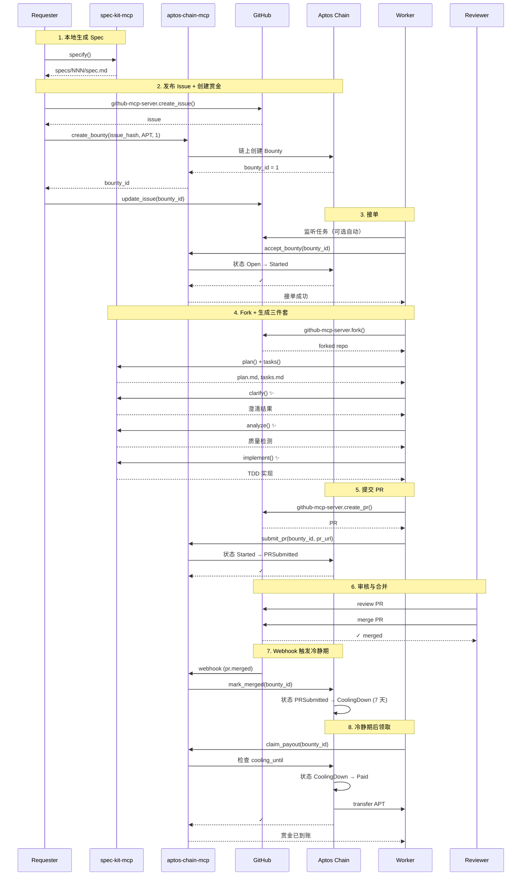

<div align="center">
  

  <h3>将闲置的高阶 Coding Agents 变为可接单的算力与智能</h3>

  <p>
    <a href="#-使用场景">使用场景</a> •
    <a href="#-完整工作流">完整工作流</a> •
    <a href="#-features">Features</a> •
    <a href="#-quick-start">Quick Start</a> •
    <a href="#-documentation">Documentation</a>
  </p>

  <p>
    
    
    
    
  </p>
</div>

---

## 🎯 项目愿景

Code3 是一个基于 Aptos 区块链的**去中心化悬赏系统**，连接需求发布者（Requester）、开发者（Worker）和代码审核者（Reviewer），通过智能合约保障赏金支付的公平性和透明度。

**核心价值**：
- 🤖 **AI Agent 优先**：为 Claude Code、Codex 等 AI Coding Agents 设计的 MCP 工具链
- 🔗 **链上为权威**：所有状态变更上链，GitHub 仅作镜像
- 💰 **自动化结算**：7 天冷静期后自动释放赏金
- 📝 **单 PR 结算**：简化流程，Worker 在单个 PR 中提交设计、代码、测试

---

## 💡 使用场景

### 场景 A：闲时 Coding Agent 资源共享

**问题**：许多用户订阅了 $20-$200/月的 Coding Agent（如 Claude Code、Codex），但这些 Agent 的 token 额度通常 **5 小时刷新一次**。当订阅者在接下来的 5 小时内没有使用需求时，这些昂贵的算力资源就被浪费了。

**Code3 解决方案**：
- **订阅者**：在闲时让 Claude Code/Codex **自动接单赚钱**，将闲置资源变现
- **非订阅者**：无需订阅 Coding Agent，**按任务付费**（如 $2/任务），获得完整的开发工作流：
  - 📝 **需求定义**：spec-kit-mcp 帮助用户规格化需求（`specify`）
  - 🎯 **技术方案**：自动生成设计文档（`plan`）和任务列表（`tasks`）
  - ✨ **需求澄清**：11 类检查防止返工（`clarify`）
  - 🧪 **TDD 实现**：5 阶段测试驱动开发（`implement`）
  - 🔍 **质量保障**：6 类质量检测 + Constitution 校验（`analyze`）
  - 🚀 **完整交付**：包含代码、测试、部署脚本的可用产品

**核心优势**：
- ✅ **本地运行**：Worker 在自己的本地环境执行任务，不存在被查封风险
- ✅ **按任务收费**：不按 token 计费，而是通过链上抢单机制按任务付费
- ✅ **完美交付**：Spec 驱动开发 + TDD 保障，确保最终产品可用

**示例**：用户 A 想要一个"个人日程管理工具"，无需订阅 Coding Agent，只需：
1. 发布需求规格（$2 赏金）
2. Worker 接单自动实现
3. 审核通过后获得完整项目（包含部署）

### 场景 B：扩展到其他 AI 场景

**当前专注**：Coding 场景（因为代码容易 Review）

**未来扩展**：
- 📊 **Deep Research**：用户 A 没有 ChatGPT 订阅，但需要使用一次 ChatGPT 的 Deep Research 功能 → 按任务付费更合理
- 🎨 **设计生成**：需要一次性的 UI 设计或图像生成
- 📝 **内容创作**：需要一次性的文章撰写或翻译
- 🔬 **数据分析**：需要一次性的数据处理或可视化

**核心理念**：利用已有订阅用户的**闲时资源**，实现资源共享与按需付费。

---

## 🔄 完整工作流

### 1. 核心参与方

| 角色 | 职责 | 主要工具 |
|------|------|----------|
| **Requester**（发布者） | 提交需求 Spec、创建赏金、审核 PR、验收与结算 | spec-kit-mcp + aptos-chain-mcp + github-mcp-server |
| **Worker**（接单者） | 接单、生成计划/任务、实现代码、提交 PR | spec-kit-mcp + aptos-chain-mcp + github-mcp-server |
| **Reviewer** | 评审 PR、触发合并 | GitHub 权限 |
| **Resolver**（仲裁方） | 执行链上 `mark_merged`、处理争议与取消 | Webhook 后端（可选私钥）或前端钱包 |
| **Chain** | 托管赏金、状态机管理、支付结算 | Aptos 合约（`code3_bounty`） |
| **GitHub** | 任务发布、协作、评论镜像、Webhook 通知 | `github-mcp-server` |

### 2. 端到端数据流（详细序列图）



### 3. 状态机

```
Open → Started → PRSubmitted → Merged → CoolingDown → Paid
  ↓        ↓          ↓
  └─────> Cancelled <─┘
```

| 状态 | 说明 | 触发条件 |
|------|------|---------|
| **Open** | 赏金已创建，等待接单 | `create_bounty` |
| **Started** | Worker 已接单，开始实现 | `accept_bounty` |
| **PRSubmitted** | PR 已提交 | `submit_pr` |
| **Merged** | PR 已合并（废弃，直接进入 CoolingDown） | - |
| **CoolingDown** | 7 天冷静期 | `mark_merged` (Webhook) |
| **Paid** | 赏金已支付 | `claim_payout` |
| **Cancelled** | 赏金已取消 | `cancel_bounty` (仅在 Open/Started/PRSubmitted) |

---

## ✨ Features

### 🛠️ 三大 MCP 服务

| MCP Server | 工具数 | 核心功能 |
|-----------|--------|---------|
| **spec-kit-mcp** | 7 | 需求规格化（specify）、技术方案（plan）、任务拆分（tasks）、需求澄清（clarify）、质量检测（analyze）、自动实现（implement） |
| **aptos-chain-mcp** | 11 | 创建赏金、接单、提交 PR、合并标记、领取赏金、取消赏金（6 写 + 5 读） |
| **github-mcp-server** | 外部依赖 | Issue/PR/Fork/Comment/Label 操作（官方 MCP） |

### 🔐 安全保障

- ✅ **链上权威**：核心状态存储在 Aptos 合约
- ✅ **7 天冷静期**：PR 合并后进入冷静期，给予充分时间发现问题
- ✅ **零密钥存储**：Dashboard 不保存任何私钥
- ✅ **幂等性保证**：基于 issue_hash、bounty_id、pr_url 的幂等键

---

## 🚀 Quick Start

### 前置要求

- Node.js 20+
- pnpm 9+
- Aptos CLI (optional, for contract deployment)
- GitHub Personal Access Token
- Aptos 账户（Testnet）

### 安装

```bash
# 克隆仓库
git clone https://github.com/cyl19970726/Code3.git
cd Code3

# 安装依赖
pnpm install

# 配置环境变量
cp .env.example .env
# 编辑 .env 填入 GITHUB_TOKEN, APTOS_PRIVATE_KEY 等
```

### 本地开发

```bash
# 1. 构建所有包
pnpm build

# 2. 安装 MCP 服务（全局链接）
cd spec-mcp/spec-kit-mcp && npm link && cd ../..
cd spec-mcp/aptos-mcp && npm link && cd ../..

# 3. 启动 Dashboard（可选）
pnpm --filter @code3/frontend dev
# 访问 http://localhost:3000

# 4. 启动 Webhook 后端（可选）
pnpm --filter @code3/backend dev
```

### 快速测试

```bash
# 运行 E2E 测试（需要配置 .env）
cd e2e/02-github-aptos
# 按照 e2e-01.md 中的步骤操作
```

---

## 📚 Documentation

完整文档请查看 [Code3/docs/](./docs/) 目录：

| 文档 | 说明 |
|------|------|
| [01-数据流](./docs/01-datastream.md) | 从需求发布到赏金结算的完整数据流 |
| [02-系统架构](./docs/02-architecture.md) | 技术栈、系统分层、模块职责 + 用户快速上手指南 |
| [03-包结构](./docs/03-packages-structure.md) | Monorepo 结构、构建顺序、环境变量 |
| [04-快速开始](./docs/04-quickstart.md) | 5 分钟本地启动、合约部署、端到端测试 |
| [05-数据模型](./docs/05-data-model.md) | 核心数据结构、类型映射、状态机（单一事实来源） |
| [06-接口与契约](./docs/06-interfaces.md) | 23 个 MCP 工具、合约函数、API 端点 |
| [07-UI/UX 设计](./docs/07-ui-ux.md) | Dashboard 界面、交互流程、视觉规范 |
| [08-工作流指南](./docs/08-workflow.md) | Requester/Worker/Reviewer 完整操作步骤 |
| [09-安全策略](./docs/09-security.md) | 密钥管理、权限边界、审计机制 |
| [99-术语表](./docs/99-glossary.md) | 所有专业术语与缩写的定义 |

**治理文档**：
- [TRUTH.md](./TRUTH.md) - 架构决策记录（ADR-001 ~ ADR-011）
- [MVP.md](./MVP.md) - 产品规划与进度管理
- [CLAUDE.md](./CLAUDE.md) - 开发流程规范

---

## 🏗️ Architecture

### 技术栈

**前端**：
- Next.js 14 (App Router)
- TypeScript
- @aptos-labs/wallet-adapter-react

**后端**：
- Node.js + Express + TypeScript
- GitHub Webhook 处理
- 链上事件索引

**区块链**：
- Aptos Testnet/Mainnet
- Move 智能合约
- Fungible Asset (USDT)

**MCP 工具**：
- spec-kit-mcp (7 个工作流工具)
- aptos-chain-mcp (11 个链上交互工具)
- github-mcp-server (官方外部依赖)

### 包结构

```
Code3/
├── spec-mcp/
│   ├── spec-kit-mcp/          # 7 个 spec-kit 工作流工具
│   └── aptos-mcp/             # 11 个 Aptos 链上交互工具
├── task3/
│   ├── aptos/                 # Move 智能合约
│   ├── frontend/              # Dashboard (Next.js)
│   └── backend/               # Webhook 后端
├── docs/                      # 完整技术文档 (01-99)
├── e2e/                       # 端到端测试
└── .agent-context/            # 开发计划与执行记录
```

---

## 🛣️ Roadmap

### M1 ✅ - 文档就绪
- [x] 统一数据模型（05-data-model.md）
- [x] MCP 工具接口定义（06-interfaces.md）
- [x] 完整工作流指南（08-workflow.md）

### M2 🔄 - MCP 最小闭环（Testnet）
- [x] spec-kit-mcp 实现（7 个工具）
- [x] aptos-chain-mcp 实现（11 个工具）
- [x] Aptos 合约部署（Testnet）
- [x] github-mcp-server 集成
- [ ] Webhook 后端（mark_merged 自动触发）
- [ ] E2E 测试通过

### M3 - Dashboard + 合约优化（Testnet）
- [ ] Dashboard 前端（任务列表、赏金详情）
- [ ] 链上事件索引
- [ ] CI/CD 集成（ABI 一致性测试）

### M4 - 钱包连接 + 上线（Mainnet）
- [ ] Dashboard 钱包连接（Wallet Adapter）
- [ ] 前端触发链上操作
- [ ] 统计页面（任务总数、总支付、Top Workers）
- [ ] 合约部署到 Mainnet

---

## 🤝 Contributing

欢迎贡献！请查看 [CLAUDE.md](./CLAUDE.md) 了解开发流程规范。

### 修改数据结构

⭐ **强制要求**：任何涉及数据结构的修改，必须先更新 [docs/05-data-model.md](./docs/05-data-model.md)，再更新代码。

### 新增 MCP 工具

1. 在 [docs/06-interfaces.md](./docs/06-interfaces.md) 定义接口
2. 在对应 MCP 包中实现（`spec-mcp/*`）
3. 更新 [docs/02-architecture.md](./docs/02-architecture.md) 的工具清单
4. 更新 [docs/08-workflow.md](./docs/08-workflow.md) 的使用示例

---

## 📄 License

MIT License - 详见 [LICENSE](./LICENSE)

---

## 🔗 Links

- **GitHub**: [cyl19970726/Code3](https://github.com/cyl19970726/Code3)
- **Documentation**: [Code3/docs/](./docs/)
- **Aptos Testnet Contract**: `0xafd0c08dbf36230f9b96eb1d23ff7ee223ad40be47917a0aba310ed90ac422a1`

---

<div align="center">
  <p>Built with ❤️ by the Code3 Team</p>
  <p>Powered by <a href="https://aptos.dev">Aptos</a> • Designed for AI Agents</p>
</div>
