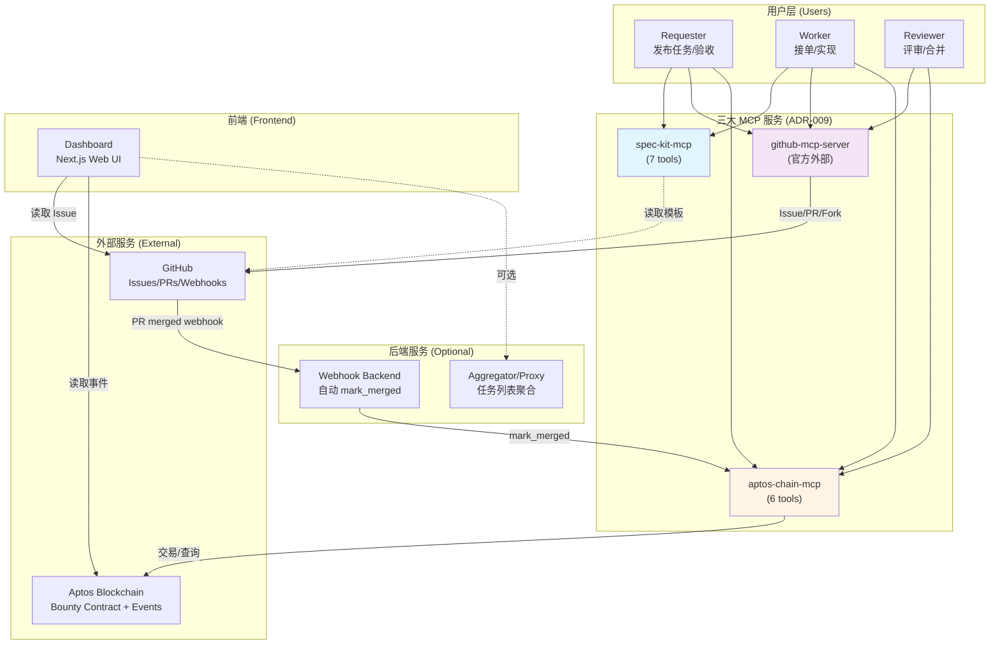
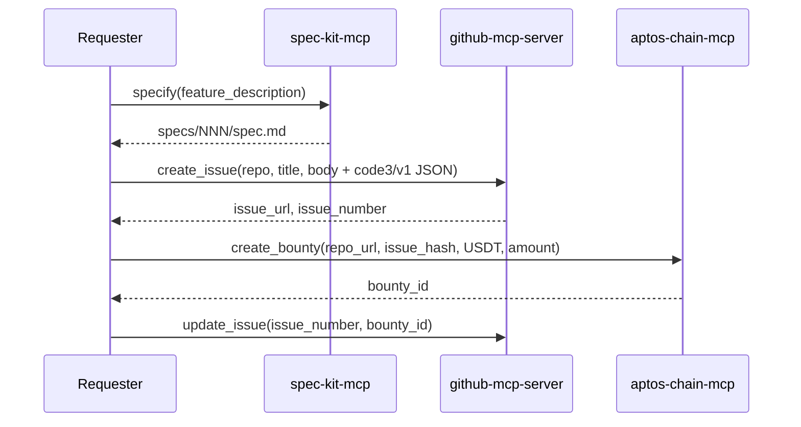
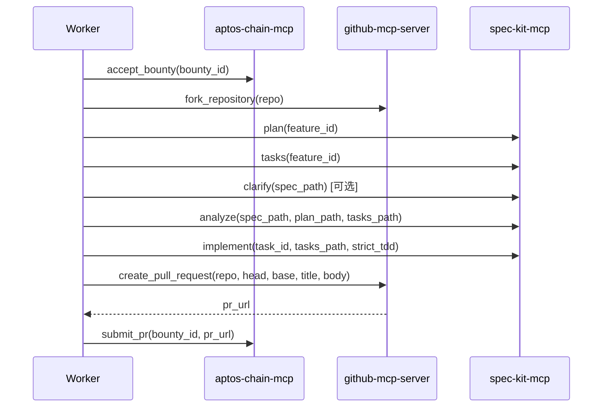
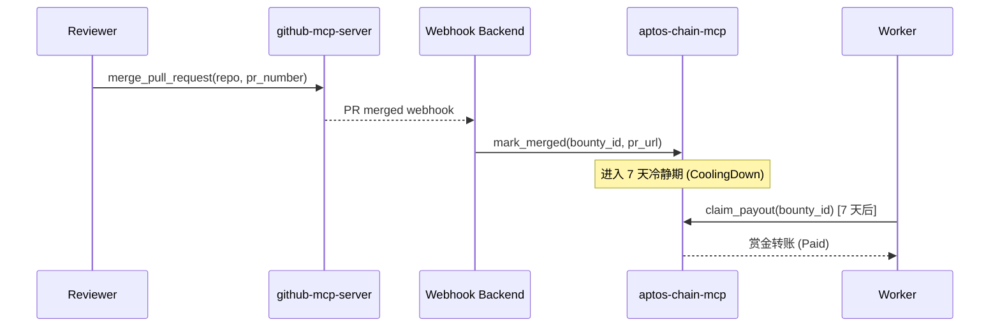
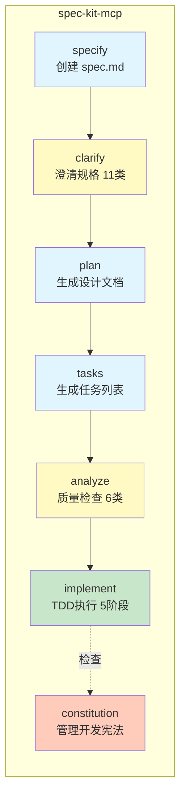
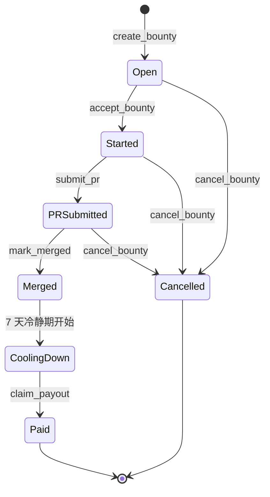
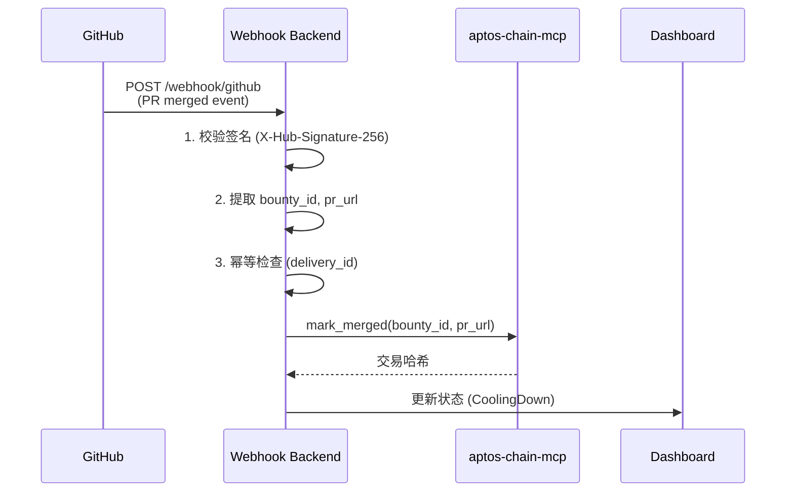
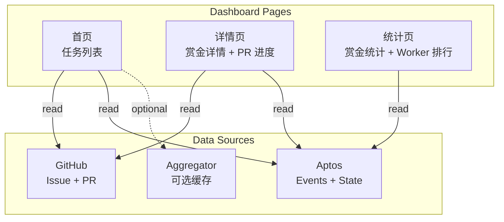

# 02 — 系统架构与模块设计

> 本文定义 Code3 项目的技术栈选择、系统分层架构、模块职责划分。
> 参考：[TRUTH.md](../../TRUTH.md) ADR-009（三大 MCP 统一架构）

---

## 1. 技术栈选择

### 1.1 语言与运行时

| 组件 | 技术选型 | 版本要求 | 选择理由 |
|------|----------|----------|----------|
| MCP 工具 | TypeScript | Node 20+ | 类型安全、与 spec-kit 兼容、MCP 协议原生支持 |
| 合约 | Move | Aptos 1.0+ | 资源模型清晰、事件友好、官方推荐 |
| 前端 | Next.js + TypeScript | 14+ | App Router、SSR/SSG、快速迭代 |
| 后端 | Node.js + TypeScript | 20+ | 与 MCP 工具共享类型、异步 I/O |

### 1.2 核心依赖库

**GitHub 集成**:
- `github-mcp-server`（官方 MCP，直接使用）
- 实现路径：外部依赖，通过 MCP 协议调用
- 文档：https://github.com/github/github-mcp-server

**Aptos 集成**（参考 TRUTH.md ADR-006/007）:
- `@aptos-labs/ts-sdk`（链上交互）
- `@aptos-labs/wallet-adapter-react`（M4 前端钱包，MVP 不使用）
- `@aptos-labs/gas-station-client`（可选 Gas 赞助）
- `@aptos-labs/aptos-mcp`（Aptos Build 管理：API Keys/Gas Station）

**Spec-kit 流程**:
- 复用现有模板：`.specify/templates/`
- 复用现有脚本：`.specify/scripts/bash/`
- MCP 化封装：[Code3/spec-mcp/spec-kit/](../../spec-mcp/spec-kit/)

**包管理**:
- `pnpm` 工作区（Monorepo）
- 配置文件：[Code3/pnpm-workspace.yaml](../../pnpm-workspace.yaml)

---

## 2. 系统架构（分层视图）

### 2.1 总体架构（Mermaid）

**设计理念**（参考 TRUTH.md ADR-009）:
- **功能分层**：按技术栈（spec-kit/Aptos/GitHub）而非角色分层
- **关注点分离**：spec-kit 负责工作流，aptos-chain 负责链上，github 负责 GitHub 操作
- **角色配置化**：通过 AGENTS.md/CLAUDE.md 指导不同角色使用哪些工具
- **简化部署**：用户只需安装 3 个 MCP Server

### 2.2 角色 → MCP 工具映射

| 角色 | 使用的 MCP 工具组合 | 典型工作流 |
|------|-------------------|-----------|
| **Requester** | `spec-kit-mcp` + `github-mcp-server` + `aptos-chain-mcp` | specify → create_issue → create_bounty |
| **Worker** | `spec-kit-mcp` + `github-mcp-server` + `aptos-chain-mcp` | accept_bounty → fork → plan/tasks/implement → create_pr → submit_pr → claim_payout |
| **Reviewer** | `github-mcp-server` + `aptos-chain-mcp` | review → merge_pr → mark_merged |

**详细工作流说明**：参见 [08-workflow.md](./08-workflow.md)

### 2.3 数据流向（关键路径）

**发布任务**:

**接单执行**:

**合并结算**:

---

## 3. 三大 MCP 服务详解

### 3.1 spec-kit-mcp（7 个工具）

**定位**: 封装所有 spec-kit 工作流命令
**实现路径**: [Code3/spec-mcp/spec-kit/](../../spec-mcp/spec-kit/)

**工具清单**:

| 工具 | 职责 | 输入 | 输出 | 幂等键 |
|------|------|------|------|--------|
| `specify` | 创建 spec.md | `feature_description`, `allow_overwrite` | `specs/NNN-slug/spec.md` | `feature_id` |
| `plan` | 生成设计文档 | `feature_id`, `tech_constraints` | `plan.md`, `research.md`, `data-model.md`, `contracts/`, `quickstart.md` | `feature_id + file paths` |
| `tasks` | 生成任务列表 | `feature_id` | `tasks.md` | `feature_id` |
| `clarify` | 澄清规格（11 类） | `spec_path`, `max_questions`, `interactive`, `categories` | `questions[]`, `updated_spec_path` | `spec_path` |
| `analyze` | 质量检查（6 类 + Constitution） | `spec_path`, `plan_path`, `tasks_path` | `issues[]`, `score`, `constitution_conflicts[]` | `spec_path + plan_path + tasks_path` |
| `implement` | TDD 执行（5 阶段） | `task_id`, `tasks_path`, `strict_tdd` | `phase_results[]`, `test_results`, `coverage` | `task_id` |
| `constitution` | 管理开发宪法 | `action: view/update/check`, `rules` | `current_constitution`, `check_results` | `action` |

**依赖**:
- spec-kit 模板：`.specify/templates/`
- spec-kit 脚本：`.specify/scripts/bash/`

**环境变量**: 无（纯本地文件操作）

**错误处理**:
- `E_EXISTS` — 文件已存在且未允许覆盖
- `E_PRECONDITION` — 前置文件缺失（如 plan 前需要 spec）
- `E_VALIDATION` — 输入参数校验失败
- `E_CONSTITUTION_CRITICAL` — Constitution 关键冲突（阻塞执行）

### 3.2 aptos-chain-mcp（6 个工具）

**定位**: 封装所有 Aptos 链上交互
**实现路径**: [Code3/spec-mcp/aptos-mcp/](../../spec-mcp/aptos-mcp/)

**工具清单**:

| 工具 | 职责 | 合约函数 | 权限要求 | 状态迁移 |
|------|------|----------|----------|---------|
| `create_bounty` | 创建赏金 | `code3_bounty::create_bounty` | Sponsor | `[*] → Open` |
| `accept_bounty` | 接受赏金 | `code3_bounty::accept_bounty` | Worker | `Open → Started` |
| `submit_pr` | 链上记录 PR | `code3_bounty::submit_pr` | Worker | `Started → PRSubmitted` |
| `mark_merged` | 标记合并 | `code3_bounty::mark_merged` | Resolver | `PRSubmitted → Merged → CoolingDown` |
| `claim_payout` | 领取赏金 | `code3_bounty::claim_payout` | Winner | `CoolingDown → Paid` |
| `cancel_bounty` | 取消赏金 | `code3_bounty::cancel_bounty` | Sponsor | `Open/Started/PRSubmitted → Cancelled` |

**依赖**:
- `@aptos-labs/ts-sdk` — Aptos TypeScript SDK
- `@aptos-labs/gas-station-client` — Gas Station 赞助（可选）

**环境变量**:
- `APTOS_NETWORK` — testnet（MVP）| mainnet（M4）
- `APTOS_API_KEY` — 全节点 API Key
- `APTOS_PRIVATE_KEY` — 签名私钥（可选，未提供时返回未签名交易 payload）
- `APTOS_GAS_STATION_API_KEY` — Gas Station API Key（可选）

**签名策略**（参考 TRUTH.md ADR-007）:
- MVP (M2/M3): 只支持私钥签名（环境变量）
- M4: 扩展支持 Wallet Adapter（前端钱包）

**错误处理**:
- `E_CHAIN_TX_FAILED` — 链上交易失败
- `E_INVALID_STATE` — 状态迁移非法（如 Open → Paid）
- `E_PERMISSION_DENIED` — 权限不足（如非 Winner 调用 claim_payout）
- `E_COOLING_PERIOD` — 冷静期未满（claim_payout 提前调用）

### 3.3 github-mcp-server（官方外部依赖）

**定位**: 统一处理所有 GitHub 操作（Issue/PR/Fork/Comment/Label）
**文档**: https://github.com/github/github-mcp-server
**安装**: `npm install -g @modelcontextprotocol/server-github`

**常用工具**:

| 工具 | 职责 | API 端点 | 权限要求 |
|------|------|----------|---------|
| `create_issue` | 创建 Issue | `POST /repos/{owner}/{repo}/issues` | `repo` scope |
| `update_issue` | 更新 Issue | `PATCH /repos/{owner}/{repo}/issues/{number}` | `repo` scope |
| `fork_repository` | Fork 仓库 | `POST /repos/{owner}/{repo}/forks` | `repo` scope |
| `create_pull_request` | 创建 PR | `POST /repos/{owner}/{repo}/pulls` | `repo` scope |
| `merge_pull_request` | 合并 PR | `PUT /repos/{owner}/{repo}/pulls/{number}/merge` | `repo` scope |
| `create_comment` | 评论 Issue/PR | `POST /repos/{owner}/{repo}/issues/{number}/comments` | `public_repo` scope |
| `add_labels` | 添加标签 | `POST /repos/{owner}/{repo}/issues/{number}/labels` | `repo` scope |

**环境变量**:
- `GITHUB_TOKEN` （或 `GITHUB_PERSONAL_ACCESS_TOKEN`）

**权限要求**:
- 最小权限：`repo:status`, `repo`, `public_repo`, `workflow`
- 只读场景：`public_repo` 足够

**错误处理**:
- 速率限制：自动重试（指数退避）
- 权限不足：返回 403 错误
- 网络失败：重试 3 次后上报

---

## 4. 辅助服务

### 4.1 Webhook Backend（自动化桥接）

**定位**: 监听 GitHub Webhook，自动触发链上 `mark_merged`
**实现路径**: [Code3/task3/backend/](../../task3/backend/)

**处理流程**:
1. 接收 `pull_request[action=closed, merged=true]` 事件
2. 校验签名（`X-Hub-Signature-256`，使用 `GITHUB_WEBHOOK_SECRET`）
3. 提取 `pr_url` 与 `bounty_id`（从 Issue 元数据或 PR body）
4. 幂等检查（`delivery_id` 存储于 Redis/SQLite）
5. 调用 `aptos-chain-mcp.mark_merged(bounty_id, pr_url)`
6. 记录结果（成功/失败/重试）

**环境变量**:
- `GITHUB_WEBHOOK_SECRET` — 签名校验密钥
- `APTOS_API_KEY` — 链上交易提交
- `RESOLVER_PRIVATE_KEY` — 可选（自动调用 `mark_merged`）
- `REDIS_URL` — 幂等去重存储（可选，默认 SQLite）

**失败重试策略**:
- 链上交易失败 → 重试 3 次（指数退避：2s, 4s, 8s）
- 重试失败 → 记录告警，人工介入
- 幂等跳过 → 返回 200（已处理）

### 4.2 Dashboard（前端可视化）

**定位**: 展示任务列表、赏金详情、触发链上操作
**实现路径**: [Code3/task3/frontend/](../../task3/frontend/)

**数据来源**:
- **链上事件索引**：读取 `BountyCreated`, `BountyAccepted`, `Merged`, `Paid` 等事件
- **GitHub Issue 元数据**：读取 `code3/v1` JSON（repo, issue_number, feature_id, bounty 等）
- **聚合缓存**（可选）：通过 Aggregator/Proxy 提供统一 API

**操作边界**（参考 TRUTH.md ADR-007）:
- **MVP (M2/M3)**: 只读展示，不触发链上操作（无钱包连接）
- **M4**: 增加钱包连接按钮，前端触发 MCP 调用（经 Wallet Adapter）

**环境变量**:
- `NEXT_PUBLIC_APTOS_NETWORK` — testnet | mainnet
- `NEXT_PUBLIC_APTOS_API_KEY` — 全节点 API Key（仅读取公开数据）

---

## 5. 参考

- 数据流详细说明：[01-datastream.md](./01-datastream.md)
- 包结构与配置：[03-packages-structure.md](./03-packages-structure.md)
- 快速开始与部署：[04-quickstart.md](./04-quickstart.md)
- 数据模型：[05-data-model.md](./05-data-model.md)
- MCP 工具契约：[06-interfaces.md](./06-interfaces.md)
- 工作流详细说明：[08-workflow.md](./08-workflow.md)
- 安全策略：[09-security.md](./09-security.md)
- TRUTH.md ADR-009：[../../TRUTH.md](../../TRUTH.md)
