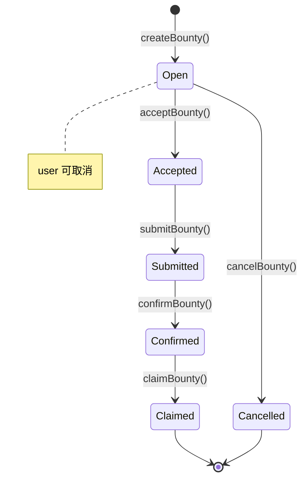

# 01 — 数据模型

> 本文定义 task3/ 核心数据结构、类型定义和状态机
> 参考：[TRUTH.md](../../TRUTH.md) ADR-012

---

## 1. 数据模型总览

task3/ 系统包含以下核心数据模型：

```
┌──────────────────────────────────────────────────────────┐
│                    核心数据模型                           │
├──────────────────────────────────────────────────────────┤
│                                                          │
│  1. Bounty（赏金实体）                                    │
│     - 链上存储的赏金数据                                  │
│     - 包含状态、金额、参与者等信息                         │
│                                                          │
│  2. TaskMetadata（任务元数据）                            │
│     - 任务的完整元信息                                    │
│     - 存储在数据层（GitHub Issue / IPFS 等）              │
│                                                          │
│  3. BountyStatus（赏金状态枚举）                          │
│     - 定义赏金的 6 种状态                                 │
│     - 状态机转换规则                                      │
│                                                          │
│  4. Flow Params/Result（流程参数与返回值）                │
│     - 5 个流程的输入输出数据结构                          │
│                                                          │
└──────────────────────────────────────────────────────────┘
```

---

## 2. Bounty 数据模型

### 2.1 Bounty 实体

**定义位置**: `task3/bounty-operator/types.ts`

```typescript
export interface Bounty {
  // ========== 基础信息 ==========
  bountyId: string;              // 赏金 ID（链上唯一标识）
  taskId: string;                // 任务 ID（如 "owner/repo#123" 或 UUID）
  taskHash: string;              // 任务内容哈希（用于幂等性检查）

  // ========== 参与者 ==========
  user: string;                  // 赏金发起人地址（requester）
  worker: string | null;         // 接单的 worker 地址（null 表示未接单）

  // ========== 赏金信息 ==========
  amount: string;                // 赏金金额（字符串格式，避免精度问题）
  asset: string;                 // 资产类型（"USDT" / "APT" / "SUI" / "ETH" 等）

  // ========== 状态与时间戳 ==========
  status: BountyStatus;          // 当前状态（见 2.2）
  createdAt: number;             // 创建时间（Unix 时间戳，秒）
  acceptedAt: number | null;     // 接受时间（null 表示未接受）
  submittedAt: number | null;    // 提交时间（worker 提交工作成果）
  confirmedAt: number | null;    // 确认时间（requester 确认工作成果）
  claimedAt: number | null;      // 领取时间（worker 领取赏金）
}
```

**字段说明**:

| 字段 | 类型 | 必填 | 说明 |
|------|------|------|------|
| `bountyId` | string | ✅ | 链上唯一标识，由合约生成 |
| `taskId` | string | ✅ | 任务 ID，格式依数据层而定 |
| `taskHash` | string | ✅ | SHA256(taskData)，防止重复创建 |
| `user` | string | ✅ | 发起人的链上地址（requester） |
| `worker` | string \| null | ❌ | 接单后才有值 |
| `amount` | string | ✅ | 使用字符串避免浮点数精度问题 |
| `asset` | string | ✅ | 资产标识符（代币名称或地址） |
| `status` | BountyStatus | ✅ | 当前状态（见 2.2） |
| `createdAt` | number | ✅ | 创建时的 Unix 时间戳 |
| `submittedAt` | number \| null | ❌ | worker 提交工作成果的时间 |
| `confirmedAt` | number \| null | ❌ | requester 确认工作成果的时间 |
| `claimedAt` | number \| null | ❌ | worker 领取赏金的时间 |

---

### 2.2 BountyStatus 状态枚举

**定义位置**: `task3/bounty-operator/types.ts`

```typescript
export enum BountyStatus {
  Open = 'Open',           // 已发布，等待接单
  Accepted = 'Accepted',   // 已接单，worker 工作中
  Submitted = 'Submitted', // worker 已提交工作成果
  Confirmed = 'Confirmed', // requester 已确认，进入冷静期
  Claimed = 'Claimed',     // worker 已领取赏金
  Cancelled = 'Cancelled'  // user 已取消（仅 Open 状态可取消）
}
```

**状态说明**:

| 状态 | 说明 | 可执行操作 | 下一状态 |
|------|------|-----------|---------|
| **Open** | 赏金已创建，等待接单 | acceptBounty, cancelBounty | Accepted, Cancelled |
| **Accepted** | worker 已接单，开始工作 | submitBounty | Submitted |
| **Submitted** | worker 已提交工作成果 | confirmBounty | Confirmed |
| **Confirmed** | requester 已确认，可领取 | claimPayout | Claimed |
| **Claimed** | worker 已领取赏金 | - | 终态 |
| **Cancelled** | user 已取消赏金 | - | 终态 |

---

### 2.3 状态机



**状态转换规则**:

1. **[*] → Open** (`createBounty`)
   - **触发者**: User (requester)
   - **前置条件**: 无（初始状态）
   - **链上操作**: 锁定赏金金额到合约
   - **后置条件**:
     - 赏金状态为 `Open`
     - `bountyId` 被创建
     - `createdAt` 被记录
     - 资金已锁定在合约中

2. **Open → Accepted** (`acceptBounty`)
   - **触发者**: Worker（接受任务）
   - **前置条件**: 赏金状态为 `Open`
   - **链上操作**: 将 worker 地址绑定到 bounty
   - **后置条件**:
     - 赏金状态为 `Accepted`
     - `worker` 字段被设置
     - `acceptedAt` 被记录

3. **Accepted → Submitted** (`submitBounty`)
   - **触发者**: Worker（提交工作成果）
   - **前置条件**:
     - 赏金状态为 `Accepted`
     - 调用者必须是该 bounty 的 worker
   - **链上操作**: 记录提交的 PR URL（或其他提交凭证）
   - **后置条件**:
     - 赏金状态为 `Submitted`
     - `submittedAt` 被记录
     - 提交 URL 已上链

4. **Submitted → Confirmed** (`confirmBounty`)
   - **触发者**: User (requester)（确认工作成果）
   - **前置条件**:
     - 赏金状态为 `Submitted`
     - 调用者必须是该 bounty 的 user（原始发起人）
   - **链上操作**: 确认工作成果
   - **后置条件**:
     - 赏金状态为 `Confirmed`
     - `confirmedAt` 被记录

5. **Confirmed → Claimed** (`claimBounty`)
   - **触发者**: Worker（领取赏金）
   - **前置条件**:
     - 赏金状态为 `Confirmed`
     - 调用者必须是该 bounty 的 worker
   - **链上操作**: 将锁定的资金转账给 worker
   - **后置条件**:
     - 赏金状态为 `Claimed`
     - `claimedAt` 被记录
     - 资金已转账给 worker

6. **Open → Cancelled** (`cancelBounty`)
   - **触发者**: User (requester)（取消赏金）
   - **前置条件**:
     - 赏金状态为 `Open`（仅未接单的赏金可取消）
     - 调用者必须是该 bounty 的 user
   - **链上操作**: 退还锁定的资金给 user
   - **后置条件**:
     - 赏金状态为 `Cancelled`
     - 资金已退还给 user

---

## 3. TaskMetadata 数据模型

### 3.1 TaskMetadata 结构

**定义位置**: `task3/data-operator/types.ts`

```typescript
export interface TaskMetadata {
  // ========== Schema 版本 ==========
  schema: 'code3/v2';            // 元数据格式版本

  // ========== 任务标识 ==========
  taskId: string;                // 任务 ID（如 "owner/repo#123" 或 IPFS CID）
  taskHash: string;              // 任务内容哈希（幂等性）

  // ========== 链上信息 ==========
  chain: {
    name: string;                // aptos / sui / ethereum
    network: string;             // testnet / mainnet
    bountyId: string;            // 关联的 bounty ID
    contractAddress: string;     // 合约地址
  };

  // ========== Workflow 信息 ==========
  workflow: {
    name: string;                // spec-kit / observer / ...
    version: string;             // workflow 版本（如 "1.0.0"）
    adapter: string;             // spec-kit-mcp-adapter / observer-adapter
  };

  // ========== 赏金信息 ==========
  bounty: {
    asset: string;               // 资产类型
    amount: string;              // 赏金金额
    confirmedAt: number | null;  // requester 确认时间
  };

  // ========== 数据层信息 ==========
  dataLayer: {
    type: string;                // github / ipfs / arweave / s3
    url: string;                 // 数据层 URL（taskUrl）
  };
}
```

**字段说明**:

| 字段 | 类型 | 必填 | 说明 |
|------|------|------|------|
| `schema` | string | ✅ | 固定为 "code3/v2"，用于版本兼容性 |
| `taskId` | string | ✅ | 任务标识符，格式依数据层而定 |
| `taskHash` | string | ✅ | 任务内容的 SHA256 哈希 |
| `chain.name` | string | ✅ | 链名称（aptos/sui/ethereum） |
| `chain.network` | string | ✅ | 网络类型（testnet/mainnet） |
| `chain.bountyId` | string | ✅ | 关联的链上 bounty ID |
| `chain.contractAddress` | string | ✅ | 合约地址 |
| `workflow.name` | string | ✅ | workflow 名称 |
| `workflow.version` | string | ✅ | workflow 版本号 |
| `workflow.adapter` | string | ✅ | 使用的 adapter 名称 |
| `bounty.asset` | string | ✅ | 赏金资产类型 |
| `bounty.amount` | string | ✅ | 赏金金额 |
| `bounty.confirmedAt` | number \| null | ❌ | 确认时间（确认后才有） |
| `dataLayer.type` | string | ✅ | 数据层类型 |
| `dataLayer.url` | string | ✅ | 任务数据的 URL（taskUrl） |

**示例**（GitHub + Aptos）:

```json
{
  "schema": "code3/v2",
  "taskId": "code3-team/repo#123",
  "taskHash": "a3f8c9d2e1b4...",
  "chain": {
    "name": "aptos",
    "network": "testnet",
    "bountyId": "456",
    "contractAddress": "0xabc123..."
  },
  "workflow": {
    "name": "spec-kit",
    "version": "1.0.0",
    "adapter": "spec-kit-mcp-adapter"
  },
  "bounty": {
    "asset": "USDT",
    "amount": "100.00",
    "confirmedAt": 1696550400
  },
  "dataLayer": {
    "type": "github",
    "url": "https://github.com/code3-team/repo/issues/123"
  }
}
```

---

## 4. Flow 参数与返回值类型

### 4.1 PublishFlow 类型

**定义位置**: `task3/orchestration/types.ts`

```typescript
export interface PublishFlowParams {
  dataOperator: DataOperator;      // 数据操作接口实例
  bountyOperator: BountyOperator;  // 链上操作接口实例
  taskData: any;                   // 任务数据（workflow 特定格式）
  metadata: TaskMetadata;          // 任务元数据
  amount: string;                  // 赏金金额
  asset: string;                   // 资产类型
}

export interface PublishFlowResult {
  taskUrl: string;                 // 任务 URL（GitHub Issue URL / IPFS CID 等）
  bountyId: string;                // 创建的 bounty ID
  txHash: string | null;           // 交易哈希（幂等时为 null）
  isNew: boolean;                  // true=新创建, false=已存在（幂等）
}
```

---

### 4.2 AcceptFlow 类型

```typescript
export interface AcceptFlowParams {
  dataOperator: DataOperator;      // 数据操作接口实例
  bountyOperator: BountyOperator;  // 链上操作接口实例
  taskUrl: string;                 // 任务 URL
}

export interface AcceptFlowResult {
  taskData: any;                   // 下载的任务数据（workflow 特定格式）
  localPath: string;               // 本地存储路径
  bountyId: string;                // 关联的 bounty ID
  txHash: string;                  // 接受交易的哈希
}
```

---

### 4.3 SubmitFlow 类型

```typescript
export interface SubmitFlowParams {
  dataOperator: DataOperator;      // 数据操作接口实例
  bountyOperator: BountyOperator;  // 链上操作接口实例
  taskUrl: string;                 // 任务 URL
  submissionData: any;             // 提交数据（workflow 特定格式）
}

export interface SubmitFlowResult {
  submissionUrl: string;           // 提交 URL（GitHub PR URL / IPFS CID 等）
  txHash: string;                  // 提交交易的哈希
}
```

---

### 4.4 ConfirmFlow 类型

```typescript
export interface ConfirmFlowParams {
  bountyOperator: BountyOperator;  // 链上操作接口实例
  dataOperator: DataOperator;      // 数据操作接口实例
  taskUrl: string;                 // 任务 URL
}

export interface ConfirmFlowResult {
  txHash: string;                  // 确认交易的哈希
  coolingUntil: number;            // 冷静期结束时间戳
}
```

---

### 4.5 ClaimFlow 类型

```typescript
export interface ClaimFlowParams {
  bountyOperator: BountyOperator;  // 链上操作接口实例
  dataOperator: DataOperator;      // 数据操作接口实例
  taskUrl: string;                 // 任务 URL
}

export interface ClaimFlowResult {
  txHash: string;                  // 领取交易的哈希
  amount: string;                  // 领取的赏金金额
  asset: string;                   // 领取的资产类型
}
```

---

## 5. BountyOperator 参数与返回值类型

### 5.1 Create Bounty

```typescript
export interface CreateBountyParams {
  taskId: string;                  // 任务 ID
  taskHash: string;                // 任务内容哈希（幂等性）
  amount: string;                  // 赏金金额
  asset: string;                   // 资产类型
}

export interface CreateBountyResult {
  bountyId: string;                // 创建的 bounty ID
  txHash: string;                  // 交易哈希
}
```

---

### 5.2 Accept Bounty

```typescript
export interface AcceptBountyParams {
  bountyId: string;                // Bounty ID
  worker: string;                  // Worker 地址
}

export interface AcceptBountyResult {
  txHash: string;                  // 交易哈希
  acceptedAt: number;              // 接受时间戳
}
```

---

### 5.3 Submit Bounty

```typescript
export interface SubmitBountyParams {
  bountyId: string;                // Bounty ID
  submissionUrl: string;           // 提交内容 URL
}

export interface SubmitBountyResult {
  txHash: string;                  // 交易哈希
  submittedAt: number;             // 提交时间戳
}
```

---

### 5.4 Confirm Bounty

```typescript
export interface ConfirmBountyParams {
  bountyId: string;                // Bounty ID
}

export interface ConfirmBountyResult {
  txHash: string;                  // 交易哈希
}
```

---

### 5.5 Claim Payout

```typescript
export interface ClaimPayoutParams {
  bountyId: string;                // Bounty ID
}

export interface ClaimPayoutResult {
  txHash: string;                  // 交易哈希
  claimedAt: number;               // 领取时间戳
}
```

---

### 5.6 Cancel Bounty

```typescript
export interface CancelBountyParams {
  bountyId: string;                // Bounty ID
}

export interface CancelBountyResult {
  txHash: string;                  // 交易哈希
}
```

---

### 5.7 Get Bounty

```typescript
export interface GetBountyParams {
  bountyId: string;                // Bounty ID
}

// 返回值：Bounty（见 Section 2.1）
```

---

### 5.8 Get Bounty By Task Hash

```typescript
export interface GetBountyByTaskHashParams {
  taskHash: string;                // 任务内容哈希
}

export interface GetBountyByTaskHashResult {
  found: boolean;                  // 是否找到
  bountyId?: string;               // Bounty ID（found=true 时有值）
}
```

---

### 5.9 List Bounties

```typescript
export interface ListBountiesParams {
  offset?: number;                 // 偏移量（分页）
  limit?: number;                  // 限制数量（分页）
}

export interface ListBountiesResult {
  bounties: Bounty[];              // Bounty 列表
  total: number;                   // 总数
}
```

---

### 5.10 Get Bounties By User

```typescript
export interface GetBountiesByUserParams {
  user: string;                    // User 地址（requester）
}

export interface GetBountiesByUserResult {
  bounties: Bounty[];              // Bounty 列表
}
```

---

### 5.11 Get Bounties By Worker

```typescript
export interface GetBountiesByWorkerParams {
  worker: string;                  // Worker 地址
}

export interface GetBountiesByWorkerResult {
  bounties: Bounty[];              // Bounty 列表
}
```

---

## 6. DataOperator 参数与返回值类型

### 6.1 Upload Task Data

```typescript
export interface UploadTaskDataParams {
  taskData: any;                   // 任务数据（workflow 特定格式）
  metadata: TaskMetadata;          // 任务元数据
}

export interface UploadTaskDataResult {
  taskUrl: string;                 // 任务 URL（GitHub Issue URL / IPFS CID 等）
  taskId: string;                  // 任务 ID
  metadata: TaskMetadata;          // 完整的任务元数据
}
```

---

### 6.2 Download Task Data

```typescript
export interface DownloadTaskDataParams {
  taskUrl: string;                 // 任务 URL
}

export interface DownloadTaskDataResult {
  taskData: any;                   // 任务数据（workflow 特定格式）
  localPath: string;               // 本地存储路径
  metadata: TaskMetadata;          // 任务元数据
}
```

---

### 6.3 Upload Submission

```typescript
export interface UploadSubmissionParams {
  taskUrl: string;                 // 关联的任务 URL
  submissionData: any;             // 提交数据（workflow 特定格式）
  metadata?: any;                  // 可选的额外元数据
}

export interface UploadSubmissionResult {
  submissionUrl: string;           // 提交 URL（GitHub PR URL / IPFS CID 等）
  submissionId: string;            // 提交 ID
  metadata?: any;                  // 返回的元数据
}
```

---

### 6.4 Get Task Metadata

```typescript
export interface GetTaskMetadataParams {
  taskUrl: string;                 // 任务 URL
}

// 返回值：TaskMetadata（见 Section 3.1）
```

---

### 6.5 Update Task Metadata

```typescript
export interface UpdateTaskMetadataParams {
  taskUrl: string;                 // 任务 URL
  metadata: Partial<TaskMetadata>; // 部分更新的元数据
}

export interface UpdateTaskMetadataResult {
  success: boolean;                // 是否成功
}
```

---

## 7. 幂等性机制

### 7.1 幂等性定义

**目的**: 防止重复创建相同的 bounty（如用户误操作、网络重试等）。

**规则**:
- 每个任务数据有唯一的 `taskHash = SHA256(taskData)`
- 链上存储 `taskHash → bountyId` 映射
- 创建 bounty 前，先查询 `getBountyByTaskHash(taskHash)`
- 如果已存在，返回现有 bounty 信息（`isNew = false`）

---

### 7.2 幂等性字段

```typescript
interface Bounty {
  taskHash: string;                // 任务内容的 SHA256 哈希（唯一标识）
}

interface PublishFlowResult {
  isNew: boolean;                  // true=新创建, false=已存在（幂等）
  txHash: string | null;           // 幂等时为 null（无新交易）
}
```

---

### 7.3 幂等性逻辑

```typescript
// 在 publishFlow 中实现幂等性
const taskHash = crypto.createHash('sha256').update(JSON.stringify(taskData)).digest('hex');

// 检查是否已存在
const existingBounty = await bountyOperator.getBountyByTaskHash({ taskHash });
if (existingBounty.found) {
  // 已存在，返回现有 bounty
  return {
    taskUrl: metadata.dataLayer.url,
    bountyId: existingBounty.bountyId,
    txHash: null,               // 无新交易
    isNew: false                // 幂等返回
  };
}

// 不存在，创建新 bounty
const bountyResult = await bountyOperator.createBounty({ taskId, taskHash, amount, asset });
```

---

## 8. 参考

- **接口定义**: [02-interfaces.md](./02-interfaces.md)
- **ADR-012**: [TRUTH.md](../../TRUTH.md) ADR-012
- **接口原始定义**: [interface.md](../../.agent-context/truth/todo/adr-12/interface.md)
