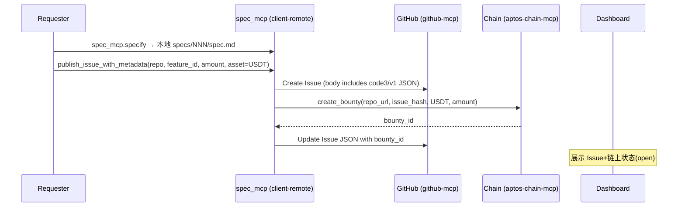
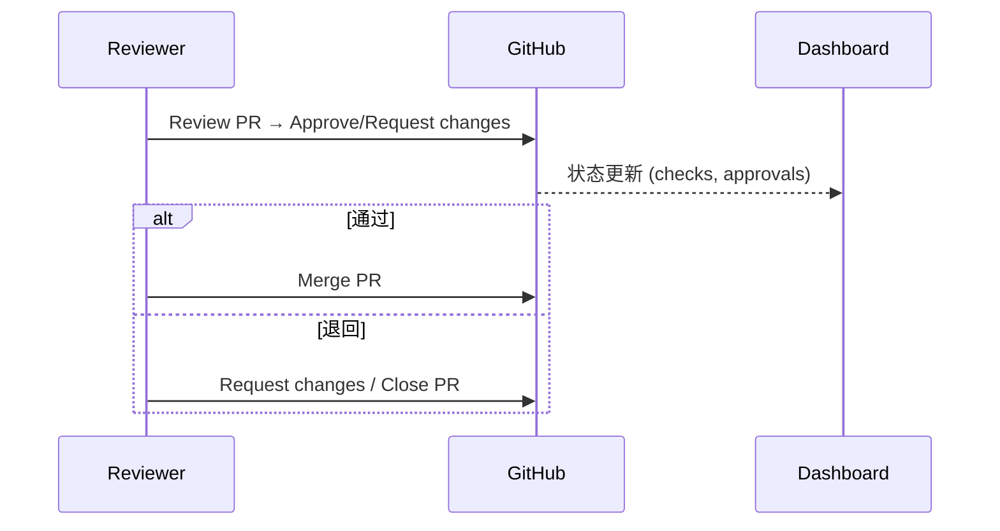
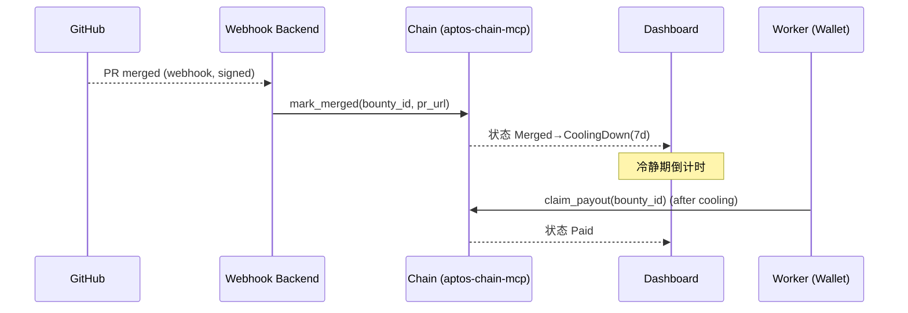
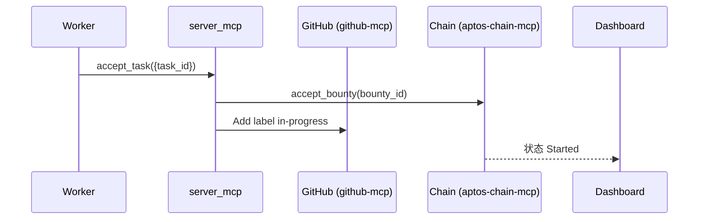
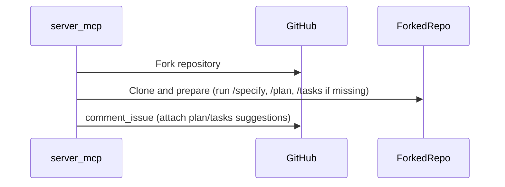
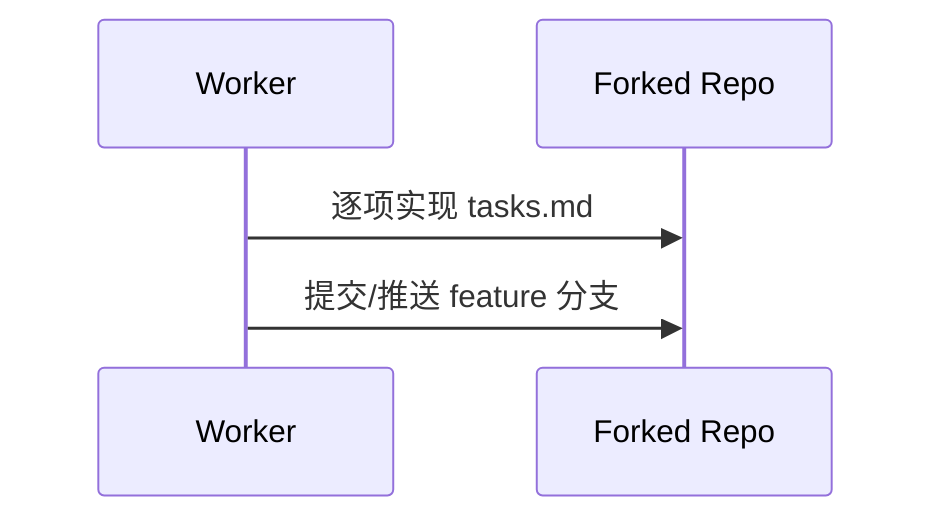
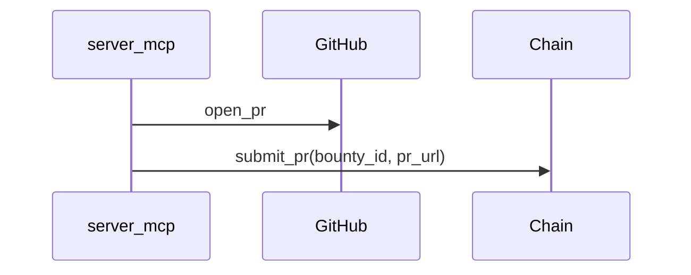
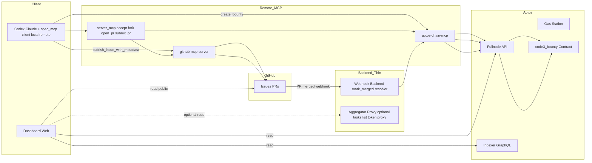

Code3 — 数据流与核心数据结构

本文梳理 Client / Server / Dashboard 三端在“发布→接单→验收→结算”全链路中的数据流、核心数据结构演化与顺序图。图示使用 Mermaid 表达。

## 1) 核心数据结构

### 1.1 Issue 元数据（code3/v1）
```
{
  "schema": "code3/v1",
  "repo": "https://github.com/{owner}/{repo}",
  "issue_number": 123,
  "issue_hash": "sha256(<canonical-json>)",
  "feature_id": "NNN-slug",
  "task_id": "{owner}/{repo}#123",
  "bounty": {
    "network": "testnet",
    "asset": "USDT",
    "amount": "1",
    "bounty_id": null,
    "merged_at": null,
    "cooling_until": null
  },
  "spec_refs": ["specs/NNN-slug/spec.md"],
  "labels": ["code3", "open"]
}
```

变化路径：
- 发布后：`bounty.bounty_id` 写入；`labels` = [open]
- 接单后：GitHub 侧加 `in-progress`
- 合并后：`bounty.merged_at/cooling_until` 写入；`labels` 增加 `merged`/`cooling`
- 领取后：`labels` 增加 `paid`

### 1.2 合约状态（code3_bounty）
```
Open → Started → PRSubmitted → Merged → CoolingDown(7d) → Paid / Cancelled
```

关键字段：`winner`, `pr_url`, `merged_at`, `cooling_until`

---

## 2) Client 侧数据流

### 2.1 发布任务（Requester）


映射规则：Issue JSON 中 `issue_hash` 作为幂等键；`bounty_id` 回填确保链上/离线一致性。

### 2.2 验收任务（Requester/Reviewer）


验收依据：PR diff、CI、文档/测试回写（tasks.md/quickstart.md 等）。合约状态不因“验收失败”改变（仍在 Started/PRSubmitted）。

### 2.3 结算（自动+半自动）


幂等：Webhook 以 delivery_id + bounty_id；合约侧 mark_merged 单次有效；失败重试与死信。

---

## 3) Server 侧数据流

### 3.1 接单任务（Worker）


### 3.2 规划与拆分（远程生成/补全）


### 3.3 根据 tasks 执行实现


### 3.4 提交任务（PR 与链上记录）


---

## 4) Dashboard 行为与链接策略

- 查看：任何人可查看列表/详情；状态来自链上事件聚合与 GitHub 标签/Checks
- 链接：每个任务提供直达 GitHub Issue/PR 与链上合约（资源 URL 或浏览器区块浏览器链接）
- 触发：按钮发起 MCP 调用（钱包签名），如 接受/提交/领取；不保存私钥/状态

---

## 5) 数据一致性与幂等

- 单一真相：链上事件（Open/Started/PRSubmitted/Merged/CoolingDown/Paid/Cancelled）
- Issue 侧为镜像：标签/评论/元数据 JSON；以 `issue_hash` 与 `bounty_id` 建立映射
- 幂等键：issue_hash、bounty_id、pr_url；Webhook delivery_id

---

## 6) 全局架构图与模块拆分

### 6.1 架构总览


说明：
- GitHub 所有写操作经 `github-mcp-server`；链上写操作经 aptos-chain-mcp；Dashboard 默认只读（读取 GH 与链上数据）。
- Webhook Backend 仅负责接收 PR 合并并触发 `mark_merged`（如不想让 Sponsor 前端签名）。
- Aggregator/Proxy 为可选，避免在前端暴露 GitHub Token、统一聚合 tasks 列表（Issue+合约）。

### 6.2 模块职责（详细）

- spec_mcp（client-local）
  - 职责：在本地仓库生成三件套（/specify → spec.md，/plan → plan/research/data-model/contracts/quickstart，/tasks → tasks.md）
  - 输入/输出：见 mcp‑tools‑spec；文件落盘并返回相对路径 JSON
  - 幂等/错误：已存在且未允许覆盖 → E_EXISTS；前置缺失 → E_PRECONDITION；返回统一错误码
  - 安全：纯本地文件操作，无外部凭据

- spec_mcp（client-remote）
  - 职责：发布与远程生成；`spec_mcp.specify`（本地变体）+ `publish_issue_with_metadata` + `remote_plan` + `remote_tasks`
  - 对外依赖：
    - GitHub：经 github‑mcp‑server 创建/更新 Issue、贴标签、回写 JSON
    - Aptos：经 aptos-chain-mcp 调用 `create_bounty`，回写 `bounty_id`
  - 幂等/错误：以 `issue_hash` 作为幂等键；重复发布返回已有 Issue；速率/网络错误按退避策略上报
  - 安全：不直接持有 GitHub PAT/私钥；通过各自 MCP 执行

- server_mcp（remote）
  - 职责：Worker 侧接单与实现流程编排
    - `accept_task/accept_best_task`：登记链上 `accept_bounty`，Issue 贴 `in‑progress`
    - `fork_and_prepare`：Fork→Clone；缺三件套则调用 local spec_mcp 生成；可将 plan/tasks 建议稿贴回 Issue
    - `open_pr`：创建 PR；`submit_pr`：链上记录 pr_url；`claim_payout`：冷静期后领取
  - 对外依赖：github‑mcp‑server 与 aptos-chain-mcp
  - 本地状态：允许维护轻量映射（issue_url ↔ bounty_id ↔ pr_url），不得持久化机密
  - 幂等/错误：重复接单应显式报错或返回当前接单者；PR 已存在返回已有 pr_url；链上交易失败上报 E_CHAIN_TX_FAILED

- github-mcp-server
  - 职责：统一 GitHub 写操作出口：创建/更新 Issue、标签、评论、Fork、PR、合并（如启用）
  - 安全：持有最小权限的 `GITHUB_TOKEN`；负责速率限制与重试；返回标准响应

- aptos-chain-mcp
  - 职责：统一链上交互：`create_bounty/accept_bounty/submit_pr/mark_merged/claim_payout`；读取事件/余额/资产；支持 Gas Station
  - 安全：注入 `APTOS_API_KEY`；前端钱包或本机私钥签名；不回传私钥
  - 错误：网络/链上失败映射到统一错误码，指导调用方重试

- Webhook Backend（thin，按需）
  - 职责：接收 GitHub `PR merged` 事件，校验签名，调用 `mark_merged(bounty_id, pr_url)`；保证幂等
  - 可选：作为 Resolver 的自动化执行点（如 Sponsor 不手动触发）
  - 安全：仅持有 `GITHUB_WEBHOOK_SECRET`；如需自动 `mark_merged`，可配置 `RESOLVER_PRIVATE_KEY`（高风险，须最小暴露）

- Aggregator/Proxy（可选）
  - 职责：聚合任务列表（Issue + 合约状态）、隐藏 GitHub Token、提供统一分页/过滤/排序、缓存热点请求
  - 安全：不存放链上私钥；仅代理读/公共操作；可做简单速率防护

- Dashboard（Web）
  - 职责：只读可视化（Issue 标签 + 合约状态、冷静期倒计时、日志镜像）与触发入口（按钮→MCP 调用）
  - 安全：不保存机密；签名动作走前端钱包；链接直达 GitHub Issue/PR 与链上合约浏览器

- Contract（code3_bounty）
  - 职责：作为单一真相的状态机（Open/Started/PRSubmitted/Merged/CoolingDown/Paid/Cancelled）、事件源、访问控制与支付转账
  - 不变量：winner 只能确立一次；冷静期 7 天；Paid/Cancelled 终态

### 6.3 合并验证与提款条件（How）

问题：合约无法直接访问 GitHub 验证 PR 是否被合并，如何在链上“可信地”允许提款？

设计（基于授权见证 + 绑定提交）：
1) Worker 提交 PR 后调用 `submit_pr(bounty_id, pr_url, commit_sha?)`
   - 合约记录 `worker` 与 `pr_url`，并计算存储 `pr_digest = hash(bounty_id || pr_url || commit_sha?)`
   - 目的：将 PR 身份与可选的提交哈希绑定，防止后续换 PR 或换提交
2) PR 合并后，Webhook Backend 验证 GitHub 签名并解析 `pr_url/commit_sha`
   - 若签名与仓库/Issue 匹配，即代表“外部合并事实”已成立
3) Webhook Backend 以 Resolver/Sponsor 身份调用 `mark_merged(bounty_id, pr_url, commit_sha?)`
   - 合约仅允许授权地址调用；校验 `pr_url` 必须是先前 `submit_pr` 记录的同一个
   - 如提供 `commit_sha`，合约要求 `hash(bounty_id || pr_url || commit_sha) == pr_digest`
   - 首个有效调用确立 `winner`（即提交该 PR 的 worker），写入 `merged_at/cooling_until`，进入 `Merged`
4) 冷静期（7 天）
   - 争议/撤销窗口；必要时 Sponsor 可 `cancel_bounty`（若策略允许）或走仲裁扩展
5) 期满提款：`claim_payout(bounty_id)`
   - 仅允许 `winner` 调用；若 `now >= cooling_until` 则转账 `amount` 给 winner，进入 `Paid`

信任模型与权衡：
- 使用“授权见证（Resolver/Sponsor 调用）”替代“链上直接校验 GitHub 状态”，符合多数链上集成实践；Webhook 只持有 `GITHUB_WEBHOOK_SECRET`，必要时可配置 `RESOLVER_PRIVATE_KEY`。
- 通过 `pr_digest` 将 `submit_pr` 与 `mark_merged` 绑定，降低替换/篡改风险；即使不提供 `commit_sha`，也可至少绑定 PR URL。
- 结合冷静期（7 天）作为人为争议窗口，进一步降低错误/恶意的资金释放风险。

### 6.3 后端是否必需（结论）
- Aptos 侧：发送交易不必需专用后端（前端钱包或 MCP 即可）；读取可直接经 Fullnode/Indexer。仅当要自动处理 PR 合并为链上状态时需要 Webhook Backend（并放置 Resolver 私钥或让 Sponsor 操作）。
- Dashboard：最小实现可纯前端（读 GH 公共数据 + 读链上数据 + 前端钱包签名动作）。为生产可用，建议增加：
  - Webhook Backend（PR 合并自动结算）
  - Aggregator/Proxy（隐藏 GitHub Token、统一分页/过滤、缓存）
