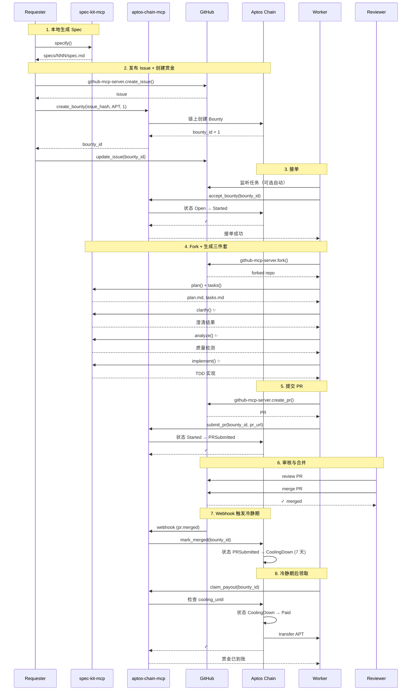

# 01 — 数据流（Data Stream）

> 本文描述 Code3 项目中从需求发布到赏金结算的完整数据流，包括所有参与方、核心状态迁移与外部集成点。
> 参考：[TRUTH.md](../../TRUTH.md) ADR-003（链上为真相，GitHub 为镜像）

---

## 1. 核心参与方

| 角色 | 职责 | 主要工具 |
|------|------|----------|
| **Requester**（发布者） | 提交需求 Spec、创建赏金、审核 PR、验收与结算 | spec-kit-mcp + aptos-chain-mcp + github-mcp-server |
| **Worker**（接单者） | 接单、生成计划/任务、实现代码、提交 PR | spec-kit-mcp + aptos-chain-mcp + github-mcp-server |
| **Reviewer** | 评审 PR、触发合并 | GitHub 权限 |
| **Resolver**（仲裁方） | 执行链上 `mark_merged`、处理争议与取消 | Webhook 后端（可选私钥）或前端钱包 |
| **Chain** | 托管赏金、状态机管理、支付结算 | Aptos 合约（`code3_bounty`） |
| **GitHub** | 任务发布、协作、评论镜像、Webhook 通知 | `github-mcp-server` |

---

## 2. 端到端数据流（Mermaid 序列图）



---

## 3. 数据结构与状态迁移

### 3.1 Issue 元数据（GitHub 中）

**Schema**: `code3/v1`
**位置**: Issue 正文内的 JSON 代码块（三反引号包裹，首行注明 `code3-meta`）
**实现**: 由 `github-mcp-server.create_issue` + `aptos-chain-mcp.create_bounty` 组合生成
**文件路径**:
- Schema 定义：[Code3/docs/05-data-model.md](./05-data-model.md)

```json
{
  "schema": "code3/v1",
  "repo": "https://github.com/owner/repo",
  "issue_number": 123,
  "issue_hash": "sha256(canonical-json)",
  "feature_id": "NNN-slug",
  "task_id": "owner/repo#123",
  "bounty": {
    "network": "testnet",
    "asset": "0x1::aptos_coin::AptosCoin",  // 支持任何 Fungible Asset
    "amount": "1000000",  // 1 APT = 1,000,000 octas (8 decimals)
    "bounty_id": "0x...",
    "merged_at": "2025-01-15T10:30:00Z",
    "cooling_until": "2025-01-22T10:30:00Z"
  },
  "spec_refs": ["specs/NNN-slug/spec.md"],
  "labels": ["code3", "open"]
}
```

**幂等键**: `issue_hash`（由 canonical JSON 生成 sha256）

### 3.2 链上赏金状态（Aptos 合约）

**合约模块**: `code3_bounty`
**实现文件**: [Code3/task3/aptos/sources/bounty.move](../../task3/aptos/sources/bounty.move)
**事件索引**: [Code3/task3/backend/src/indexer/events.ts](../../task3/backend/src/indexer/events.ts)

**状态机**（参考 TRUTH.md ADR-002）:

```
         create_bounty
              ↓
           [Open] ────────────────┐
              ↓                   │ cancel_bounty
        accept_bounty             │ (Requester)
              ↓                   ↓
         [Started] ──────────> [Cancelled]
              ↓
        submit_pr
              ↓
      [PRSubmitted]
              ↓
        mark_merged
              ↓
         [Merged]
              ↓
        (7 days wait)
              ↓
      [CoolingDown]
              ↓
       claim_payout
              ↓
          [Paid]
```

**约束**:
- `cancel_bounty` 仅允许在 `Open` 或 `Started` 状态
- `mark_merged` 仅由 Resolver 或 Sponsor 调用
- `claim_payout` 须满足：`status == CoolingDown`, `block_timestamp >= cooling_until`, `signer == winner`
- 首个合并 PR 的接单者自动成为 `winner`（多接单并发场景）

---

## 4. 核心模块数据流

### 4.1 Requester 发布任务

**流程**: 本地创建 Spec → 远程发布 Issue → 创建链上赏金
**工具链**:
1. `spec-kit-mcp.specify()` — 本地生成 `specs/NNN-slug/spec.md`
   - 实现：[Code3/spec-mcp/spec-kit-mcp/src/tools/specify.ts](../../spec-mcp/spec-kit-mcp/src/tools/specify.ts)
2. `github-mcp-server.create_issue()` — 创建 GitHub Issue（含 code3/v1 元数据）
3. `aptos-chain-mcp.create_bounty()` — 链上创建赏金
   - 实现：[Code3/spec-mcp/aptos-mcp/src/tools/create_bounty.ts](../../spec-mcp/aptos-mcp/src/tools/create_bounty.ts)
4. `github-mcp-server.update_issue()` — 回写 `bounty_id` 到 Issue 元数据

**输入**:
- `feature_description`: 需求描述（技术无关）
- `amount`: 赏金金额（u64，单位：octas，如 "1000000" = 1 APT）
- `asset`: 资产类型（支持任何 Fungible Asset，测试推荐 `0x1::aptos_coin::AptosCoin`）
- `network`: Aptos 网络（MVP 固定 "testnet"）

**输出**:
- `issue_url`: GitHub Issue 链接
- `bounty_id`: 链上赏金 ID
- `issue_hash`: 幂等键

**失败处理**:
- GitHub 限流 → 退避重试
- 链上交易失败 → 删除 Issue 或标记为无效
- 幂等冲突 → 返回现有 Issue/bounty 信息

### 4.2 Worker 接单与实现

**流程**: 监听任务 → 接单 → Fork → 生成文档 → 实现 → PR
**工具链**:
1. `aptos-chain-mcp.accept_bounty(bounty_id)` — 接单
   - 实现：[Code3/spec-mcp/aptos-mcp/src/tools/accept_bounty.ts](../../spec-mcp/aptos-mcp/src/tools/accept_bounty.ts)
   - 链上动作：状态 `Open → Started`
2. `github-mcp-server.fork()` — Fork 仓库
   - GitHub 动作：添加 `in-progress` 标签
3. 本地生成三件套（若未就绪）
   - `spec-kit-mcp.plan()` → `plan.md`, `research.md`, `data-model.md`, `contracts/`, `quickstart.md`
   - `spec-kit-mcp.tasks()` → `tasks.md`
   - 实现：[Code3/spec-mcp/spec-kit-mcp/src/tools/](../../spec-mcp/spec-kit-mcp/src/tools/)
4. `spec-kit-mcp.clarify()` — 澄清规格（可选但推荐）✨
   - 实现：[Code3/spec-mcp/spec-kit-mcp/src/tools/clarify.ts](../../spec-mcp/spec-kit-mcp/src/tools/clarify.ts)
   - 检查：11 类（功能边界/数据模型/用户体验/质量属性/集成点/边界条件/术语定义/完成信号/非功能需求/技术约束/假设与风险）
   - 输出：澄清问题列表（可交互或自动补充到 `spec.md`）
5. `spec-kit-mcp.analyze()` — 质量检查 ✨
   - 实现：[Code3/spec-mcp/spec-kit-mcp/src/tools/analyze.ts](../../spec-mcp/spec-kit-mcp/src/tools/analyze.ts)
   - 检测：6 类（重复/模糊/不足/Constitution 对齐/覆盖 gap/不一致）
   - Constitution Authority：强制校验 Constitution 合规性（CRITICAL 级别冲突阻断执行）
   - 输出：问题列表（按严重程度排序）+ 修复建议
6. `spec-kit-mcp.implement()` — 执行实现 ✨
   - 实现：[Code3/spec-mcp/spec-kit-mcp/src/tools/implement.ts](../../spec-mcp/spec-kit-mcp/src/tools/implement.ts)
   - 阶段：Setup → Tests(红) → Core(绿) → Integration → Polish
   - TDD + Constitution 约束：测试优先、库优先、CLI 接口、集成测试优先
   - 输入：`task_id`（从 `tasks.md` 选择）
   - 输出：代码变更 + 测试通过报告
7. `github-mcp-server.create_pull_request()` — 创建 PR
8. `aptos-chain-mcp.submit_pr(bounty_id, pr_url)` — 链上记录 PR 提交
   - 实现：[Code3/spec-mcp/aptos-mcp/src/tools/submit_pr.ts](../../spec-mcp/aptos-mcp/src/tools/submit_pr.ts)
   - 链上动作：状态 `Started → PRSubmitted`

**输入**:
- `task_id`: 规范化任务标识（如 `owner/repo#123`）
- 或 `criteria`: 自动选择策略（如 `{"strategy": "max_amount", "min_amount": "1"}`）

**输出**:
- `pr_url`: PR 链接
- `branch`: 工作分支名
- `commit_sha`: 最新提交哈希

**失败处理**:
- Fork 失败 → 检查权限/Token 配置
- 生成文档失败 → 回退接单（链上状态复原）
- PR 创建失败 → 重试或通知 Worker

### 4.3 Reviewer 验收与合并

**流程**: 评审 PR → 合并 → Webhook 触发链上状态迁移
**GitHub 动作**:
- Reviewer 在 GitHub 上评审 PR（人工或 CI/CD）
- 满足条件后点击 Merge

**Webhook 后端动作**:
- 接收 `pull_request[action=closed, merged=true]` 事件
  - 实现：[Code3/task3/backend/src/webhook/github.ts](../../task3/backend/src/webhook/github.ts)
- 校验签名（`GITHUB_WEBHOOK_SECRET`）
- 提取 `pr_url` 与 `bounty_id`（从 Issue 元数据或 PR body）
- 调用 `aptos-chain-mcp.mark_merged(bounty_id, pr_url)`
  - 实现：[Code3/spec-mcp/aptos-mcp/src/tools/mark_merged.ts](../../spec-mcp/aptos-mcp/src/tools/mark_merged.ts)
  - 链上动作：状态 `PRSubmitted → Merged`，写入 `merged_at`, `cooling_until = merged_at + 7 days`
- 幂等键：`delivery_id`（GitHub Webhook 提供）

**验收依据**（人工判断）:
- PR 包含完整产物：`plan.md`, `tasks.md`, 代码实现, 测试
- CI/CD 通过
- 文档完整（`quickstart.md`, `contracts/` 等）
- 代码质量符合 Constitution 约束

### 4.4 Worker 领取赏金

**流程**: 等待冷静期 → 调用 `claim_payout`
**工具链**:
1. 检查冷静期：`cooling_until <= current_timestamp`
2. `aptos-chain-mcp.claim_payout(bounty_id)` — 领取赏金
   - 实现：[Code3/spec-mcp/aptos-mcp/src/tools/claim_payout.ts](../../spec-mcp/aptos-mcp/src/tools/claim_payout.ts)
   - 链上动作：状态 `CoolingDown → Paid`，transfer `amount` from contract to `winner`
   - 权限：仅 `winner` 可调用

**输入**:
- `bounty_id`: 链上赏金 ID

**输出**:
- `tx_hash`: 交易哈希
- `amount`: 实际领取金额

**失败处理**:
- 冷静期未结束 → 返回剩余等待时间
- 权限错误 → 仅 `winner` 可领取
- 链上交易失败 → 重试

---

## 5. 外部集成与幂等保证

### 5.1 GitHub 集成（经 `github-mcp-server`）

**操作清单**:
| 操作 | 工具 | 幂等键 |
|------|------|--------|
| 创建 Issue | `github.create_issue()` | `issue_hash` |
| 更新 Issue | `github.update_issue()` | `issue_number` |
| Fork 仓库 | `github.fork_repo()` | `repo_url` |
| 创建 PR | `github.create_pull_request()` | `head_branch` |
| 添加评论 | `github.create_comment()` | `comment_body` (去重逻辑) |
| 添加标签 | `github.add_labels()` | `label_name` |

**限流策略**:
- 遵循 GitHub API 速率限制（5000 req/h for authenticated users）
- 优先级队列：创建 > 更新 > 评论
- 失败退避：指数退避（1s, 2s, 4s, 8s）

### 5.2 Aptos 集成（经 `code3-aptos-mcp`）

**操作清单**:
| 操作 | 工具 | 幂等键 | 实现文件 |
|------|------|--------|----------|
| 创建赏金 | `aptos.create_bounty()` | `issue_hash` | [create_bounty.ts](../../spec-mcp/aptos/src/tools/create_bounty.ts) |
| 接受赏金 | `aptos.accept_bounty()` | `bounty_id + worker_address` | [accept_bounty.ts](../../spec-mcp/aptos/src/tools/accept_bounty.ts) |
| 提交 PR | `aptos.submit_pr()` | `bounty_id + pr_url` | [submit_pr.ts](../../spec-mcp/aptos/src/tools/submit_pr.ts) |
| 标记合并 | `aptos.mark_merged()` | `bounty_id + pr_url` | [mark_merged.ts](../../spec-mcp/aptos/src/tools/mark_merged.ts) |
| 领取赏金 | `aptos.claim_payout()` | `bounty_id + tx_hash` | [claim_payout.ts](../../spec-mcp/aptos/src/tools/claim_payout.ts) |
| 取消赏金 | `aptos.cancel_bounty()` | `bounty_id` | [cancel_bounty.ts](../../spec-mcp/aptos/src/tools/cancel_bounty.ts) |

**签名策略**（参考 TRUTH.md ADR-007）:
- **MVP (M2/M3)**: 只使用私钥签名
  - Worker: `APTOS_PRIVATE_KEY`（本机环境变量）
  - Resolver: `RESOLVER_PRIVATE_KEY`（Webhook 后端可选）
- **M4**: 扩展支持 Wallet Adapter（前端钱包）

**Gas 优化**:
- 可选配置 Gas Station（`APTOS_GAS_STATION_API_KEY`）
- 赞助交易费，提升 Worker 体验

### 5.3 Webhook 幂等与重试

**幂等键**: `delivery_id`（GitHub Webhook 请求头 `X-GitHub-Delivery`）
**存储**: 轻量 KV（Redis/SQLite）
**实现**: [Code3/task3/backend/src/webhook/dedup.ts](../../task3/backend/src/webhook/dedup.ts)

**重试策略**:
- 链上交易失败 → 最多重试 3 次（指数退避：2s, 4s, 8s）
- 签名校验失败 → 立即拒绝，记录告警
- 重复 `delivery_id` → 返回 200（幂等跳过）

---

## 6. 数据流关键路径性能

| 路径 | 预计延迟 | 瓶颈点 | 优化方案 |
|------|----------|--------|----------|
| 发布任务（Spec → Issue → 链上） | < 10s | GitHub API + 链上交易确认 | 并行创建 Issue 与赏金 |
| 接单（监听 → 接受 → Fork） | < 30s | Fork 操作 + Clone 大仓库 | 预热常用仓库，使用 shallow clone |
| 实现（计划 → 编码 → PR） | 1h - 24h | Agent 实现速度 | 分段提交，优先核心功能 |
| 合并（评审 → Webhook → 链上） | < 1min | Webhook 延迟 + 链上确认 | 异步处理，幂等去重 |
| 领取（冷静期 → claim） | 7 days + < 30s | 冷静期硬约束 | 前端提醒 + 自动领取选项 |

---

## 7. 异常流与回滚策略

### 7.1 发布失败回滚
- **场景**: Issue 创建成功，但链上赏金创建失败
- **策略**: 关闭 Issue 并添加 `error` 标签，通知 Requester
- **实现**: [Code3/spec-mcp/github-mcp-server + aptos-chain-mcp/src/rollback/publish.ts](../../spec-mcp/github-mcp-server + aptos-chain-mcp/src/rollback/publish.ts)

### 7.2 接单失败回滚
- **场景**: 链上接受成功，但 Fork 失败
- **策略**: 调用 `cancel_bounty`（仅 Sponsor 权限），释放任务
- **实现**: [Code3/spec-mcp/spec-kit-mcp (worker)/src/rollback/accept.ts](../../spec-mcp/spec-kit-mcp (worker)/src/rollback/accept.ts)

### 7.3 PR 提交失败
- **场景**: PR 创建失败，但链上已标记 `PRSubmitted`
- **策略**: Worker 重试创建 PR；若持续失败，通知 Requester 取消任务
- **实现**: 手动触发 `spec-kit-mcp.open_pr()` 重试

### 7.4 Webhook 丢失或延迟
- **场景**: PR 合并，但 Webhook 未触发或失败
- **策略**: 定时任务（每 15 分钟）扫描 `PRSubmitted` 状态的赏金，检查对应 PR 是否已合并
- **实现**: [Code3/task3/backend/src/cron/check_merged.ts](../../task3/backend/src/cron/check_merged.ts)

---

## 8. 参考

- 状态机详细定义：[05-data-model.md](./05-data-model.md)
- MCP 工具契约：[06-interfaces.md](./06-interfaces.md)
- 安全与密钥管理：[09-security.md](./09-security.md)
- TRUTH.md ADR-001/002/003：[../../TRUTH.md](../../TRUTH.md)
