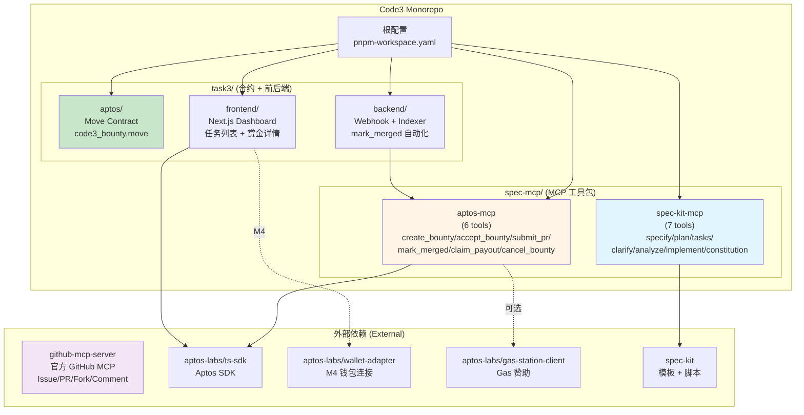
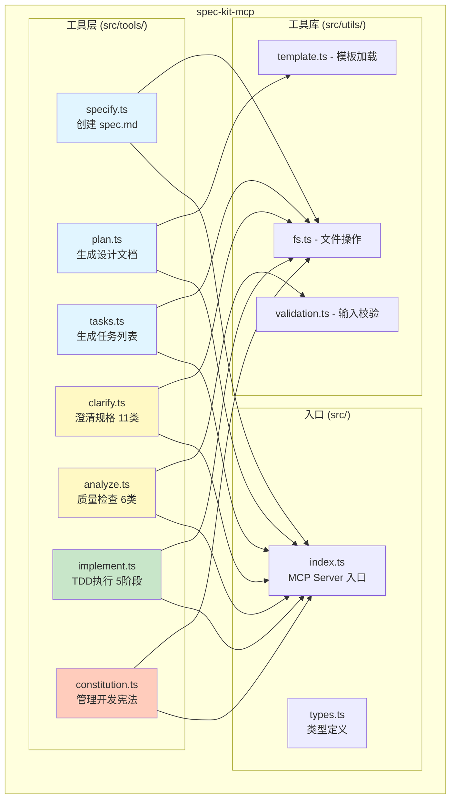
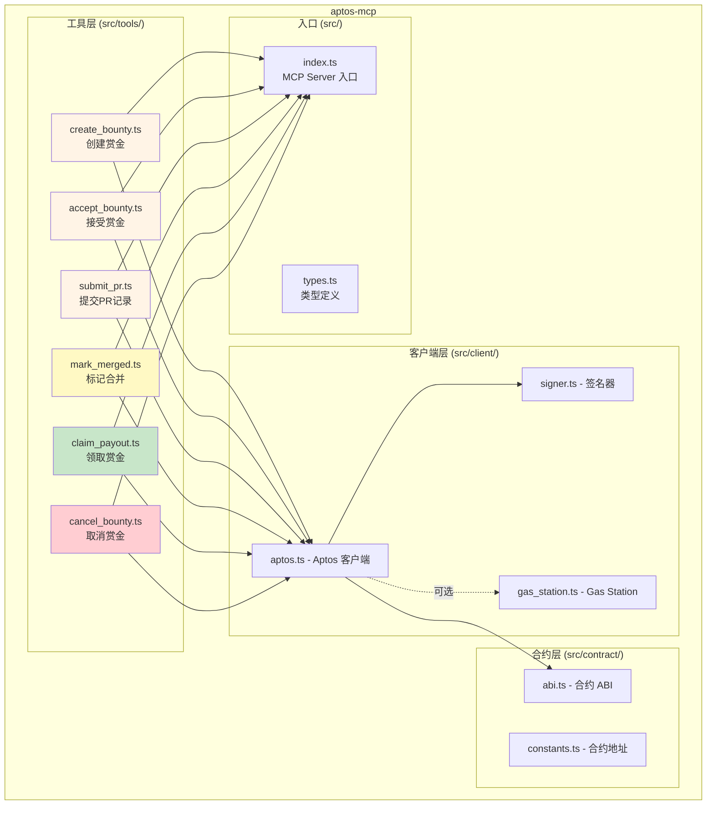
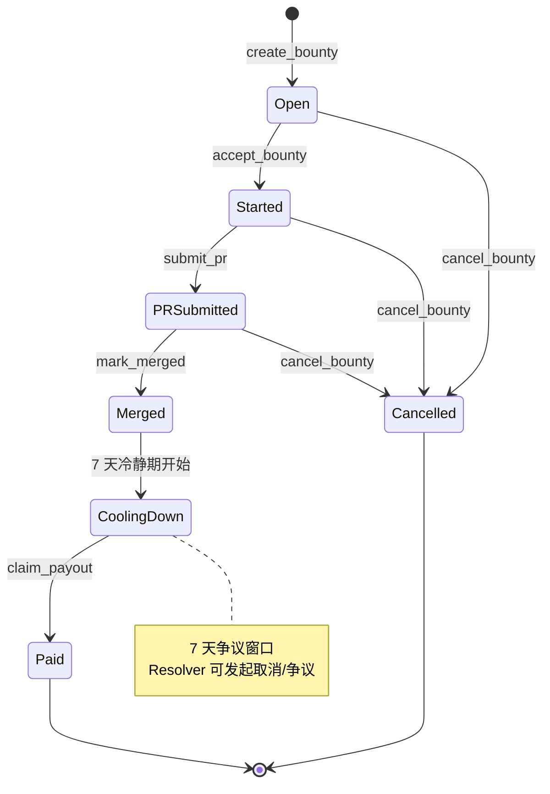
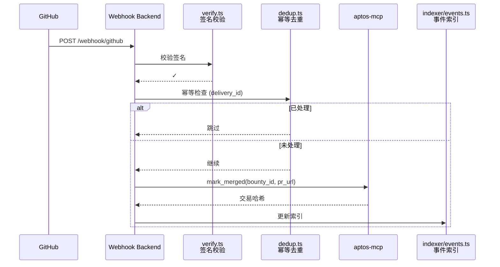
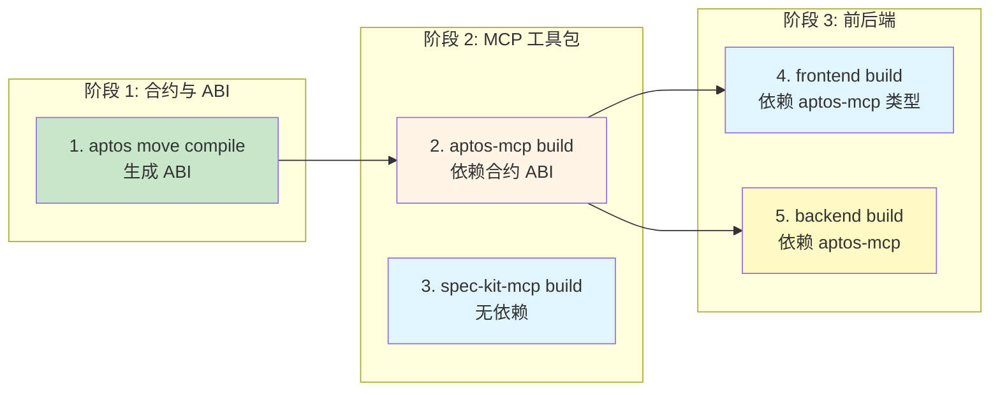

# 03 — 包结构与配置文件

> 本文详细说明 Code3 Monorepo 的包划分、目录结构、配置文件与构建顺序。
> 参考：[TRUTH.md](../../TRUTH.md) ADR-009（三大 MCP 统一架构）

---

## 1. Monorepo 根配置

### 1.1 工作区配置

**文件路径**: [Code3/pnpm-workspace.yaml](../../pnpm-workspace.yaml)

```yaml
packages:
  - 'spec-mcp/*'
  - 'task3/*'
```

### 1.2 根 package.json

**文件路径**: [Code3/package.json](../../package.json)

```json
{
  "name": "@code3/root",
  "version": "0.1.0",
  "private": true,
  "scripts": {
    "dev": "pnpm --parallel --filter './spec-mcp/*' --filter './task3/*' dev",
    "build": "pnpm --filter './spec-mcp/*' --filter './task3/aptos' --filter './task3/frontend' --filter './task3/backend' build",
    "test": "pnpm --parallel --filter './spec-mcp/*' --filter './task3/*' test",
    "lint": "pnpm --parallel --filter './spec-mcp/*' --filter './task3/*' lint",
    "clean": "pnpm --parallel --filter './spec-mcp/*' --filter './task3/*' clean"
  },
  "devDependencies": {
    "@types/node": "^20.0.0",
    "typescript": "^5.3.0",
    "vitest": "^1.0.0",
    "eslint": "^8.56.0",
    "@typescript-eslint/eslint-plugin": "^6.19.0",
    "@typescript-eslint/parser": "^6.19.0"
  },
  "engines": {
    "node": ">=20.0.0",
    "pnpm": ">=8.0.0"
  }
}
```

### 1.3 TypeScript 根配置

**文件路径**: [Code3/tsconfig.json](../../tsconfig.json)

```json
{
  "compilerOptions": {
    "target": "ES2022",
    "module": "ESNext",
    "lib": ["ES2022"],
    "moduleResolution": "bundler",
    "resolveJsonModule": true,
    "allowSyntheticDefaultImports": true,
    "esModuleInterop": true,
    "strict": true,
    "skipLibCheck": true,
    "forceConsistentCasingInFileNames": true,
    "declaration": true,
    "declarationMap": true,
    "sourceMap": true,
    "outDir": "./dist"
  },
  "exclude": ["node_modules", "dist"]
}
```

---

## 2. 包结构总览（Mermaid）



**设计理念**（参考 TRUTH.md ADR-009）:
- **两大 MCP 包**：spec-kit-mcp（工作流）+ aptos-mcp（链上）
- **外部依赖**：github-mcp-server（官方 GitHub MCP）
- **辅助服务**：合约 + Dashboard + Webhook Backend

---

## 3. spec-mcp 包族

### 3.1 spec-kit-mcp（7 个工具）



**包路径**: [Code3/spec-mcp/spec-kit/](../../spec-mcp/spec-kit/)

**目录结构**:
```
spec-kit/
├── src/
│   ├── tools/
│   │   ├── specify.ts          # /specify 工具实现
│   │   ├── plan.ts             # /plan 工具实现
│   │   ├── tasks.ts            # /tasks 工具实现
│   │   ├── clarify.ts          # /clarify 工具实现（11 类检查）
│   │   ├── analyze.ts          # /analyze 工具实现（6 类检测 + Constitution）
│   │   ├── implement.ts        # /implement 工具实现（5 阶段 TDD）
│   │   ├── constitution.ts     # /constitution 工具实现
│   │   └── index.ts            # 工具导出
│   ├── utils/
│   │   ├── fs.ts               # 文件系统工具
│   │   ├── template.ts         # 模板加载
│   │   └── validation.ts       # 输入校验
│   ├── types.ts                # 类型定义
│   └── index.ts                # MCP Server 入口
├── tests/
│   ├── specify.test.ts
│   ├── plan.test.ts
│   ├── tasks.test.ts
│   ├── clarify.test.ts
│   ├── analyze.test.ts
│   └── implement.test.ts
├── package.json
├── tsconfig.json
└── README.md
```

**package.json**:
```json
{
  "name": "@code3/spec-kit-mcp",
  "version": "0.1.0",
  "type": "module",
  "main": "./dist/index.js",
  "types": "./dist/index.d.ts",
  "scripts": {
    "dev": "tsc --watch",
    "build": "tsc",
    "test": "vitest run",
    "test:watch": "vitest",
    "lint": "eslint src/**/*.ts",
    "clean": "rm -rf dist"
  },
  "dependencies": {
    "fs-extra": "^11.2.0",
    "yaml": "^2.3.4",
    "zod": "^3.22.4"
  },
  "devDependencies": {
    "@types/fs-extra": "^11.0.4",
    "typescript": "^5.3.0",
    "vitest": "^1.0.0"
  }
}
```

**tsconfig.json**:
```json
{
  "extends": "../../tsconfig.json",
  "compilerOptions": {
    "outDir": "./dist",
    "rootDir": "./src"
  },
  "include": ["src/**/*.ts"],
  "exclude": ["node_modules", "dist", "tests"]
}
```

### 3.2 aptos-mcp（6 个工具）



**包路径**: [Code3/spec-mcp/aptos/](../../spec-mcp/aptos/)

**目录结构**:
```
aptos/
├── src/
│   ├── tools/
│   │   ├── create_bounty.ts    # 创建赏金
│   │   ├── accept_bounty.ts    # 接受赏金
│   │   ├── submit_pr.ts        # 提交 PR
│   │   ├── mark_merged.ts      # 标记合并
│   │   ├── claim_payout.ts     # 领取赏金
│   │   ├── cancel_bounty.ts    # 取消赏金
│   │   └── index.ts
│   ├── client/
│   │   ├── aptos.ts            # Aptos 客户端封装
│   │   ├── signer.ts           # 签名器（私钥/Wallet Adapter）
│   │   └── gas_station.ts      # Gas Station 集成
│   ├── contract/
│   │   ├── abi.ts              # 合约 ABI（自动生成）
│   │   └── constants.ts        # 合约地址常量
│   ├── types.ts
│   └── index.ts
├── tests/
│   ├── create_bounty.test.ts
│   ├── accept_bounty.test.ts
│   └── mock/
│       └── aptos_mock.ts       # Testnet Mock
├── package.json
├── tsconfig.json
└── README.md
```

**package.json**:
```json
{
  "name": "@code3/aptos-mcp",
  "version": "0.1.0",
  "type": "module",
  "main": "./dist/index.js",
  "types": "./dist/index.d.ts",
  "scripts": {
    "dev": "tsc --watch",
    "build": "tsc",
    "test": "vitest run",
    "lint": "eslint src/**/*.ts",
    "clean": "rm -rf dist",
    "generate:abi": "aptos move compile --save-metadata && node scripts/extract_abi.js"
  },
  "dependencies": {
    "@aptos-labs/ts-sdk": "^1.12.0",
    "@aptos-labs/gas-station-client": "^0.1.0",
    "zod": "^3.22.4"
  },
  "devDependencies": {
    "@aptos-labs/aptos-mcp": "^0.1.0"
  }
}
```

---

## 4. task3 包族

### 4.1 aptos（Move 合约）



**包路径**: [Code3/task3/aptos/](../../task3/aptos/)

**目录结构**:
```
aptos/
├── sources/
│   └── bounty.move             # 赏金合约主文件
├── scripts/
│   ├── deploy_testnet.sh       # Testnet 部署脚本
│   └── deploy_mainnet.sh       # Mainnet 部署脚本（M4）
├── tests/
│   └── bounty_test.move        # Move 单元测试
├── Move.toml                   # Move 项目配置
└── README.md
```

**Move.toml**:
```toml
[package]
name = "code3_bounty"
version = "0.1.0"
upgrade_policy = "compatible"

[addresses]
code3 = "_"

[dependencies]
AptosFramework = { git = "https://github.com/aptos-labs/aptos-core.git", subdir = "aptos-move/framework/aptos-framework", rev = "mainnet" }

[dev-dependencies]
```

**构建命令**:
```bash
# 编译合约
aptos move compile

# 运行测试
aptos move test

# 部署到 Testnet
bash scripts/deploy_testnet.sh

# 生成 ABI（供 TypeScript 使用）
aptos move compile --save-metadata
```

### 4.2 frontend（Next.js Dashboard）

```mermaid
graph TB
    subgraph "Dashboard 页面"
        HOME[app/page.tsx<br/>首页 - 任务列表]
        DETAIL[app/bounty/[id]/page.tsx<br/>赏金详情页]
        API[app/api/events/route.ts<br/>链上事件 API]
    end

    subgraph "组件层"
        BC[components/BountyCard.tsx<br/>赏金卡片]
        BL[components/BountyList.tsx<br/>赏金列表]
        BD[components/BountyDetail.tsx<br/>赏金详情]
        WC[components/WalletConnect.tsx<br/>钱包连接 M4]
        SB[components/StatusBadge.tsx<br/>状态徽标]
    end

    subgraph "数据层"
        LA[lib/aptos.ts<br/>Aptos 客户端]
        LG[lib/github.ts<br/>GitHub 元数据]
        LE[lib/events.ts<br/>事件索引查询]
    end

    HOME --> BL
    BL --> BC
    DETAIL --> BD
    BC --> SB
    BD --> SB

    HOME --> LE
    DETAIL --> LE
    LE --> LA
    LE --> LG

    style HOME fill:#e1f5ff
    style DETAIL fill:#e1f5ff
    style WC fill:#fff9c4
```

**包路径**: [Code3/task3/frontend/](../../task3/frontend/)

**目录结构**:
```
frontend/
├── app/
│   ├── layout.tsx              # 根布局
│   ├── page.tsx                # 首页（任务列表）
│   ├── bounty/
│   │   └── [id]/
│   │       └── page.tsx        # 赏金详情页
│   └── api/
│       └── events/
│           └── route.ts        # 链上事件 API（Server Action）
├── components/
│   ├── BountyCard.tsx          # 赏金卡片
│   ├── BountyList.tsx          # 赏金列表
│   ├── BountyDetail.tsx        # 赏金详情
│   ├── WalletConnect.tsx       # 钱包连接按钮（M4）
│   └── StatusBadge.tsx         # 状态徽标
├── lib/
│   ├── aptos.ts                # Aptos 客户端
│   ├── github.ts               # GitHub 元数据解析
│   └── events.ts               # 事件索引查询
├── public/
│   └── assets/                 # 静态资源
├── styles/
│   └── globals.css             # 全局样式
├── package.json
├── next.config.js
├── tsconfig.json
└── README.md
```

**package.json**:
```json
{
  "name": "@code3/frontend",
  "version": "0.1.0",
  "private": true,
  "scripts": {
    "dev": "next dev",
    "build": "next build",
    "start": "next start",
    "lint": "next lint"
  },
  "dependencies": {
    "next": "^14.1.0",
    "react": "^18.2.0",
    "react-dom": "^18.2.0",
    "@aptos-labs/ts-sdk": "^1.12.0",
    "@aptos-labs/wallet-adapter-react": "^3.0.0",
    "zod": "^3.22.4"
  },
  "devDependencies": {
    "@types/react": "^18.2.0",
    "@types/node": "^20.0.0",
    "typescript": "^5.3.0",
    "eslint": "^8.56.0",
    "eslint-config-next": "^14.1.0"
  }
}
```

**next.config.js**:
```js
/** @type {import('next').NextConfig} */
const nextConfig = {
  reactStrictMode: true,
  env: {
    NEXT_PUBLIC_APTOS_NETWORK: process.env.NEXT_PUBLIC_APTOS_NETWORK || 'testnet',
    NEXT_PUBLIC_APTOS_API_KEY: process.env.NEXT_PUBLIC_APTOS_API_KEY,
  },
}

module.exports = nextConfig
```

### 4.3 backend（Webhook + 索引）



**包路径**: [Code3/task3/backend/](../../task3/backend/)

**目录结构**:
```
backend/
├── src/
│   ├── webhook/
│   │   ├── github.ts           # GitHub Webhook 接收
│   │   ├── verify.ts           # 签名校验
│   │   └── dedup.ts            # 幂等去重
│   ├── indexer/
│   │   ├── events.ts           # 链上事件索引
│   │   ├── store.ts            # 存储层（Redis/SQLite）
│   │   └── query.ts            # 查询接口
│   ├── cron/
│   │   └── check_merged.ts     # 定时补偿检查
│   ├── server.ts               # HTTP Server 入口
│   ├── config.ts               # 配置加载
│   └── index.ts
├── tests/
│   ├── webhook.test.ts
│   └── indexer.test.ts
├── Dockerfile                  # Docker 容器化
├── package.json
├── tsconfig.json
└── README.md
```

**package.json**:
```json
{
  "name": "@code3/backend",
  "version": "0.1.0",
  "type": "module",
  "main": "./dist/index.js",
  "scripts": {
    "dev": "tsx watch src/index.ts",
    "build": "tsc",
    "start": "node dist/index.js",
    "test": "vitest run",
    "lint": "eslint src/**/*.ts",
    "docker:build": "docker build -t code3-backend .",
    "docker:run": "docker run -p 3000:3000 --env-file .env code3-backend"
  },
  "dependencies": {
    "@code3/aptos-mcp": "workspace:*",
    "express": "^4.18.2",
    "redis": "^4.6.12",
    "better-sqlite3": "^9.4.0",
    "node-cron": "^3.0.3",
    "zod": "^3.22.4"
  },
  "devDependencies": {
    "@types/express": "^4.17.21",
    "@types/node-cron": "^3.0.11",
    "tsx": "^4.7.0",
    "typescript": "^5.3.0",
    "vitest": "^1.0.0"
  }
}
```

**Dockerfile**:
```dockerfile
FROM node:20-alpine AS base

# Install dependencies
WORKDIR /app
COPY package.json pnpm-lock.yaml ./
RUN npm install -g pnpm && pnpm install --frozen-lockfile

# Build
COPY . .
RUN pnpm build

# Production
FROM node:20-alpine
WORKDIR /app
COPY --from=base /app/dist ./dist
COPY --from=base /app/node_modules ./node_modules
COPY package.json ./

EXPOSE 3000
CMD ["node", "dist/index.js"]
```

---

## 5. 构建顺序与依赖

### 5.1 编译顺序（Mermaid）



**构建命令**:
```bash
# 1. Aptos 合约（生成 ABI）
cd task3/aptos
aptos move compile --save-metadata

# 2. aptos-mcp（依赖合约 ABI）
cd spec-mcp/aptos
pnpm build

# 3. spec-kit-mcp（无依赖）
cd spec-mcp/spec-kit
pnpm build

# 4. frontend（依赖 aptos-mcp 类型）
cd task3/frontend
pnpm build

# 5. backend（依赖 aptos-mcp）
cd task3/backend
pnpm build
```

### 5.2 一键构建（根目录）

```bash
# 并行构建（自动处理依赖顺序）
pnpm build
```

**pnpm 自动依赖解析**:
- `pnpm` 会根据 `workspace:*` 依赖自动确定构建顺序
- `aptos-mcp` 必须先于 `frontend` 和 `backend` 构建
- `spec-kit-mcp` 可与 `aptos-mcp` 并行构建

---

## 6. 环境变量清单

### 6.1 开发环境 (`.env.local`)

```env
# ===== GitHub =====
GITHUB_TOKEN=ghp_xxxxxxxxxxxxxxxxxxxx
GITHUB_WEBHOOK_SECRET=your_webhook_secret

# ===== Aptos =====
APTOS_NETWORK=testnet
APTOS_API_KEY=your_aptos_api_key

# MVP (M2/M3): 私钥签名
APTOS_PRIVATE_KEY=0x...                    # Worker 私钥
RESOLVER_PRIVATE_KEY=0x...                 # Resolver 私钥（可选）

# M4: Wallet Adapter（前端不需要私钥）
# APTOS_PRIVATE_KEY 不配置

# Gas Station（可选）
APTOS_GAS_STATION_API_KEY=your_gas_station_key

# ===== Backend =====
REDIS_URL=redis://localhost:6379          # 或 sqlite:./data/dedup.db
PORT=3000

# ===== Frontend (Next.js Public Env) =====
NEXT_PUBLIC_APTOS_NETWORK=testnet
NEXT_PUBLIC_APTOS_API_KEY=your_aptos_api_key
```

### 6.2 生产环境（容器 Secret）

**Vercel（Dashboard）**:
- `NEXT_PUBLIC_APTOS_NETWORK`
- `NEXT_PUBLIC_APTOS_API_KEY`

**Railway / Fly.io（Backend）**:
- `GITHUB_WEBHOOK_SECRET`
- `RESOLVER_PRIVATE_KEY`（如启用自动 `mark_merged`）
- `APTOS_API_KEY`
- `REDIS_URL`

---

## 7. 脚本与工具

### 7.1 根目录脚本 ([Code3/scripts/](../../scripts/))

```bash
scripts/
├── setup.sh                    # 初始化开发环境
├── deploy_contracts.sh         # 部署合约（Testnet/Mainnet）
├── generate_abi.sh             # 生成 ABI 并同步到 TypeScript
└── check_env.sh                # 环境变量校验
```

**setup.sh** 示例:
```bash
#!/bin/bash
set -e

echo "🚀 Code3 开发环境初始化"

# 检查 pnpm
if ! command -v pnpm &> /dev/null; then
    echo "❌ pnpm 未安装，请先安装: npm install -g pnpm"
    exit 1
fi

# 安装依赖
echo "📦 安装依赖..."
pnpm install

# 检查环境变量
echo "🔍 检查环境变量..."
bash scripts/check_env.sh

# 构建所有包
echo "🔨 构建所有包..."
pnpm build

echo "✅ 初始化完成！运行 'pnpm dev' 启动开发环境"
```

### 7.2 Git Hooks ([Code3/.husky/](../../.husky/))

```bash
.husky/
├── pre-commit                  # Lint + 类型检查
└── pre-push                    # 单元测试
```

**pre-commit**:
```bash
#!/bin/sh
. "$(dirname "$0")/_/husky.sh"

pnpm lint
pnpm test
```

---

## 8. IDE 配置

### 8.1 VSCode 推荐配置 ([Code3/.vscode/settings.json](../../.vscode/settings.json))

```json
{
  "editor.formatOnSave": true,
  "editor.codeActionsOnSave": {
    "source.fixAll.eslint": true
  },
  "typescript.tsdk": "node_modules/typescript/lib",
  "typescript.enablePromptUseWorkspaceTsdk": true,
  "files.associations": {
    "*.move": "move"
  },
  "[typescript]": {
    "editor.defaultFormatter": "esbenp.prettier-vscode"
  },
  "[json]": {
    "editor.defaultFormatter": "esbenp.prettier-vscode"
  }
}
```

### 8.2 VSCode 推荐扩展 ([Code3/.vscode/extensions.json](../../.vscode/extensions.json))

```json
{
  "recommendations": [
    "dbaeumer.vscode-eslint",
    "esbenp.prettier-vscode",
    "move.move-analyzer",
    "bradlc.vscode-tailwindcss"
  ]
}
```

---

## 9. 包依赖关系（Mermaid）

```mermaid
graph TB
    subgraph "两大 MCP 包"
        SK[spec-kit-mcp]
        AP[aptos-mcp]
    end

    subgraph "辅助服务"
        FE[frontend]
        BE[backend]
        CT[aptos/contract]
    end

    subgraph "外部依赖"
        TPL[spec-kit<br/>templates + scripts]
        SDK[@aptos-labs/ts-sdk]
        GS[@aptos-labs/gas-station-client]
        WA[@aptos-labs/wallet-adapter]
        GHM[github-mcp-server<br/>官方 GitHub MCP]
    end

    SK --> TPL
    AP --> SDK
    AP -.->|可选| GS

    FE --> SDK
    FE -.->|M4| WA
    FE -.->|读取| CT

    BE --> AP
    BE -.->|Webhook 触发| AP

    style SK fill:#e1f5ff
    style AP fill:#fff4e6
    style GHM fill:#f3e5f5
    style CT fill:#c8e6c9
```

**依赖说明**:
- `spec-kit-mcp` → 复用 spec-kit 模板与脚本（无运行时依赖）
- `aptos-mcp` → 依赖 `@aptos-labs/ts-sdk`（运行时依赖）
- `frontend` → 依赖 `@aptos-labs/ts-sdk`（读取链上数据）
- `backend` → 依赖 `aptos-mcp`（workspace 内部依赖）
- 所有角色 → 使用 `github-mcp-server`（外部 MCP，通过 MCP 协议调用）

---

## 10. 参考

- 系统架构：[02-architecture.md](./02-architecture.md)
- 快速开始：[04-quickstart.md](./04-quickstart.md)
- 数据模型：[05-data-model.md](./05-data-model.md)
- MCP 工具契约：[06-interfaces.md](./06-interfaces.md)
- TRUTH.md ADR-009：[../../TRUTH.md](../../TRUTH.md)
