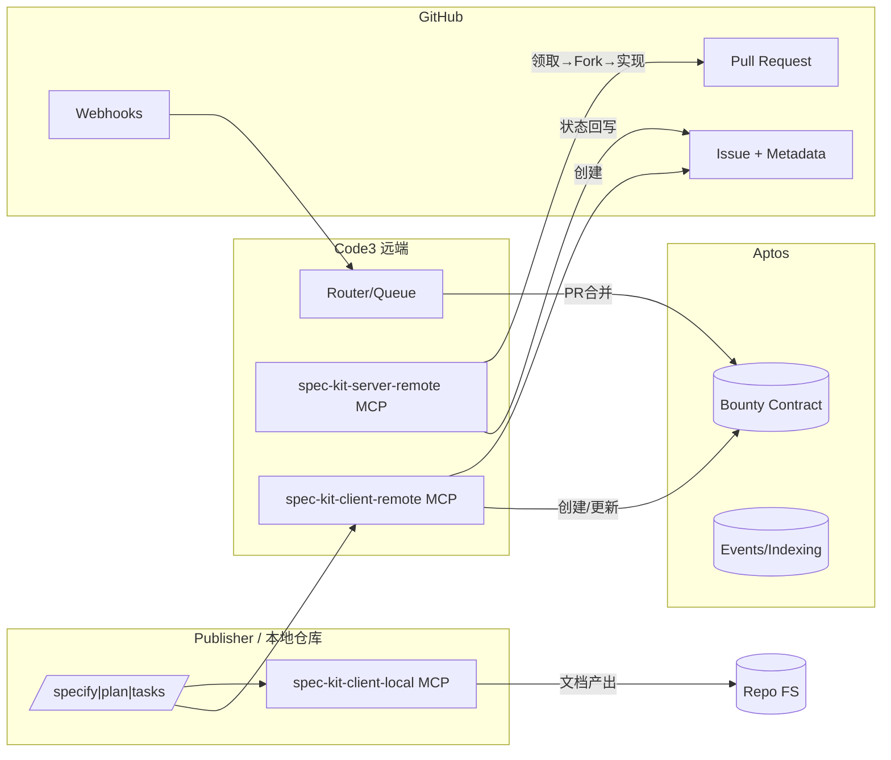
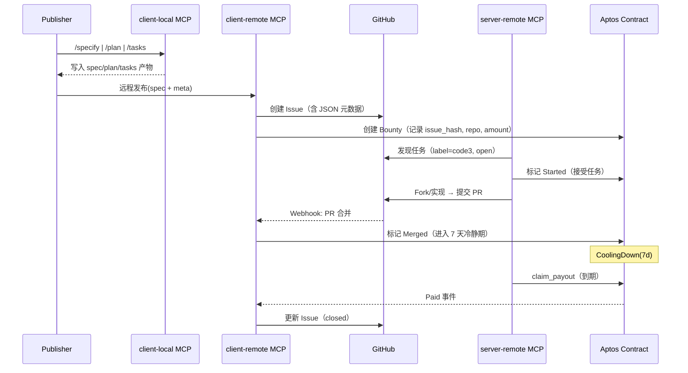

# Architect v1 — Spec-MCP（spec-kit 的 MCP 化）

## 1. 技术栈选择

| 层级 | 主选技术 | 选择理由 | 备注 |
| --- | --- | --- | --- |
| CLI/本地 | Node.js + TypeScript + 文件系统 | 与现有 spec-kit 接口兼容，易落盘/回写 | 统一 ESM, Node 20+ |
| MCP 服务（Client/Server） | TypeScript + MCP 协议 | 统一工具面与远程编排 | 与 IDE/代理框架兼容 |
| 远程任务发布 | GitHub MCP Server（github-mcp-server） | 统一通过 MCP 执行 Issue/PR/Fork/评论 | Issue/PR/Webhook |
| 赏金与状态 | Aptos（Move 合约） | 低成本高吞吐，资源模型明确 | 详见 task3 |
| 身份与密钥 | 环境变量 + Provider | 最小权限/最小暴露 | 不落盘秘钥 |

## 2. 总体架构



## 3. 模块职责

- spec-kit-client-local MCP
  - 暴露工具：`/specify`、`/plan`、`/tasks`
  - 入参：feature 标识、上下文（可选）
  - 产物：`specs/<feature>/spec.md`、研究/模型/契约/快速验证、`tasks.md`
- spec-kit-client-remote MCP
  - 将 Spec/Plan/Tasks 交由远端生成（或仅发布现有产物）
  - 在 GitHub 创建 Issue，并写入机器可读元数据（经 github-mcp-server）
  - 创建 Aptos 赏金并将 `bounty_id` 回写 Issue 元数据
- spec-kit-server-remote MCP
  - 轮询/订阅任务：按标签/状态选择可接单项
  - Fork→拉取→生成/补全文档→按 `tasks.md` 执行→提交 PR（经 github-mcp-server）
  - 同步状态：Issue 评论与标签（镜像）；合约状态迁移（Started/Submitted/Merged/CoolingDown/ Paid）
  - 自动接单：`accept_best_task(criteria)` 依据金额/预估投入挑选任务
- Router/Queue
  - 任务分发策略、速率限制、失败重试
  - 消费 Webhook：PR 合并→调用合约释放赏金

## 4. 元数据规范（Issue 正文中的 JSON 代码块）

```json
{
  "schema": "code3/v1",
  "repo": "https://github.com/org/repo",
  "issue_number": 123,
  "issue_hash": "sha256(body)",
  "feature_id": "spec-mcp-integration",
  "bounty": {
    "network": "testnet",
    "asset": "USDT",
    "amount": "1",
    "bounty_id": null,
    "merged_at": null,
    "cooling_until": null
  },
  "spec_refs": [
    "specs/spec-mcp/spec.md"
  ],
  "labels": ["code3", "open"]
}
```

- 由 client-remote 生成与维护；server-remote 读取并回写 `bounty.bounty_id`、状态 label。

## 5. 核心流程（顺序图）



## 6. 安全与合规
- 秘钥最小化：不落盘，使用环境变量与 Secret 管理；优先前端钱包签名。
- 接单者自动化：允许本机 `APTOS_PRIVATE_KEY` 注入，用于 `accept_bounty` / `submit_pr` / `claim_payout`。
- Resolver 自动化（可选）：`RESOLVER_PRIVATE_KEY` 仅在启用“Webhook 自动 mark_merged”时配置。
- 授权最小化：GitHub 仅限 Issue/PR 与 Webhook 所需权限；Aptos 使用全节点 API Key 与 Gas Station（可选）。
- 数据可追溯：Issue 留痕 + 合约事件；必要时导出审计日志。

## 7. 部署与运行
- Local（开发者机器）：client-local MCP + CLI
- Remote（服务端）：client-remote MCP + server-remote MCP + Router（容器化）
- GitHub：配置 Webhook（PR 合并/关闭）指向 Remote Router
- Aptos：部署到 testnet；Dashboard 与后端在 task3 中提供

## 8. 迭代提示
- 先打通最小闭环（单 Issue、单接单者、单 PR 结算）
- 逐步扩展：并发接单、里程碑支付、申诉/争议流程、信誉分与风控
