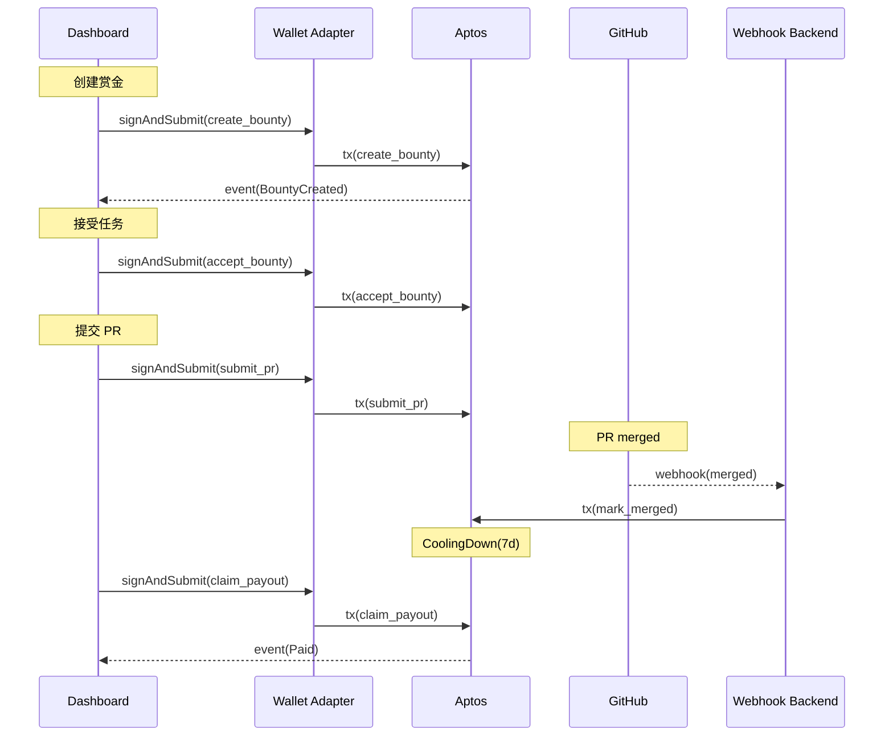

# Architect v1 — Code3 Bounty（Aptos 合约 + Dashboard + 后端）

## 1. 技术栈选择

| 层级 | 主选技术 | 选择理由 | 备注 |
| --- | --- | --- | --- |
| 合约 | Move (Aptos) | 资源模型清晰，事件友好 | testnet 起步 |
| 前端 | Next.js + TypeScript | 快速实现 Dashboard | App Router |
| 钱包 | `@aptos-labs/wallet-adapter-react` | 官方适配，统一多钱包接口 | MCP 资源指导 |
| SDK | `@aptos-labs/ts-sdk` | 交易/查询与等待 | APTOS_API_KEY 注入 |
| Gas | `@aptos-labs/gas-station-client` | 赞助交易（可选） | 体验更佳 |
| 后端 | Node.js + Webhook | 监听 GitHub PR 合并/关闭 | 触发合约状态迁移 |
| 存储 | 轻量 KV/JSON | 仅做外链映射缓存 | 可无状态化 |

## 2. 合约设计（简化）

模块：`code3_bounty`（示意）
- 结构体：
  - `Bounty { id, sponsor, winner, repo_url, issue_hash, pr_url, asset, amount, status, merged_at, cooling_until }`
- 事件：
  - `BountyCreated`, `BountyAccepted`, `PRSubmitted`, `Merged`, `CoolingDown`, `Paid`, `Cancelled`
- 公共函数：
  - `create_bounty(repo_url, issue_hash, asset, amount)` -> `bounty_id`
  - `accept_bounty(bounty_id)`（允许多接单登记）
  - `submit_pr(bounty_id, pr_url)`
  - `mark_merged(bounty_id, pr_url)`（记录首个合并 PR 的接单者为 `winner`，写入 `merged_at/cooling_until`）
  - `claim_payout(bounty_id)`（仅 `winner` 在冷静期后可领款）
  - `cancel_bounty(bounty_id)`
- 约束：
  - `accept_bounty` 只能在 `Open`；`submit_pr` 需要 `worker==signer`；`mark_merged` 由 `resolver`（后端持有）或 Sponsor 调用；`claim_payout` 需满足时间窗口且 `signer==winner`；`cancel` 限定状态。

资产：统一 USDT（测试网）；余额查询/转账参考 aptos MCP 资料（FA 标准、已知资产地址、交易调用）。

## 3. 前端架构

- Provider：
  - `AptosWalletAdapterProvider` 注入 `network` 与 `APTOS_API_KEY`（参考 MCP 文档“全节点 API Key 配置”）。
  - 可选注入 `transactionSubmitter`（Gas Station）。
- Hooks：
  - `useWallet()`：`account`、`signAndSubmitTransaction`、`connected`。
  - SDK 客户端：`new Aptos(new AptosConfig({ network, clientConfig: { API_KEY } }))`。
- 页面：
  - 列表：查询所有赏金（事件/索引器）。
  - 详情：显示状态、按钮（创建/接受/提交/领取/取消）。

## 4. 后端架构

- 接口：GitHub Webhook（PR merged/closed）
  - 合法性：GitHub Secret 校验签名。
  - 路由：定位 `bounty_id`（由 Issue 元数据/PR body 附件反查）。
  - 动作：合并→`mark_merged`；关闭未合并→`cancel_bounty`（可选策略）。
- 运行：无状态/容器化；通过环境变量注入 Aptos 网络与密钥。

## 5. 时序与交互

## 6. MCP 资源绑定（实现时遵循）
- 钱包连接：`@aptos-labs/wallet-adapter-react` 示例（MCP 文档“如何接入钱包连接”）。
- 交易签名：`useWallet().signAndSubmitTransaction`（MCP 文档“如何签名与提交交易”）。
- Gas Station：创建 `GasStationTransactionSubmitter` 并注入 Provider（MCP 文档“如何配置 Gas Station”）。
- Fungible Asset：余额/转账与已知资产地址（MCP 文档“集成同质化资产标准”）。
- Full Node API Key：注入 Provider 与 SDK（MCP 文档“配置全节点 API Key”）。

## 7. 安全与运维
- 环境变量：`APTOS_API_KEY`、`APTOS_GAS_STATION_API_KEY`（可选）、`GITHUB_WEBHOOK_SECRET`。
- 访问控制与密钥：优先前端钱包签名；接单者可在本机注入 `APTOS_PRIVATE_KEY` 自动化；`mark_merged` 仅允许特定 `resolver` 账户调用（后端托管或 Sponsor），`RESOLVER_PRIVATE_KEY` 仅在启用时配置。
- 监控：记录失败交易与重试；Webhook 去重与幂等键。

## 8. 迭代与扩展
- 里程碑式支付（多次合并/阶段验收）。
- 多接单者与指派逻辑；信誉分与质押。
- 争议期与仲裁角色；多签金库。
