# @code3-team/spec-kit-mcp

> Pure MCP + LLM feature specification tool
> **7 MCP Prompts + 4 MCP Tools** for guided spec-driven development

---

## Installation & Configuration

### Option 1: Quick Start with npx (Recommended)

Add to your Claude Code `.mcp.json`:

```json
{
  "mcpServers": {
    "spec-kit": {
      "command": "npx",
      "args": ["-y", "@code3-team/spec-kit-mcp"]
    }
  }
}
```

**Verify Installation**:
1. Restart Claude Code
2. Check that spec-kit-mcp prompts appear in the Prompts list
3. Check that spec-kit-mcp tools appear in the Tools list

### Option 2: Local Development

```bash
# 1. Clone repository
git clone https://github.com/cyl19970726/Code3-Workspace.git
cd Code3-Workspace/spec-mcp/spec-kit-mcp

# 2. Install dependencies
npm install

# 3. Build
npm run build

# 4. Link locally
npm link

# 5. Add to .mcp.json
{
  "mcpServers": {
    "spec-kit": {
      "command": "spec-kit-mcp"
    }
  }
}
```

### Verify Setup

After configuration, verify that spec-kit-mcp is working:

```bash
# In your project directory
ls -la .mcp.json  # Should exist with spec-kit configuration

# In Claude Code, you should see:
# - Prompts: specify, clarify, plan, tasks, analyze, implement, constitution
# - Tools: init, spec-context, plan-context, tasks-context
```

---

## Quick Start Guide

### 1. Initialize Your Project

```bash
# Create project directory
mkdir my-awesome-project
cd my-awesome-project

# Initialize Git (required)
git init
touch README.md
git add .
git commit -m "Initial commit"
```

### 2. Start Creating Specs

In Claude Code:

```
User: "Create spec for a daily todo management tool"

Claude: [Calls init tool to create .specify/ structure]
Claude: [Calls specify Prompt with your description]
Claude: [Generates comprehensive spec.md with 15 requirements]
Claude: [Calls clarify Prompt to ask 5 clarification questions]
Claude: [Calls plan Prompt to generate technical design]
Claude: [Calls tasks Prompt to break down into 40+ tasks]
Claude: [Calls analyze Prompt to detect quality issues]
```

### 3. Your spec-kit workflow is ready!

```
.specify/
├── scripts/bash/       # 4 automation scripts
├── templates/          # 3 document templates
└── memory/
    └── constitution.md # Your project principles

specs/001-todo/
├── spec.md            # Feature specification
├── plan.md            # Technical design
└── tasks.md           # Implementation tasks
```

---

# Complete Workflow Guide

## Overview

spec-kit-mcp is a Pure MCP + LLM architecture tool that uses **7 MCP Prompts** and **4 MCP Tools**
to guide you through feature specification and implementation.

**CRITICAL**: You must call MCP Prompts at each stage. DO NOT manually generate content using
Write/Bash tools - the Prompts provide the instructions you need to execute correctly.

## Architecture: Pure MCP + LLM

**How it works**:
1. MCP Server provides **Prompts** (instructions) and **Tools** (operations)
2. LLM (you) calls a **Prompt** to receive instructions
3. LLM executes the instructions using Bash/Write/Read tools
4. LLM calls **Tools** to verify results
5. MCP Server does NOT call LLM - you are in full control

**Why Prompts are critical**:
- Prompts provide standardized, high-quality instructions
- Prompts ensure consistent output quality (8k-12k chars, 12-20 requirements, etc.)
- Prompts guide you on what to generate, how to structure it, and what to validate
- Manually skipping Prompts results in low-quality output

## Workflow Diagram

```mermaid
flowchart TD
    Start([User: Create spec for X]) --> Stage0[Stage 0: Initialization]

    Stage0 --> Init[Call init tool]
    Init --> InitVerify[Verify: ls -R .specify/]
    InitVerify --> Stage1

    Stage1[Stage 1: Specification] --> SpecifyPrompt[Call specify Prompt<br/>args: featureDescription]
    SpecifyPrompt --> SpecifyReceive[Receive Prompt instructions]
    SpecifyReceive --> SpecifyExec[Execute instructions:<br/>1. Run create-new-feature.sh<br/>2. Read spec-template.md<br/>3. Generate spec.md]
    SpecifyExec --> SpecifyVerify[Call spec-context tool]
    SpecifyVerify --> SpecValid{Valid?<br/>8k+ chars<br/>12-20 reqs}
    SpecValid -->|No| SpecifyExec
    SpecValid -->|Yes| Stage2

    Stage2[Stage 2: Clarification] --> ClarifyPrompt[Call clarify Prompt<br/>args: specPath]
    ClarifyPrompt --> ClarifyReceive[Receive Prompt instructions]
    ClarifyReceive --> ClarifyExec[Execute instructions:<br/>1. Run check-prerequisites.sh<br/>2. Scan 11 ambiguity types<br/>3. Generate 5 questions<br/>4. Ask user interactively<br/>5. Update spec.md]
    ClarifyExec --> ClarifyVerify[Call spec-context tool]
    ClarifyVerify --> ClarValid{Clarifications<br/>section exists?}
    ClarValid -->|No| ClarifyExec
    ClarValid -->|Yes| Stage3

    Stage3[Stage 3: Planning] --> PlanPrompt[Call plan Prompt<br/>args: specPath]
    PlanPrompt --> PlanReceive[Receive Prompt instructions]
    PlanReceive --> PlanExec[Execute instructions:<br/>1. Run setup-plan.sh<br/>2. Read spec.md + constitution.md<br/>3. Generate plan.md]
    PlanExec --> PlanVerify[Call plan-context tool]
    PlanVerify --> PlanValid{Valid?<br/>Tech stack<br/>Data model<br/>5 phases}
    PlanValid -->|No| PlanExec
    PlanValid -->|Yes| Stage4

    Stage4[Stage 4: Tasks] --> TasksPrompt[Call tasks Prompt<br/>args: planPath]
    TasksPrompt --> TasksReceive[Receive Prompt instructions]
    TasksReceive --> TasksExec[Execute instructions:<br/>1. Read plan.md + tasks-template.md<br/>2. Generate tasks.md]
    TasksExec --> TasksVerify[Call tasks-context tool]
    TasksVerify --> TasksValid{Valid?<br/>20+ tasks<br/>5 phases}
    TasksValid -->|No| TasksExec
    TasksValid -->|Yes| Stage5

    Stage5[Stage 5: Quality Analysis] --> AnalyzePrompt[Call analyze Prompt<br/>args: specPath, planPath, tasksPath]
    AnalyzePrompt --> AnalyzeReceive[Receive Prompt instructions]
    AnalyzeReceive --> AnalyzeExec[Execute instructions:<br/>1. Read all docs + constitution.md<br/>2. Perform 6 quality checks<br/>3. Generate report<br/>4. Ask user to approve fixes<br/>5. Apply fixes if approved]
    AnalyzeExec --> AnalyzeReport[Present report to user]
    AnalyzeReport --> AnalyzeFix{User approves<br/>fixes?}
    AnalyzeFix -->|Yes| AnalyzeApply[Apply fixes]
    AnalyzeFix -->|No| Stage6
    AnalyzeApply --> Stage6

    Stage6[Stage 6: Implementation] --> ImplPrompt[Call implement Prompt<br/>args: tasksPath]
    ImplPrompt --> ImplReceive[Receive Prompt instructions]
    ImplReceive --> ImplExec[Execute instructions:<br/>1. Read tasks.md<br/>2. For each task: TDD cycle<br/>3. Update tasks.md progress]
    ImplExec --> ImplMore{More tasks?}
    ImplMore -->|Yes| ImplExec
    ImplMore -->|No| End([Complete])

    style Start fill:#e1f5e1
    style End fill:#e1f5e1
    style SpecValid fill:#ffe6e6
    style ClarValid fill:#ffe6e6
    style PlanValid fill:#ffe6e6
    style TasksValid fill:#ffe6e6
    style AnalyzeFix fill:#fff4e6
    style ImplMore fill:#fff4e6
```



---

## 7 MCP Prompts (⭐ Core Components)

### 1. specify Prompt
**Purpose**: Generate comprehensive feature specification from user description

**When to call**: Stage 1

**Arguments**:
- `featureDescription`: User's requirement (supports Chinese)

**What it does**:
1. Returns Prompt instructions (PromptMessage[])
2. Instructions tell you to:
   - Run `create-new-feature.sh --json "description"`
   - Read `.specify/templates/spec-template.md`
   - Generate `specs/{id}/spec.md` with:
     - 12-20 detailed requirements (60-100 words each)
     - 4-6 entities with 7-10 attributes
     - 3-5 Given-When-Then scenarios
     - 8+ step execution flow
     - 8,000-12,000 characters total

**Validation**: Call `spec-context` tool to verify

**Example**:
```
Call specify Prompt with:
  featureDescription: "每日 todo 工具，支持添加/编辑/删除任务、标记完成、按日期分组、持久化存储"

Receive instructions → Execute → Generate spec.md → Call spec-context tool
```

---

### 2. clarify Prompt
**Purpose**: Identify ambiguities through interactive Q&A and update spec

**When to call**: Stage 2 (after specify)

**Arguments**:
- `specPath`: Path to spec.md

**What it does**:
1. Returns Prompt instructions
2. Instructions tell you to:
   - Run `check-prerequisites.sh --json --paths-only`
   - Read spec.md
   - Scan for 11 types of ambiguities (performance, storage, UI/UX, error handling, etc.)
   - Generate max 5 high-priority questions
   - Ask user interactively (multiple choice format)
   - Update spec.md with answers in Clarifications section

**Validation**: Call `spec-context` tool to verify Clarifications section exists

**Example**:
```
Call clarify Prompt with:
  specPath: "specs/001-todo/spec.md"

Receive instructions → Scan ambiguities → Ask Q1-Q5 → Update spec.md
```

---

### 3. plan Prompt
**Purpose**: Generate technical design with architecture, data model, and phases

**When to call**: Stage 3 (after clarify)

**Arguments**:
- `specPath`: Path to spec.md

**What it does**:
1. Returns Prompt instructions
2. Instructions tell you to:
   - Run `setup-plan.sh --json`
   - Call `spec-context` tool to read spec.md
   - Read `.specify/memory/constitution.md`
   - Read `.specify/templates/plan-template.md`
   - Generate `specs/{id}/plan.md` with:
     - Technical stack selection (with rationale)
     - Architecture design
     - Data model (TypeScript interfaces)
     - API/Interface design
     - 5 implementation phases

**Validation**: Call `plan-context` tool to verify

**Example**:
```
Call plan Prompt with:
  specPath: "specs/001-todo/spec.md"

Receive instructions → Read contexts → Generate plan.md → Call plan-context tool
```

---

### 4. tasks Prompt
**Purpose**: Break down plan into atomic, executable tasks

**When to call**: Stage 4 (after plan)

**Arguments**:
- `planPath`: Path to plan.md

**What it does**:
1. Returns Prompt instructions
2. Instructions tell you to:
   - Run `check-prerequisites.sh --json`
   - Call `plan-context` tool to read plan.md
   - Read `.specify/templates/tasks-template.md`
   - Generate `specs/{id}/tasks.md` with:
     - 20+ tasks grouped by 5 phases
     - Each task: clear goal, dependencies, acceptance criteria
     - File paths for each task
     - Time estimates

**Validation**: Call `tasks-context` tool to verify

**Example**:
```
Call tasks Prompt with:
  planPath: "specs/001-todo/plan.md"

Receive instructions → Read plan → Generate tasks.md → Call tasks-context tool
```

---

### 5. analyze Prompt
**Purpose**: Detect quality issues and provide fixes

**When to call**: Stage 5 (after tasks, optional but recommended)

**Arguments**:
- `specPath`: Path to spec.md
- `planPath`: Path to plan.md
- `tasksPath`: Path to tasks.md

**What it does**:
1. Returns Prompt instructions
2. Instructions tell you to:
   - Run `check-prerequisites.sh --json --require-tasks --include-tasks`
   - Call `spec-context`, `plan-context`, `tasks-context` tools
   - Read `.specify/memory/constitution.md`
   - Perform 6 types of quality checks:
     - A. Duplication detection
     - B. Ambiguity detection
     - C. Underspecification
     - D. Constitution alignment
     - E. Coverage gaps (requirements without tasks)
     - F. Inconsistency
   - Generate analysis report
   - Ask user if they want fixes
   - Apply fixes if approved

**Example**:
```
Call analyze Prompt with:
  specPath: "specs/001-todo/spec.md"
  planPath: "specs/001-todo/plan.md"
  tasksPath: "specs/001-todo/tasks.md"

Receive instructions → Read all docs → Detect issues → Present report → Apply fixes
```

---

### 6. implement Prompt
**Purpose**: Execute tasks using TDD cycle

**When to call**: Stage 6 (after analyze, optional)

**Arguments**:
- `tasksPath`: Path to tasks.md

**What it does**:
1. Returns Prompt instructions
2. Instructions tell you to:
   - Call `tasks-context` tool to read tasks.md
   - For each task in order:
     - Red: Write failing test
     - Green: Implement minimum code to pass
     - Refactor: Clean up while keeping tests green
     - Commit: Clear message linking to task ID
   - Update tasks.md checkboxes as tasks complete

**Example**:
```
Call implement Prompt with:
  tasksPath: "specs/001-todo/tasks.md"

Receive instructions → Read tasks → TDD cycle (Red/Green/Refactor/Commit)
```

---

### 7. constitution Prompt
**Purpose**: Update project constitution (design principles)

**When to call**: When user explicitly requests constitution changes

**Arguments**: (varies)

**What it does**: Manages `.specify/memory/constitution.md` updates

---

## 4 MCP Tools (Verification)

### 1. init Tool
**Purpose**: Create .specify/ directory structure

**When to call**: Stage 0 (once per project)

**Arguments**:
- `projectPath`: Path to project root

**What it returns**: List of created files (4 scripts, 3 templates, 1 constitution)

**Example**:
```
Call init tool with:
  projectPath: "/path/to/project"

Returns: { success: true, created: [".specify/scripts/...", ...] }
```

---

### 2. spec-context Tool
**Purpose**: Read and parse spec.md

**When to call**: After generating/updating spec.md

**Arguments**:
- `specPath`: Path to spec.md

**What it returns**:
- `path`: spec.md path
- `content`: Full spec.md content
- `sections`: Parsed sections (overview, clarifications, requirements, entities, scenarios)
- `metadata`: Feature branch, character count, etc.

**Example**:
```
Call spec-context tool with:
  specPath: "specs/001-todo/spec.md"

Returns: { path, content, sections: { requirements: [...], entities: [...] }, metadata }
```

---

### 3. plan-context Tool
**Purpose**: Read and parse plan.md

**When to call**: After generating/updating plan.md

**Arguments**:
- `planPath`: Path to plan.md

**What it returns**:
- `path`: plan.md path
- `content`: Full plan.md content
- `sections`: Parsed sections (dataModel, technicalContext, progressTracking)

**Example**:
```
Call plan-context tool with:
  planPath: "specs/001-todo/plan.md"

Returns: { path, content, sections: { dataModel, technicalContext, progressTracking } }
```

---

### 4. tasks-context Tool
**Purpose**: Read and parse tasks.md

**When to call**: After generating/updating tasks.md

**Arguments**:
- `tasksPath`: Path to tasks.md

**What it returns**:
- `path`: tasks.md path
- `content`: Full tasks.md content
- `tasks`: Parsed task list (array)
- `phases`: Tasks grouped by phase (object)

**Example**:
```
Call tasks-context tool with:
  tasksPath: "specs/001-todo/tasks.md"

Returns: { path, content, tasks: [...], phases: { setup: [...], tests: [...], ... } }
```

---

## Common Pitfalls and How to Avoid Them

### ❌ Pitfall 1: Skipping Prompts

**Wrong**:
```
User: "Create spec for todo app"
LLM: [Directly writes spec.md using Write tool]
```

**Correct**:
```
User: "Create spec for todo app"
LLM: [Calls specify Prompt]
LLM: [Receives instructions]
LLM: [Executes instructions to generate spec.md]
```

**Why**: Prompts provide standardized instructions that ensure high-quality output.

---

### ❌ Pitfall 2: Manually Generating Content

**Wrong**:
```
LLM: I'll generate spec.md with Write tool
[Writes spec.md directly without calling specify Prompt]
```

**Correct**:
```
LLM: I'll call specify Prompt to get instructions
[Calls specify Prompt → Receives instructions → Executes instructions]
```

**Why**: Manual generation bypasses quality standards (8k-12k chars, 12-20 requirements, etc.).

---

### ❌ Pitfall 3: Skipping Clarify Stage

**Wrong**:
```
Stage 1: specify → Stage 3: plan [SKIP Stage 2: clarify]
```

**Correct**:
```
Stage 1: specify → Stage 2: clarify → Stage 3: plan
```

**Why**: Clarify identifies ambiguities through interactive Q&A, improving spec quality.

---

### ❌ Pitfall 4: Skipping Analyze Stage

**Wrong**:
```
Stage 4: tasks → Stage 6: implement [SKIP Stage 5: analyze]
```

**Correct**:
```
Stage 4: tasks → Stage 5: analyze → Stage 6: implement
```

**Why**: Analyze detects quality issues (duplication, ambiguity, coverage gaps, inconsistency).

---

### ❌ Pitfall 5: Not Validating with Tools

**Wrong**:
```
[Generates spec.md]
LLM: "Done!"
[Does not call spec-context tool]
```

**Correct**:
```
[Generates spec.md]
[Calls spec-context tool]
[Verifies: character count >= 8k, requirements: 12-20]
LLM: "Done! spec.md validated."
```

**Why**: Tools provide automated validation against quality standards.

---

## Quality Standards

### spec.md
- ✅ Character count: 8,000-12,000
- ✅ Requirements: 12-20 (FR-001 to FR-020)
- ✅ Entities: 4-6 with 7-10 attributes each
- ✅ Given-When-Then scenarios: 3-5
- ✅ Execution flow: 8+ steps
- ✅ Clarifications section (after clarify stage)

### plan.md
- ✅ Technical decisions: 7 (Framework, Build Tool, Styling, State, Persistence, Testing, Libraries)
- ✅ Each decision: rationale + alternatives considered
- ✅ Data model: TypeScript interfaces with comments
- ✅ Interface design: API contracts for all components
- ✅ Implementation phases: 5 (Phase 0-4)

### tasks.md
- ✅ Total tasks: 20+ (typically 40-50)
- ✅ Phases: 5 (Setup, Tests, Core, Integration, Polish)
- ✅ Each task: ID, description, file paths, dependencies, acceptance criteria, time estimate
- ✅ TDD ordering: Tests phase before Core phase

---

## File Structure

```
project-root/
├── .specify/
│   ├── scripts/bash/
│   │   ├── create-new-feature.sh    # Creates feature branch and spec file
│   │   ├── setup-plan.sh            # Creates plan file
│   │   ├── check-prerequisites.sh   # Validates environment
│   │   └── common.sh                # Shared utilities
│   ├── templates/
│   │   ├── spec-template.md         # Specification template
│   │   ├── plan-template.md         # Planning template
│   │   └── tasks-template.md        # Tasks template
│   └── memory/
│       └── constitution.md          # Project design principles
└── specs/
    └── {feature-id}/
        ├── spec.md                  # Feature specification
        ├── plan.md                  # Technical design
        └── tasks.md                 # Implementation tasks
```

---

## Documentation

- **[Core Architecture](./docs/core.md)**: Pure MCP + LLM architecture explained
- **[Development Guide](./docs/core.md#4-完整开发流程指南实践)**: Stage-by-stage execution guide
- **[Guide Tool Plan](./docs/guide-tool-plan.md)**: Implementation plan for workflow guide tool

---

## Contributing

Contributions welcome! Please read the [Development Guidelines](https://github.com/cyl19970726/Code3-Workspace/blob/main/CLAUDE.md).

## License

MIT

---

**Version**: 0.2.0
**Created**: 2025-10-03
**Updated**: 2025-10-06
