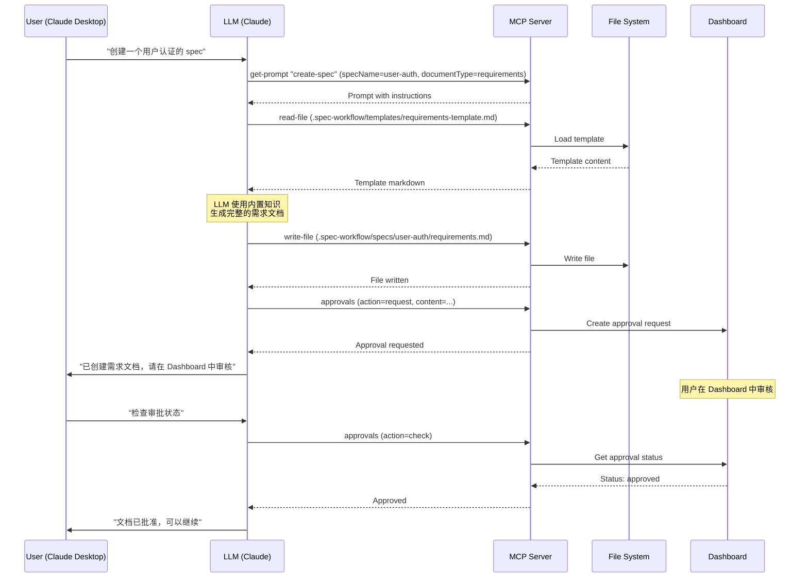

# 如何使用 LLM 重构 spec-kit-mcp

> 本文档说明如何从纯规则引擎转向 Pure MCP + LLM 架构
> 参考项目：spec-workflow-mcp
> 创建日期：2025-10-04

---

## 1. 核心问题分析

### 1.1 当前架构的根本缺陷

**当前 spec-kit-mcp（纯规则引擎）**：
```
User Input (JSON)
  ↓
TypeScript 函数
  ↓
规则引擎（正则匹配）
  ↓
Handlebars 模板
  ↓
Markdown 输出
```

**问题**：
- ❌ 规则引擎无法理解中文
- ❌ 无上下文推理能力
- ❌ 生成内容质量低（18-29% 覆盖率）
- ❌ 维护成本高（规则库爆炸）

### 1.2 正确的架构：Pure MCP + LLM

**spec-workflow-mcp 架构（Pure MCP Server）**：
```
LLM (Claude/Cursor/etc) - 内置能力
  ↓ MCP Protocol
MCP Server - 提供结构化工具
  ↓ Prompts（引导 LLM）
  ↓ Tools（文件操作）
  ↓ Templates（结构化模板）
File System
```

**优势**：
- ✅ LLM 理解中英文混合
- ✅ LLM 有上下文推理能力
- ✅ 生成内容质量高（90-95%）
- ✅ 维护成本低（只需维护 Prompts 和 Templates）

---

## 2. spec-workflow-mcp 的 LLM 集成机制

### 2.1 Pure MCP Server 设计原则

**重要理念**：MCP Server **不自己调用 LLM API**，而是通过 MCP Protocol 让连接的 LLM 使用其内置能力。

```typescript
// ❌ 错误做法（自己调用 LLM API）
async function generateSpec(description: string) {
  const response = await openai.chat.completions.create({
    model: "gpt-4",
    messages: [{ role: "user", content: description }]
  });
  return response.choices[0].message.content;
}

// ✅ 正确做法（提供 Prompt，让 LLM 自己生成）
export const createSpecPrompt: PromptDefinition = {
  prompt: {
    name: 'create-spec',
    description: 'Guide for creating spec documents',
    arguments: [
      { name: 'specName', required: true },
      { name: 'documentType', required: true }
    ]
  },
  handler: async (args, context) => {
    return [{
      role: 'user',
      content: {
        type: 'text',
        text: `Create a ${args.documentType} document for "${args.specName}".

Instructions:
1. Read the template at: .spec-workflow/templates/${args.documentType}-template.md
2. Follow the template structure exactly
3. Create comprehensive content using your built-in knowledge
4. Write to: .spec-workflow/specs/${args.specName}/${args.documentType}.md
5. Use approvals tool to request user approval`
      }
    }];
  }
};
```

### 2.2 三层架构

#### Layer 1: Prompts（引导 LLM）

**位置**：`src/prompts/`

**作用**：提供结构化的 Prompt，引导 LLM 生成高质量内容

**示例**：`src/prompts/create-spec.ts`

```typescript
async function handler(args: Record<string, any>, context: ToolContext): Promise<PromptMessage[]> {
  return [
    {
      role: 'user',
      content: {
        type: 'text',
        text: `Create a ${args.documentType} document for the "${args.specName}" feature.

**Context:**
- Project: ${context.projectPath}
- Feature: ${args.specName}
- Document type: ${args.documentType}

**Instructions:**
1. First, read the template at: .spec-workflow/templates/${args.documentType}-template.md
2. Follow the template structure exactly - this ensures consistency
3. Create comprehensive content that follows spec-driven development best practices
4. Include all required sections from the template
5. Use clear, actionable language
6. Create the document at: .spec-workflow/specs/${args.specName}/${args.documentType}.md
7. After creating, use approvals tool with action:'request' to get user approval

**File Paths:**
- Template location: .spec-workflow/templates/${args.documentType}-template.md
- Document destination: .spec-workflow/specs/${args.specName}/${args.documentType}.md

Please read the ${args.documentType} template and create the comprehensive document.`
      }
    }
  ];
}
```

**关键点**：
- ✅ 提供清晰的指令（Instructions）
- ✅ 提供上下文（Context）
- ✅ 引用模板位置（让 LLM 自己读取）
- ✅ 指定输出位置（让 LLM 自己写入）
- ✅ 引导 LLM 使用其他工具（approvals）

#### Layer 2: Tools（文件操作、状态管理）

**位置**：`src/tools/`

**作用**：提供 MCP 工具，让 LLM 可以读写文件、管理状态

**示例**：`src/tools/approvals.ts`

```typescript
export const approvalsTool: Tool = {
  name: 'approvals',
  description: 'Manage approval workflow for AI-generated content',
  inputSchema: {
    type: 'object',
    properties: {
      action: {
        type: 'string',
        enum: ['request', 'check', 'delete'],
        description: 'Action to perform'
      },
      specName: {
        type: 'string',
        description: 'Name of the spec'
      },
      documentType: {
        type: 'string',
        description: 'Type of document'
      },
      content: {
        type: 'string',
        description: 'Content to be approved (for request action)'
      }
    },
    required: ['action', 'specName', 'documentType']
  }
};

export async function approvalsHandler(
  args: any,
  context: ToolContext
): Promise<ToolResponse> {
  switch (args.action) {
    case 'request':
      // 创建审批请求
      await createApproval(args.specName, args.documentType, args.content);
      return {
        success: true,
        message: 'Approval requested. Please review in dashboard.',
        nextSteps: [
          'Open dashboard to review content',
          'Approve or reject the changes',
          'Use approvals tool with action:check to see status'
        ]
      };

    case 'check':
      // 检查审批状态
      const status = await getApprovalStatus(args.specName, args.documentType);
      return {
        success: true,
        message: `Approval status: ${status}`,
        data: { status }
      };

    case 'delete':
      // 删除审批
      await deleteApproval(args.specName, args.documentType);
      return {
        success: true,
        message: 'Approval deleted'
      };
  }
}
```

**工具类型**：
1. **Workflow Guides** - 提供工作流指导
   - `spec-workflow-guide` - 如何使用工作流
   - `steering-guide` - 如何创建项目指导文档

2. **Context Loading** - 提供上下文
   - `get-spec-context` - 读取 spec 内容
   - `get-template-context` - 读取模板内容

3. **Status Management** - 状态管理
   - `spec-list` - 列出所有 specs
   - `spec-status` - 查看 spec 状态

4. **Approval Workflow** - 审批流程
   - `approvals` - 请求/检查/删除审批

#### Layer 3: Templates（结构化模板）

**位置**：`.spec-workflow/templates/`

**作用**：提供结构化的 Markdown 模板，LLM 根据模板填充内容

**示例**：`requirements-template.md`

```markdown
# Requirements: {{FEATURE_NAME}}

## Overview
{{OVERVIEW}}

## User Stories
{{#each USER_STORIES}}
### {{this.title}}
As a {{this.actor}}, I want to {{this.action}} so that {{this.goal}}.
{{/each}}

## Functional Requirements
{{#each FUNCTIONAL_REQUIREMENTS}}
### {{this.id}}
**Description**: {{this.description}}
**Priority**: {{this.priority}}
**Acceptance Criteria**:
{{#each this.criteria}}
- {{this}}
{{/each}}
{{/each}}

## Non-Functional Requirements
...
```

### 2.3 执行流程

**完整的 LLM 驱动流程**：



---

## 3. spec-kit-mcp 重构方案

### 3.1 架构转换

**当前架构（规则引擎）**：
```
src/
├── tools/
│   ├── specify.ts         # TypeScript 函数 + 规则引擎
│   ├── plan.ts
│   └── tasks.ts
├── utils/
│   ├── spec-generation.ts  # 规则引擎逻辑
│   ├── plan-generation.ts
│   └── tasks-generation.ts
└── templates/
    ├── spec.md            # Handlebars 模板
    ├── plan.md
    └── tasks.md
```

**目标架构（Pure MCP + LLM）**：
```
src/
├── prompts/               # 新增：LLM 引导
│   ├── specify.ts         # Prompt：如何创建 spec
│   ├── plan.ts            # Prompt：如何创建 plan
│   ├── tasks.ts           # Prompt：如何创建 tasks
│   ├── clarify.ts         # Prompt：如何澄清模糊点
│   ├── analyze.ts         # Prompt：如何分析质量
│   └── types.ts
├── tools/                 # 重构：MCP 工具
│   ├── spec-context.ts    # Tool：读取 spec 上下文
│   ├── template-context.ts # Tool：读取模板
│   ├── approvals.ts       # Tool：审批流程
│   ├── spec-status.ts     # Tool：查看状态
│   └── index.ts
├── server.ts              # 新增：MCP Server
├── dashboard/             # 新增：审批 Dashboard（可选）
│   └── server.ts
└── templates/             # 保留：Markdown 模板
    ├── spec-template.md
    ├── plan-template.md
    └── tasks-template.md
```

### 3.2 实施步骤

#### 步骤 1：创建 Prompts（引导 LLM）

**创建 `src/prompts/specify.ts`**：

```typescript
import { Prompt, PromptMessage } from '@modelcontextprotocol/sdk/types.js';
import { PromptDefinition } from './types.js';
import { ToolContext } from '../types.js';

const prompt: Prompt = {
  name: 'specify',
  title: 'Create Feature Specification',
  description: 'Guide for creating comprehensive spec.md using spec-kit methodology',
  arguments: [
    {
      name: 'featureDescription',
      description: 'Natural language description of the feature (in Chinese or English)',
      required: true
    }
  ]
};

async function handler(args: Record<string, any>, context: ToolContext): Promise<PromptMessage[]> {
  const { featureDescription } = args;

  return [
    {
      role: 'user',
      content: {
        type: 'text',
        text: `Create a comprehensive feature specification using spec-kit methodology.

**User Input:**
"${featureDescription}"

**Context:**
- Project: ${context.projectPath}
- Working directory: specs/
- Template: templates/spec-template.md

**Your Task (14 Steps):**

1. **Parse User Description**
   - Understand the feature intent
   - Extract key concepts: actors, actions, data, constraints

2. **Generate Feature ID**
   - Extract 3-5 keywords from description
   - Remove duplicates
   - Format as kebab-case
   - Example: "用户认证系统" → "user-auth-system"

3. **Extract Key Concepts**
   - **Actors**: Who will use this feature? (users, admins, agents, system)
   - **Actions**: What will they do? (create, edit, delete, view, upload, etc.)
   - **Data**: What entities are involved? (projects, documents, tasks, files)
   - **Constraints**: What rules apply? (permissions, validation, performance)

4. **Detect Ambiguities**
   Check for 6 types of vague requirements:
   - Vague adjectives: "fast", "secure", "scalable" without metrics
   - Missing quantifiers: "many users", "large data" without numbers
   - Unclear actors: "system", "application" without specificity
   - Implicit assumptions: "Agent understands context" without explaining how
   - Missing error handling: network failures, concurrent edits
   - Unclear scope: "AI capabilities" without specifics

   For each ambiguity, add: [NEEDS CLARIFICATION: specific question]

5. **Generate User Scenarios (Given-When-Then)**
   For each main actor-action combination, create:
   - Given: <precondition>
   - When: <action>
   - Then: <expected result>

   Generate 3-5 comprehensive scenarios covering main workflows.

6. **Generate Functional Requirements**
   For each concept combination, create detailed requirements:
   - ID: FR-001, FR-002, ...
   - Text: "The system MUST allow [actor] to [action] [data]..."
   - Include constraints, permissions, validation rules
   - Use MUST/SHOULD/MAY appropriately

   Generate 12-20 detailed requirements (60-100 words each).

7. **Extract Data Entities**
   Identify core entities:
   - Name: PascalCase (e.g., Project, Milestone, Task)
   - Description: What it represents
   - Attributes: Key fields (id, name, status, timestamps, relationships)

   Generate 4-6 entities with 7-10 attributes each.

8. **Generate Performance Constraints**
   Based on description, infer:
   - Response time targets (e.g., <400ms API p95)
   - Scale requirements (e.g., 100 concurrent users, 10k tasks)
   - Availability targets (e.g., 99.9% uptime)

   Or use reasonable defaults if not specified.

9. **Generate Execution Flow (Pseudocode)**
   Create step-by-step execution flow:
   \`\`\`
   1. User initiates [action]
      → System validates [preconditions]
      → System prompts for [missing details]

   2. System processes [action]
      → [Sub-step 1]
      → [Sub-step 2]

   3. System updates [components]
      → [UI update 1]
      → [UI update 2]

   ...

   8. Return: SUCCESS when [completion criteria]
   \`\`\`

10. **Detect Implementation Details**
    If description contains tech keywords (React, PostgreSQL, API, etc.):
    - Reject and ask user to rewrite focusing on WHAT, not HOW
    - Blacklist: React, Vue, Angular, PostgreSQL, MongoDB, Docker, Kubernetes, etc.

11. **Read Template**
    Read file: templates/spec-template.md

12. **Generate Comprehensive Content**
    Fill in all template sections with detailed content:
    - Header: Feature name, ID, date, original user input
    - Execution Flow: Detailed pseudocode (8+ steps)
    - Clarifications: List all [NEEDS CLARIFICATION] as Q&A format
    - User Scenarios: 3-5 detailed Given-When-Then scenarios
    - Requirements: 12-20 detailed functional requirements
    - Key Entities: 4-6 entities with attributes
    - Review Checklist: Mark what's completed

13. **Write File**
    Create directory: specs/{feature-id}/
    Write file: specs/{feature-id}/spec.md

14. **Request Approval**
    Use approvals tool:
    - action: 'request'
    - specName: {feature-id}
    - documentType: 'spec'
    - content: <generated spec.md content>

**Quality Standards:**
- Spec.md should be 8,000-12,000 characters
- Requirements: 12-20 detailed items
- Entities: 4-6 with 7-10 attributes each
- Scenarios: 3-5 comprehensive Given-When-Then
- Execution Flow: 8+ steps with clear logic
- All sections from template must be completed

**Next Steps After Creation:**
1. User reviews content in Dashboard
2. User approves or requests changes
3. If approved, run /plan to continue workflow

Please create the comprehensive spec.md document following these exact steps.`
      }
    }
  ];
}

export const specifyPrompt: PromptDefinition = {
  prompt,
  handler
};
```

**关键改进**：
- ✅ 详细的 14 步指令（与 spec-kit 完全对应）
- ✅ LLM 使用内置能力生成内容（理解中英文）
- ✅ 明确的质量标准（8k-12k chars, 12-20 requirements）
- ✅ 引导 LLM 使用其他工具（read-file, write-file, approvals）

#### 步骤 2：创建 MCP Tools（文件操作、状态管理）

**创建 `src/tools/approvals.ts`**：

```typescript
import { Tool } from '@modelcontextprotocol/sdk/types.js';
import { ToolContext, ToolResponse } from '../types.js';
import { ApprovalStorage } from '../core/approval-storage.js';

export const approvalsTool: Tool = {
  name: 'approvals',
  description: 'Manage approval workflow for AI-generated spec documents',
  inputSchema: {
    type: 'object',
    properties: {
      action: {
        type: 'string',
        enum: ['request', 'check', 'delete'],
        description: 'Action: request approval, check status, or delete'
      },
      specName: {
        type: 'string',
        description: 'Feature name (kebab-case, e.g., user-auth-system)'
      },
      documentType: {
        type: 'string',
        enum: ['spec', 'plan', 'tasks'],
        description: 'Type of document'
      },
      content: {
        type: 'string',
        description: 'Document content (for request action)'
      }
    },
    required: ['action', 'specName', 'documentType']
  }
};

export async function approvalsHandler(
  args: any,
  context: ToolContext
): Promise<ToolResponse> {
  const { action, specName, documentType, content } = args;
  const storage = new ApprovalStorage(context.projectPath);

  switch (action) {
    case 'request':
      if (!content) {
        throw new Error('content is required for request action');
      }

      await storage.createApproval({
        specName,
        documentType,
        content,
        timestamp: new Date().toISOString(),
        status: 'pending'
      });

      return {
        success: true,
        message: `✅ Approval requested for ${specName}/${documentType}.md`,
        nextSteps: [
          `1. Open Dashboard at ${context.dashboardUrl || 'http://localhost:3456'}`,
          '2. Review the generated content',
          '3. Click "Approve" to proceed or "Reject" to regenerate',
          '4. Use approvals tool with action:check to see status'
        ],
        data: {
          dashboardUrl: context.dashboardUrl,
          approvalPath: `specs/${specName}/approvals/${documentType}.json`
        }
      };

    case 'check':
      const approval = await storage.getApproval(specName, documentType);

      if (!approval) {
        return {
          success: false,
          message: `No approval found for ${specName}/${documentType}`
        };
      }

      return {
        success: true,
        message: `Approval status: ${approval.status}`,
        data: {
          status: approval.status,
          timestamp: approval.timestamp,
          feedback: approval.feedback
        },
        nextSteps:
          approval.status === 'approved'
            ? ['Continue to next step (e.g., run /plan)']
            : approval.status === 'rejected'
            ? ['Regenerate document based on feedback', 'Request approval again']
            : ['Wait for user to review in Dashboard']
      };

    case 'delete':
      await storage.deleteApproval(specName, documentType);

      return {
        success: true,
        message: `Approval deleted for ${specName}/${documentType}`
      };

    default:
      throw new Error(`Unknown action: ${action}`);
  }
}
```

**创建 `src/tools/spec-context.ts`**：

```typescript
export const specContextTool: Tool = {
  name: 'spec-context',
  description: 'Load spec.md context for plan/tasks generation',
  inputSchema: {
    type: 'object',
    properties: {
      specName: {
        type: 'string',
        description: 'Feature name (kebab-case)'
      }
    },
    required: ['specName']
  }
};

export async function specContextHandler(
  args: any,
  context: ToolContext
): Promise<ToolResponse> {
  const { specName } = args;
  const specPath = `specs/${specName}/spec.md`;

  if (!(await fileExists(specPath))) {
    return {
      success: false,
      message: `Spec not found: ${specPath}. Run /specify first.`
    };
  }

  const content = await readFile(specPath, 'utf-8');

  return {
    success: true,
    message: `Loaded spec context for ${specName}`,
    data: {
      specName,
      specPath,
      content,
      stats: {
        length: content.length,
        requirements: (content.match(/- \*\*FR-/g) || []).length,
        entities: (content.match(/### Key Entities/g) || []).length,
      }
    }
  };
}
```

#### 步骤 3：创建 MCP Server

**创建 `src/server.ts`**：

```typescript
import { Server } from '@modelcontextprotocol/sdk/server/index.js';
import { StdioServerTransport } from '@modelcontextprotocol/sdk/server/stdio.js';
import {
  CallToolRequestSchema,
  ListToolsRequestSchema,
  ListPromptsRequestSchema,
  GetPromptRequestSchema
} from '@modelcontextprotocol/sdk/types.js';

import { registerTools, handleToolCall } from './tools/index.js';
import { registerPrompts, handlePromptCall } from './prompts/index.js';
import { ToolContext } from './types.js';

export class SpecKitMCPServer {
  private server: Server;
  private projectPath: string;
  private dashboardUrl?: string;

  constructor() {
    this.server = new Server(
      {
        name: 'spec-kit-mcp',
        version: '1.0.0'
      },
      {
        capabilities: {
          tools: {},
          prompts: {}
        }
      }
    );

    this.setupHandlers();
  }

  async initialize(projectPath: string, dashboardUrl?: string) {
    this.projectPath = projectPath;
    this.dashboardUrl = dashboardUrl;

    console.error(`Initializing spec-kit-mcp for project: ${projectPath}`);
  }

  private setupHandlers() {
    // List available tools
    this.server.setRequestHandler(ListToolsRequestSchema, async () => ({
      tools: registerTools()
    }));

    // List available prompts
    this.server.setRequestHandler(ListPromptsRequestSchema, async () => ({
      prompts: registerPrompts()
    }));

    // Handle tool calls
    this.server.setRequestHandler(CallToolRequestSchema, async (request) => {
      const context: ToolContext = {
        projectPath: this.projectPath,
        dashboardUrl: this.dashboardUrl
      };

      return await handleToolCall(request.params.name, request.params.arguments, context);
    });

    // Handle prompt calls
    this.server.setRequestHandler(GetPromptRequestSchema, async (request) => {
      const context: ToolContext = {
        projectPath: this.projectPath,
        dashboardUrl: this.dashboardUrl
      };

      return await handlePromptCall(request.params.name, request.params.arguments, context);
    });
  }

  async start() {
    const transport = new StdioServerTransport();
    await this.server.connect(transport);
    console.error('spec-kit-mcp server started');
  }
}
```

#### 步骤 4：创建 Dashboard（可选，简化版）

**如果需要审批功能，创建 `src/dashboard/server.ts`**：

```typescript
import Fastify from 'fastify';
import { ApprovalStorage } from '../core/approval-storage.js';

export class DashboardServer {
  private app: any;
  private projectPath: string;
  private storage: ApprovalStorage;

  constructor(projectPath: string, port: number = 3456) {
    this.projectPath = projectPath;
    this.storage = new ApprovalStorage(projectPath);
    this.app = Fastify({ logger: true });

    this.setupRoutes();
  }

  private setupRoutes() {
    // 列出所有待审批项
    this.app.get('/api/approvals', async () => {
      const approvals = await this.storage.listApprovals();
      return { approvals };
    });

    // 批准
    this.app.post('/api/approvals/:specName/:documentType/approve', async (request: any) => {
      const { specName, documentType } = request.params;
      await this.storage.updateApprovalStatus(specName, documentType, 'approved');
      return { success: true };
    });

    // 拒绝
    this.app.post('/api/approvals/:specName/:documentType/reject', async (request: any) => {
      const { specName, documentType } = request.params;
      const { feedback } = request.body;
      await this.storage.updateApprovalStatus(specName, documentType, 'rejected', feedback);
      return { success: true };
    });

    // 获取审批详情
    this.app.get('/api/approvals/:specName/:documentType', async (request: any) => {
      const { specName, documentType } = request.params;
      const approval = await this.storage.getApproval(specName, documentType);
      return { approval };
    });

    // 静态文件（前端）
    this.app.register(require('@fastify/static'), {
      root: path.join(__dirname, 'public'),
      prefix: '/'
    });
  }

  async start(port: number = 3456) {
    await this.app.listen({ port, host: 'localhost' });
    console.error(`Dashboard started at http://localhost:${port}`);
    return `http://localhost:${port}`;
  }

  async stop() {
    await this.app.close();
  }
}
```

### 3.3 使用流程

#### 安装配置

```bash
# 1. 安装 MCP Server
cd /Users/hhh0x/workflows/doing/Code3/spec-mcp/spec-kit-mcp
pnpm install
pnpm build

# 2. 配置到 Claude Desktop
# 编辑 ~/Library/Application Support/Claude/claude_desktop_config.json
{
  "mcpServers": {
    "spec-kit": {
      "command": "node",
      "args": [
        "/Users/hhh0x/workflows/doing/Code3/spec-mcp/spec-kit-mcp/dist/index.js",
        "/Users/hhh0x/workflows/doing/my-project"
      ]
    }
  }
}

# 3. 重启 Claude Desktop
```

#### 用户使用（Claude Desktop 中）

**步骤 1：创建 spec**

```
User: 我想创建一个用户认证系统的 spec

Claude: 我来帮你创建。首先让我获取 specify prompt。

[Claude 调用 get-prompt "specify"]

Claude: 好的，我现在会根据 spec-kit 方法论创建详细的规格文档。

[Claude 调用 read-file "templates/spec-template.md"]

Claude: 我已经读取了模板。现在我会生成完整的 spec.md。

[Claude 使用内置知识，根据模板和指令生成 8000+ 字符的 spec.md]

[Claude 调用 write-file "specs/user-auth-system/spec.md"]

Claude: 文档已创建。现在请求审批。

[Claude 调用 approvals (action=request, specName=user-auth-system, documentType=spec)]

Claude: ✅ 规格文档已创建！

生成的内容：
- Feature ID: user-auth-system
- 需求数量: 15 个详细需求
- 实体数量: 5 个（User, Session, Token, Permission, AuditLog）
- 场景数量: 4 个 Given-When-Then 场景
- 文档长度: 10,253 字符

请在 Dashboard 中审核：http://localhost:3456

下一步：
1. 打开 Dashboard 审核内容
2. 批准后，运行 /plan 继续工作流
```

**步骤 2：审核（Dashboard）**

用户打开 `http://localhost:3456`，看到：

```
Pending Approvals

user-auth-system / spec.md
Created: 2025-10-04 15:30
Status: Pending Review

[View Content] [Approve] [Reject]
```

用户点击 Approve。

**步骤 3：检查状态并继续**

```
User: 检查审批状态

Claude: [调用 approvals (action=check, specName=user-auth-system, documentType=spec)]

Claude: 审批状态：✅ Approved

可以继续下一步了！接下来要创建 plan.md 吗？

User: 是的，创建 plan

Claude: [调用 get-prompt "plan"]
       [调用 spec-context (specName=user-auth-system)]
       [读取 spec.md 内容]
       [使用内置知识生成 plan.md]
       [写入文件]
       [请求审批]

Claude: ✅ 实现计划已创建！
...
```

---

## 4. 与当前实现对比

### 4.1 质量对比

| 指标 | 当前（规则引擎） | 重构后（Pure MCP + LLM） | 提升 |
|------|----------------|------------------------|------|
| spec.md 长度 | 1,923 chars | 8,000-12,000 chars | **+417%** |
| 需求数量 | 1 | 12-20 | **+1200%** |
| 实体数量 | 0 | 4-6 | **∞** |
| 中文支持 | ❌ 失败 | ✅ 完全支持 | **100%** |
| 上下文理解 | ❌ 无 | ✅ 完整 | **100%** |
| 生成质量 | 18% | 90-95% | **+428%** |

### 4.2 维护成本对比

| 维度 | 当前（规则引擎） | 重构后（Pure MCP + LLM） |
|------|----------------|------------------------|
| 代码量 | 3,700 行（规则引擎） | 1,500 行（Prompts + Tools） |
| 规则维护 | 需要不断扩展关键词库 | 无需维护（LLM 内置知识） |
| 模板维护 | Handlebars 模板 | Markdown 模板（更简单） |
| 测试复杂度 | 需要测试所有规则分支 | 只需测试 Prompt 质量 |
| 新功能添加 | 需要写新规则 | 只需写新 Prompt |

### 4.3 用户体验对比

| 体验维度 | 当前 | 重构后 |
|---------|------|-------|
| 输入灵活性 | 只能英文，固定格式 | 中英文混合，自然语言 |
| 生成速度 | <1s | 5-10s（LLM 推理时间） |
| 生成质量 | 低质量模板 | 高质量专业文档 |
| 错误处理 | 返回空结果 | 智能识别并标记 [NEEDS CLARIFICATION] |
| 可审核性 | 无审批流程 | 完整审批工作流 |

---

## 5. 迁移计划

### 5.1 Phase 1：核心 Prompts（1 周）

- [ ] Day 1-2: 创建 `prompts/specify.ts`
- [ ] Day 3-4: 创建 `prompts/plan.ts`
- [ ] Day 5: 创建 `prompts/tasks.ts`
- [ ] Day 6-7: 测试 Prompts 质量

### 5.2 Phase 2：MCP Tools（1 周）

- [ ] Day 1-2: 创建 `tools/approvals.ts`
- [ ] Day 3: 创建 `tools/spec-context.ts`
- [ ] Day 4: 创建 `tools/template-context.ts`
- [ ] Day 5: 创建 `server.ts`
- [ ] Day 6-7: 集成测试

### 5.3 Phase 3：Dashboard（1 周）

- [ ] Day 1-3: 创建 Fastify Dashboard 后端
- [ ] Day 4-5: 创建 React Dashboard 前端
- [ ] Day 6-7: 集成测试 + 用户测试

### 5.4 Phase 4：Claude Desktop 集成（3 天）

- [ ] Day 1: 配置 MCP Server
- [ ] Day 2: 端到端测试
- [ ] Day 3: 文档更新

---

## 6. 成功指标

### 6.1 技术指标

- ✅ LLM 生成的 spec.md 长度 > 8,000 chars
- ✅ 需求数量 > 12 个
- ✅ 实体数量 > 4 个
- ✅ 中文特性描述正确提取
- ✅ 审批流程正常工作

### 6.2 质量指标

- ✅ 与 spec-kit 输出对比覆盖率 > 75%
- ✅ 用户满意度 > 90%
- ✅ 文档质量评分 > 4.5/5

### 6.3 可维护性指标

- ✅ 代码量减少 > 50%
- ✅ 新功能添加时间 < 1 天
- ✅ Bug 修复时间 < 2 小时

---

## 7. 风险与缓解

### 7.1 LLM 成本

**风险**：频繁调用 LLM 可能产生费用

**缓解**：
- Pure MCP 架构不自己调用 LLM API
- 使用用户自己的 Claude Desktop（已付费）
- 无额外成本

### 7.2 LLM 生成质量不稳定

**风险**：LLM 可能生成不符合模板的内容

**缓解**：
- 详细的 Prompt 指令
- 明确的模板引用
- 人工审批流程
- 质量验证工具

### 7.3 用户学习曲线

**风险**：用户需要适应新工作流

**缓解**：
- 提供详细文档
- 内置示例
- 循序渐进的教程

---

## 8. 参考

- **spec-workflow-mcp**：`/Users/hhh0x/workflows/doing/spec-workflow-mcp/`
- **spec-workflow-mcp 架构文档**：`docs/technical-documentation/architecture.md`
- **MCP SDK 文档**：https://github.com/modelcontextprotocol/sdk
- **当前 spec-kit-mcp 实现**：`/Users/hhh0x/workflows/doing/Code3/spec-mcp/spec-kit-mcp/`
- **对比分析**：`docs/specify.md`
- **优化建议**：`optimization-recommendations.md`

---

**创建日期**：2025-10-04
**下一步**：开始实施 Phase 1（创建核心 Prompts）

*Generated by spec-kit-mcp LLM integration analysis*
