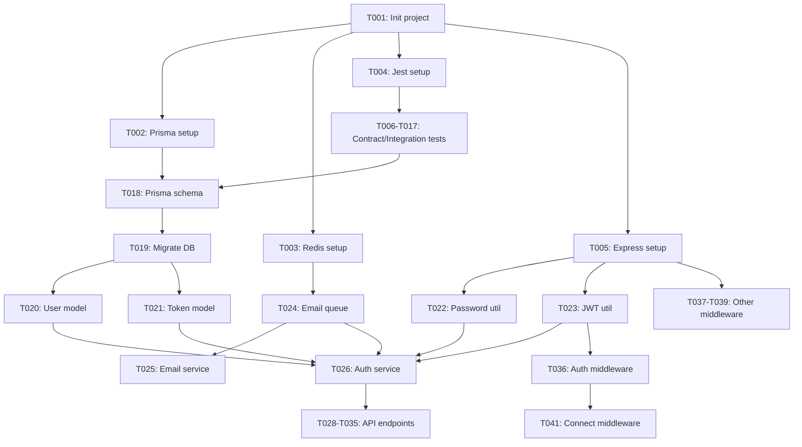

# Tasks: User Authentication

**Input**: Design documents from `specs/feat/001-user-auth/`
**Prerequisites**: plan.md (required), research.md, data-model.md, contracts/

---

## Format: `[ID] [P?] Description`
- **[P]**: Can run in parallel (different files, no dependencies)
- Include exact file paths in descriptions

---

## Phase 3.1: Setup

- [ ] **T001**: Initialize Node.js project with TypeScript 5.3+
  - File: `package.json`, `tsconfig.json`
  - Actions: npm init, install typescript, setup tsconfig with strict mode

- [ ] **T002**: Setup Prisma ORM with PostgreSQL connection
  - File: `prisma/schema.prisma`, `.env.example`
  - Dependencies: T001
  - Actions: npx prisma init, configure datasource

- [ ] **T003**: Setup Redis connection for Bull queue
  - File: `src/config/redis.ts`, `docker-compose.yml`
  - Dependencies: T001
  - Actions: Install ioredis, configure Redis client

- [ ] **T004**: Configure Jest testing framework with Supertest
  - File: `jest.config.js`, `tests/setup.ts`
  - Dependencies: T001
  - Actions: Install jest, @types/jest, supertest, ts-jest

- [ ] **T005**: Setup Express server with basic middleware
  - File: `src/server.ts`, `src/app.ts`
  - Dependencies: T001
  - Actions: Install express, cors, helmet, express-rate-limit

---

## Phase 3.2: Tests First (TDD) ⚠️ MUST COMPLETE BEFORE 3.3

**CRITICAL: These tests MUST be written and MUST FAIL before ANY implementation**

- [ ] **T006** [P]: Write contract test for POST /api/auth/register
  - File: `tests/contracts/auth.register.test.ts`
  - Dependencies: T004
  - Test cases: valid input (201), duplicate email (400), invalid email format (400), weak password (400)

- [ ] **T007** [P]: Write contract test for POST /api/auth/verify-email
  - File: `tests/contracts/auth.verify-email.test.ts`
  - Dependencies: T004
  - Test cases: valid token (200), expired token (401), invalid token (401), already used token (400)

- [ ] **T008** [P]: Write contract test for POST /api/auth/login
  - File: `tests/contracts/auth.login.test.ts`
  - Dependencies: T004
  - Test cases: valid credentials (200), invalid credentials (401), unverified email (403), locked account (403)

- [ ] **T009** [P]: Write contract test for POST /api/auth/logout
  - File: `tests/contracts/auth.logout.test.ts`
  - Dependencies: T004
  - Test cases: valid session (200), no session (401)

- [ ] **T010** [P]: Write contract test for POST /api/auth/refresh
  - File: `tests/contracts/auth.refresh.test.ts`
  - Dependencies: T004
  - Test cases: valid refresh token (200), expired refresh token (401), invalid refresh token (401)

- [ ] **T011** [P]: Write contract test for POST /api/auth/forgot-password
  - File: `tests/contracts/auth.forgot-password.test.ts`
  - Dependencies: T004
  - Test cases: valid email (200), non-existent email (200, don't reveal), rate limit exceeded (429)

- [ ] **T012** [P]: Write contract test for POST /api/auth/reset-password
  - File: `tests/contracts/auth.reset-password.test.ts`
  - Dependencies: T004
  - Test cases: valid token (200), expired token (401), invalid token (401), weak password (400)

- [ ] **T013** [P]: Write contract test for GET /api/auth/me
  - File: `tests/contracts/auth.me.test.ts`
  - Dependencies: T004
  - Test cases: valid session (200), no session (401), expired token (401)

- [ ] **T014** [P]: Write integration test for happy path flow
  - File: `tests/integration/happy-path.test.ts`
  - Dependencies: T004
  - Test scenario: Register → Verify → Login → Access /me → Logout

- [ ] **T015** [P]: Write integration test for password reset flow
  - File: `tests/integration/password-reset.test.ts`
  - Dependencies: T004
  - Test scenario: Login fail → Request reset → Use token → Login success

- [ ] **T016** [P]: Write integration test for account lockout
  - File: `tests/integration/account-lockout.test.ts`
  - Dependencies: T004
  - Test scenario: 5 failed logins → account locked → unlock email sent

- [ ] **T017** [P]: Write integration test for token expiration
  - File: `tests/integration/token-expiration.test.ts`
  - Dependencies: T004
  - Test scenario: Verify with expired token → error, request new token

---

## Phase 3.3: Core Implementation (ONLY after tests are failing)

- [ ] **T018**: Define Prisma schema for all entities
  - File: `prisma/schema.prisma`
  - Dependencies: T002, T006-T017 (tests must exist)
  - Entities: User, VerificationToken, LoginAttempt, Session

- [ ] **T019**: Run Prisma migration to create database tables
  - File: `prisma/migrations/`
  - Dependencies: T018
  - Actions: npx prisma migrate dev --name init

- [ ] **T020**: Implement User model with Prisma client
  - File: `src/models/user.model.ts`
  - Dependencies: T019
  - Methods: create, findByEmail, findById, update

- [ ] **T021**: Implement VerificationToken model
  - File: `src/models/verification-token.model.ts`
  - Dependencies: T019
  - Methods: create, findByToken, markAsUsed

- [ ] **T022**: Implement bcrypt password hashing utility
  - File: `src/utils/password.util.ts`
  - Dependencies: T005
  - Methods: hashPassword, comparePassword

- [ ] **T023**: Implement JWT token generation and verification utility
  - File: `src/utils/jwt.util.ts`
  - Dependencies: T005
  - Methods: generateAccessToken, generateRefreshToken, verifyToken

- [ ] **T024**: Implement email queue with Bull and Redis
  - File: `src/services/email.queue.ts`
  - Dependencies: T003
  - Jobs: sendVerificationEmail, sendPasswordResetEmail, sendAccountUnlockEmail

- [ ] **T025**: Implement SendGrid email service
  - File: `src/services/email.service.ts`
  - Dependencies: T024
  - Methods: sendEmail (async)

- [ ] **T026**: Implement authentication service (register, login, verify)
  - File: `src/services/auth.service.ts`
  - Dependencies: T020, T021, T022, T023, T024
  - Methods: register, verifyEmail, login, logout, refreshToken

- [ ] **T027**: Implement password reset service
  - File: `src/services/password-reset.service.ts`
  - Dependencies: T020, T021, T024
  - Methods: requestPasswordReset, resetPassword

- [ ] **T028**: Implement POST /api/auth/register endpoint
  - File: `src/routes/auth.routes.ts`, `src/controllers/auth.controller.ts`
  - Dependencies: T026
  - Should pass: T006

- [ ] **T029**: Implement POST /api/auth/verify-email endpoint
  - File: `src/controllers/auth.controller.ts`
  - Dependencies: T026
  - Should pass: T007

- [ ] **T030**: Implement POST /api/auth/login endpoint
  - File: `src/controllers/auth.controller.ts`
  - Dependencies: T026
  - Should pass: T008

- [ ] **T031**: Implement POST /api/auth/logout endpoint
  - File: `src/controllers/auth.controller.ts`
  - Dependencies: T026
  - Should pass: T009

- [ ] **T032**: Implement POST /api/auth/refresh endpoint
  - File: `src/controllers/auth.controller.ts`
  - Dependencies: T026
  - Should pass: T010

- [ ] **T033**: Implement POST /api/auth/forgot-password endpoint
  - File: `src/controllers/auth.controller.ts`
  - Dependencies: T027
  - Should pass: T011

- [ ] **T034**: Implement POST /api/auth/reset-password endpoint
  - File: `src/controllers/auth.controller.ts`
  - Dependencies: T027
  - Should pass: T012

- [ ] **T035**: Implement GET /api/auth/me endpoint
  - File: `src/controllers/auth.controller.ts`
  - Dependencies: T026
  - Should pass: T013

---

## Phase 3.4: Integration

- [ ] **T036**: Implement authentication middleware for protected routes
  - File: `src/middleware/auth.middleware.ts`
  - Dependencies: T023
  - Validates JWT, attaches user to request

- [ ] **T037**: Implement rate limiting middleware
  - File: `src/middleware/rate-limit.middleware.ts`
  - Dependencies: T003
  - Limits: 10 req/min for register, 5 req/min for login

- [ ] **T038**: Implement error handling middleware
  - File: `src/middleware/error-handler.middleware.ts`
  - Dependencies: T005
  - Catches all errors, returns consistent error responses

- [ ] **T039**: Implement request logging middleware
  - File: `src/middleware/logger.middleware.ts`
  - Dependencies: T005
  - Logs all requests with timestamp, method, path, IP

- [ ] **T040**: Implement account lockout tracking
  - File: `src/services/lockout.service.ts`
  - Dependencies: T020
  - Tracks failed logins, locks account after 5 attempts

- [ ] **T041**: Connect all middleware to Express app
  - File: `src/app.ts`
  - Dependencies: T036, T037, T038, T039
  - Order: logger → rate-limit → auth → error-handler

---

## Phase 3.5: Polish

- [ ] **T042** [P]: Write unit tests for password utility
  - File: `tests/unit/password.util.test.ts`
  - Dependencies: T022
  - Test cases: hash strength, compare correctness, timing safety

- [ ] **T043** [P]: Write unit tests for JWT utility
  - File: `tests/unit/jwt.util.test.ts`
  - Dependencies: T023
  - Test cases: token generation, token verification, expiration

- [ ] **T044** [P]: Write performance test for concurrent registrations
  - File: `tests/performance/concurrent-registration.test.ts`
  - Dependencies: T028
  - Load test: 1000 concurrent users, < 2s total

- [ ] **T045** [P]: Write security audit checklist and run scan
  - File: `docs/security-audit.md`
  - Dependencies: All implementation tasks
  - Check: no secrets in code, HTTPS only, rate limiting works

- [ ] **T046** [P]: Write API documentation (OpenAPI/Swagger)
  - File: `docs/api-spec.yaml`
  - Dependencies: T028-T035
  - Generate from contracts/

- [ ] **T047** [P]: Write deployment documentation
  - File: `docs/deployment.md`
  - Dependencies: All implementation tasks
  - Includes: Docker setup, env vars, DB migrations

---

## Dependencies



---

## Parallel Execution Examples

**Phase 3.2 (Tests)**: All contract tests can run in parallel
```bash
# Run all contract tests in parallel
npm test tests/contracts/
```

**Phase 3.3 (Core)**: Some tasks can run in parallel after models are ready
```bash
# After T020, T021 complete, these can run in parallel:
# T022 (password util)
# T023 (JWT util)
# T024 (email queue)
```

**Phase 3.5 (Polish)**: All tasks can run in parallel
```bash
# Run all polish tasks in parallel
npm test tests/unit/ &
npm test tests/performance/ &
npm run docs:generate &
```

---

## Notes
- [P] tasks = different files, no dependencies, can run in parallel
- Verify tests fail before implementing (Red phase of TDD)
- Commit after each task with message: "feat(auth): [task description]"
- Run `npm test` after each implementation task to see tests pass (Green phase)
- Avoid: vague tasks, same file conflicts, skipping tests

---

**Total Tasks**: 47
**Estimated Time**: 3-4 days (with TDD approach)

**Breakdown**:
- Setup: 5 tasks (~4 hours)
- Tests: 12 tasks (~8 hours)
- Core: 18 tasks (~16 hours)
- Integration: 6 tasks (~4 hours)
- Polish: 6 tasks (~4 hours)

**Next Step**: Run `/analyze` to check quality, then `/implement` to execute

---

## Instructions for LLM (This section should NOT appear in generated files)

**How to use this template**:

1. **Read this entire file** to understand the task breakdown format
2. **Create a NEW tasks.md** based on plan.md and data-model.md
3. **Follow the same structure**:
   - Same 5 phases (Setup, Tests, Core, Integration, Polish)
   - Same format for tasks: `- [ ] **TXXX** [P?]: Description`
   - Include File paths for each task
   - Include Dependencies when tasks must run sequentially
4. **Generate tasks from plan.md**:
   - Read data-model.md → create model tasks for each entity
   - Read contracts/ → create contract test for each endpoint
   - Read contracts/ → create implementation task for each endpoint
   - Read quickstart.md → create integration test for each scenario
5. **Task generation rules**:
   - Each entity → 1 model task
   - Each contract → 1 test task [P] + 1 implementation task
   - Each quickstart scenario → 1 integration test [P]
   - Setup phase: project init, DB setup, testing setup (5-7 tasks)
   - Integration phase: middleware, error handling, logging (5-8 tasks)
   - Polish phase: unit tests, docs, performance tests (5-8 tasks)
6. **Important**:
   - DO NOT copy "User Authentication" tasks
   - DO NOT keep example task descriptions
   - DO use the same format and numbering (T001, T002, ...)
   - DO mark tasks as [P] if they can run in parallel
   - DO include file paths for every task
   - DO aim for 40-50 total tasks (quality over quantity)
   - DO follow TDD order: Tests before implementation

**Common mistakes to avoid**:
- ❌ Keeping {{FEATURE_NAME}} or other placeholders
- ❌ Copying example tasks (User Authentication)
- ❌ Less than 20 tasks (too high-level)
- ❌ More than 80 tasks (too granular)
- ❌ Missing [P] markers for parallel tasks
- ❌ Missing file paths
- ❌ Implementation tasks before test tasks (violates TDD)
- ❌ Vague descriptions ("implement feature")
- ❌ Tasks that modify same file marked as [P]
