# spec-kit-mcp Templates Audit Report

> **审查日期**: 2025-10-07
> **审查范围**: 所有 Templates（spec.md, plan.md, tasks.md）
> **重点关注**: Template 设计与 Prompt 指令的一致性

---

## 执行摘要

发现 **Templates 设计与 Prompts 指令之间存在严重不一致**：

1. ❌ **Templates 使用 Handlebars 语法**（{{...}}），但没有渲染引擎
2. ❌ **Prompts 指令模糊**：不清楚 LLM 应该如何使用这些 templates
3. ❌ **Templates 包含可执行逻辑**：条件判断、循环，但 LLM 无法直接执行

### 核心问题

**Templates 应该是什么？**
- Option A: **纯 Markdown 示例**（供 LLM 参考结构，LLM 生成纯 Markdown）
- Option B: **Handlebars 模板**（由 spec-kit-mcp 代码渲染后提供给 LLM）

**当前实际情况**：
- Templates 设计成了 Handlebars 模板（Option B）
- 但代码中没有 Handlebars 渲染逻辑
- Prompts 指令要求 LLM 直接使用（当作 Option A）

**结果**: LLM 会看到 `{{FEATURE_NAME}}` 这样的占位符，不知道如何处理。

---

## 1. spec.md Template 分析

**文件**: `templates/spec.md`

### 1.1 当前设计

**Handlebars 语法使用情况**:
```markdown
# Feature Specification: {{FEATURE_NAME}}

**Feature Branch**: `{{FEATURE_ID}}`
**Created**: {{DATE}}
**Status**: Draft

### Primary User Story
{{PRIMARY_STORY}}

### Acceptance Scenarios
{{#each SCENARIOS}}
{{@index}}. **Given** {{this.given}}, **When** {{this.when}}, **Then** {{this.then}}
{{/each}}

### Functional Requirements
{{#each REQUIREMENTS}}
- **FR-{{@index}}**: {{this.description}}{{#if this.needsClarification}} [NEEDS CLARIFICATION: {{this.clarificationNote}}]{{/if}}
{{/each}}

{{#if ENTITIES.length}}
### Key Entities *(data model)*
{{#each ENTITIES}}
- **{{this.name}}**: {{this.description}}
{{/each}}
{{/if}}
```

**统计**:
- 简单占位符: 8个（{{FEATURE_NAME}}, {{FEATURE_ID}}, {{DATE}}, {{PRIMARY_STORY}}, ...）
- 条件语句: 3个（{{#if HAS_CLARIFICATIONS}}, {{#if ENTITIES.length}}, {{#if EXECUTION_STATUS}}）
- 循环语句: 4个（{{#each SCENARIOS}}, {{#each EDGE_CASES}}, {{#each REQUIREMENTS}}, {{#each ENTITIES}}）

### 1.2 specify Prompt 的指令

**当前指令** (src/prompts/specify.ts:46-48):
```
2. Load `.specify/templates/spec-template.md` to understand required sections.
3. Write the specification to SPEC_FILE using the template structure, replacing placeholders with concrete details derived from the feature description...
```

### 1.3 问题分析

**问题 1: 指令模糊 - "replacing placeholders"**
- ❌ LLM 会看到 `{{FEATURE_NAME}}` 这样的占位符
- ❌ 指令说"replacing placeholders"，但：
  - 是替换成 `Feature Name: My Feature`？
  - 还是保留 `{{FEATURE_NAME}}` 然后由代码渲染？
- ❌ LLM 可能会困惑：我应该保留 `{{}}` 吗？

**问题 2: 条件逻辑无法执行**
- ❌ Template 包含 `{{#if HAS_CLARIFICATIONS}}`
- ❌ LLM 无法执行这个逻辑判断
- ❌ LLM 可能会：
  - 保留原样（错误）
  - 删除整个 `{{#if}}` 块（丢失内容）
  - 猜测如何处理（不一致）

**问题 3: 循环逻辑无法执行**
- ❌ Template 包含 `{{#each SCENARIOS}}`
- ❌ LLM 无法执行循环
- ❌ LLM 可能会：
  - 保留原样（错误）
  - 只生成一个示例（不够）
  - 删除整个 `{{#each}}` 块（丢失结构）

### 1.4 严重程度

🔴 **CRITICAL** - 阻止 LLM 正确生成 spec.md

**实际影响**:
- LLM 生成的 spec.md 可能包含未处理的 `{{...}}`
- 或者 LLM 删除了重要的 sections
- 或者 LLM 自己猜测如何处理，导致不一致

---

## 2. plan.md Template 分析

**文件**: `templates/plan.md`

### 2.1 当前设计

**Handlebars 语法使用情况**:
```markdown
# Implementation Plan: {{FEATURE_NAME}}

**Branch**: `{{FEATURE_ID}}` | **Date**: {{DATE}} | **Spec**: [spec.md](./spec.md)

## Technical Context
**Language/Version**: {{LANGUAGE}}
**Primary Dependencies**: {{FRAMEWORK}}
**Storage**: {{STORAGE}}
**Testing**: {{TESTING}}

## Constitution Check
**Simplicity**:
- Projects: {{PROJECTS_COUNT}} (max 3)
- Status: {{#if CONSTITUTION_CHECK.simplicity.passed}}✅ PASS{{else}}❌ FAIL{{/if}}
{{#if CONSTITUTION_CHECK.simplicity.issues}}
{{#each CONSTITUTION_CHECK.simplicity.issues}}
  - ⚠️ {{this}}
{{/each}}
{{/if}}

### Key Decisions
{{#each RESEARCH_DECISIONS}}
**{{@index}}. {{this.topic}}**
- **Decision**: {{this.decision}}
- **Rationale**: {{this.rationale}}
- **Alternatives**: {{this.alternatives}}
{{/each}}
```

**统计**:
- 简单占位符: 15个（{{FEATURE_NAME}}, {{LANGUAGE}}, {{FRAMEWORK}}, ...）
- 条件语句: 10个（{{#if CONSTITUTION_CHECK.simplicity.passed}}, ...）
- 循环语句: 6个（{{#each RESEARCH_DECISIONS}}, {{#each DATA_ENTITIES}}, ...）

### 2.2 plan Prompt 的指令

**当前指令** (src/prompts/plan.ts:48-54):
```
4. Execute the implementation plan template:
   - Load `.specify/templates/plan-template.md` (already copied to IMPL_PLAN path)
   - Set Input path to FEATURE_SPEC
   - Run the Execution Flow (main) function steps 1-9
   - The template is self-contained and executable
   - Follow error handling and gate checks as specified
```

### 2.3 问题分析

**问题 1: "The template is self-contained and executable" - 误导性指令**
- ❌ Template 不是"executable"的
- ❌ Template 包含了大量 Handlebars 语法，需要渲染引擎
- ❌ 指令说"Run the Execution Flow (main) function steps 1-9"，但 template 中没有这样的结构

**问题 2: Constitution Check 复杂逻辑**
- ❌ Template 包含了复杂的 constitution check 逻辑
- ❌ 包含嵌套的条件判断和循环
- ❌ LLM 无法执行这些逻辑

**问题 3: 指令与 template 结构不匹配**
- ❌ 指令说"Run the Execution Flow (main) function steps 1-9"
- ❌ Template 的结构是 sections（Summary, Technical Context, Constitution Check, Phases）
- ❌ 没有"Execution Flow (main) function"

### 2.4 严重程度

🔴 **CRITICAL** - 指令完全误导，LLM 无法正确使用 template

**实际影响**:
- LLM 会困惑："Execution Flow (main) function"在哪里？
- LLM 可能生成包含未处理 `{{...}}` 的 plan.md
- LLM 可能跳过 constitution check（因为逻辑太复杂）

---

## 3. tasks.md Template 分析

**文件**: `templates/tasks.md`

### 3.1 当前设计

**Handlebars 语法使用情况**:
```markdown
# Tasks: {{FEATURE_NAME}}

**Input**: Design documents from `specs/{{FEATURE_ID}}/`

## Phase 3.1: Setup

{{#each SETUP_TASKS}}
- [{{#if this.parallel}} {{else}} {{/if}}] **{{this.id}}** {{this.description}}
{{#if this.filePath}}  - File: `{{this.filePath}}`{{/if}}
{{#if this.dependencies.length}}  - Dependencies: {{this.dependencies}}{{/if}}
{{#if this.estimatedTime}}  - Time: {{this.estimatedTime}}{{/if}}
{{/each}}

## Phase 3.2: Tests First (TDD) ⚠️ MUST COMPLETE BEFORE 3.3

{{#each TEST_TASKS}}
- [{{#if this.parallel}}P{{else}} {{/if}}] **{{this.id}}** {{this.description}}
...
{{/each}}
```

**统计**:
- 简单占位符: 6个（{{FEATURE_NAME}}, {{FEATURE_ID}}, {{DEPENDENCY_GRAPH}}, ...）
- 条件语句: 15个（每个 task 有 3个条件：filePath, dependencies, estimatedTime）
- 循环语句: 5个（{{#each SETUP_TASKS}}, {{#each TEST_TASKS}}, {{#each CORE_TASKS}}, {{#each INTEGRATION_TASKS}}, {{#each POLISH_TASKS}}）

### 3.2 tasks Prompt 的指令

**当前指令** (src/prompts/tasks.ts:49-57):
```
3. Generate tasks following the template:
   - Use `.specify/templates/tasks-template.md` as the base
   - Replace example tasks with actual tasks based on:
     * **Setup tasks**: Project init, dependencies, linting
     * **Test tasks [P]**: One per contract, one per integration scenario
     * **Core tasks**: One per entity, service, CLI command, endpoint
     * **Integration tasks**: DB connections, middleware, logging
     * **Polish tasks [P]**: Unit tests, performance, docs
```

### 3.3 问题分析

**问题 1: "Replace example tasks with actual tasks" - 没有示例**
- ❌ Template 没有示例 tasks，只有 `{{#each SETUP_TASKS}}`
- ❌ LLM 看不到任何示例来学习 task 的格式
- ❌ 指令说"Replace example tasks"，但没有 example 可以 replace

**问题 2: 复杂的嵌套结构**
- ❌ 每个 task 有多层嵌套的条件判断
- ❌ `{{#if this.filePath}}`, `{{#if this.dependencies.length}}`, `{{#if this.estimatedTime}}`
- ❌ LLM 无法执行这些逻辑

**问题 3: Parallel marker 逻辑混乱**
- ❌ Template 使用 `{{#if this.parallel}}P{{else}} {{/if}}`
- ❌ 指令说"Test tasks [P]"，但没有说明如何决定是否 parallel
- ❌ LLM 可能不知道何时添加 `[P]` 标记

### 3.4 严重程度

🟠 **HIGH** - 指令与 template 不匹配，LLM 难以正确生成 tasks.md

**实际影响**:
- LLM 生成的 tasks.md 可能包含未处理的 `{{...}}`
- LLM 可能不知道如何格式化 tasks
- LLM 可能不正确地使用 `[P]` 标记

---

## 4. Scripts 与 Templates 的关系分析 ⭐

### 4.1 Scripts 行为确认

**create-new-feature.sh (创建 spec.md)**:
```bash
# Line 48-50
TEMPLATE="$REPO_ROOT/.specify/templates/spec-template.md"
SPEC_FILE="$FEATURE_DIR/spec.md"
if [ -f "$TEMPLATE" ]; then cp "$TEMPLATE" "$SPEC_FILE"; else touch "$SPEC_FILE"; fi
```

**setup-plan.sh (创建 plan.md)**:
```bash
# Line 10-11
TEMPLATE="$REPO_ROOT/.specify/templates/plan-template.md"
[[ -f "$TEMPLATE" ]] && cp "$TEMPLATE" "$IMPL_PLAN"
```

**关键发现**:
- ✅ Scripts 只做 `cp` 复制，**没有任何渲染逻辑**
- ✅ Templates 被**原样复制**到 specs/ 目录
- ✅ LLM 会看到**未处理的 Handlebars 语法**（`{{FEATURE_NAME}}`, `{{#if ...}}`, `{{#each ...}}`）

### 4.2 Scripts 能力范围

**Scripts 提供的功能**:
1. ✅ 创建 feature branch（`create-new-feature.sh`）
2. ✅ 创建 feature 目录结构
3. ✅ 复制 templates 到正确位置
4. ✅ 返回路径信息（JSON 格式）

**Scripts 不提供的功能**:
- ❌ Template 渲染（Handlebars）
- ❌ 占位符替换
- ❌ 条件逻辑处理
- ❌ 循环逻辑处理

### 4.3 实际工作流

**当前实际流程**:
```mermaid
graph LR
    A[LLM 调用 specify Prompt] --> B[Prompt 调用 create-new-feature.sh]
    B --> C[Script cp template → spec.md]
    C --> D[LLM 读取 spec.md]
    D --> E[LLM 看到 {{FEATURE_NAME}}]
    E --> F{LLM 如何处理?}
    F -->|保留原样| G[❌ spec.md 包含 {{}}]
    F -->|删除| H[❌ 丢失内容]
    F -->|猜测| I[❌ 不一致]
```

**预期但不存在的流程**（如果要使用 Handlebars）:

```mermaid
graph LR
    A[LLM 调用 specify Prompt] --> B[Prompt 调用 create-new-feature.sh]
    B --> C[Script cp template]
    C --> D[Prompt 代码读取 template]
    D --> E[Prompt 代码渲染 Handlebars]
    E --> F[生成纯 Markdown]
    F --> G[返回给 LLM]
    G --> H[LLM 填充细节]
```


**关键问题**: 步骤 D-F（读取 → 渲染 → 生成）**完全不存在**，Prompts 只是告诉 LLM "Load template and replace placeholders"。

### 4.4 为什么 Templates 设计成 Handlebars？

**推测**: 可能参考了 observer 项目的 templates
- observer 项目可能有渲染引擎
- 或者 observer 的 templates 是给人类看的（文档）
- 但 spec-kit-mcp 直接复制了 template 设计，**没有实现渲染逻辑**

**验证**: 检查 Prompts 注释
```typescript
// src/prompts/specify.ts:2-3
/**
 * /specify Prompt - 创建 spec.md
 * 基于 observer/.codex/prompts/specify.md
 */
```

**结论**: spec-kit-mcp 基于 observer 项目，可能在迁移过程中：
1. 复制了 Handlebars templates
2. 但没有复制渲染逻辑
3. 导致 templates 设计与实现不匹配

---

## 5. 根本原因分析

### 5.1 设计意图混乱

**Templates 的两种可能设计**:

**Option A: 纯 Markdown 示例**
```markdown
# Feature Specification: User Authentication

**Feature Branch**: `feat/001-user-auth`
**Created**: 2025-10-01
**Status**: Draft

### Primary User Story
As a new user, I want to create an account so that I can access personalized features.

### Acceptance Scenarios
1. **Given** user visits signup page, **When** user enters valid email and password, **Then** account is created and user is logged in
2. **Given** user enters existing email, **When** user submits form, **Then** error message "Email already exists" is shown

### Functional Requirements
- **FR-1**: System shall allow users to register with email and password
- **FR-2**: System shall validate email format
- **FR-3**: System shall hash passwords using bcrypt
```

**Option B: Handlebars 模板（需要代码渲染）**
```typescript
// src/prompts/specify.ts
async function handler(args: Record<string, any>, context: ToolContext): Promise<PromptMessage[]> {
  // 1. 读取 template
  const template = readFileSync('.specify/templates/spec-template.md', 'utf-8');

  // 2. 准备数据
  const data = {
    FEATURE_NAME: extractFeatureName(args.featureDescription),
    FEATURE_ID: generateFeatureId(),
    DATE: new Date().toISOString().split('T')[0],
    // ...
  };

  // 3. 渲染 template
  const compiled = Handlebars.compile(template);
  const rendered = compiled(data);

  // 4. 返回给 LLM（已经是纯 Markdown）
  return [{
    role: 'user',
    content: {
      type: 'text',
      text: `Here is the template structure:\n\n${rendered}\n\nNow fill in the details...`
    }
  }];
}
```

**当前实际情况**: 混合了两种设计
- Templates 使用了 Handlebars 语法（Option B）
- 但代码没有渲染逻辑（应该是 Option A）
- Prompts 指令假设 LLM 能直接使用（Option A），但 LLM 看到的是 Handlebars 语法（Option B）

### 4.2 代码实现缺失

**缺少的代码**:
1. ❌ 没有 Handlebars 依赖
2. ❌ 没有 template 渲染逻辑
3. ❌ Prompts 只是返回 instructions，不处理 templates

**当前实现** (src/prompts/specify.ts:29-53):
```typescript
return [
  {
    role: 'user',
    content: {
      type: 'text',
      text: `Given that feature description, do this:
1. Run the script...
2. Load .specify/templates/spec-template.md to understand required sections.
3. Write the specification to SPEC_FILE using the template structure, replacing placeholders...`
    }
  }
];
```

**问题**:
- Prompt 只是告诉 LLM "Load template and replace placeholders"
- 但 template 包含了 LLM 无法处理的 Handlebars 语法

---

## 5. 推荐解决方案

### 方案 A: 转换为纯 Markdown 示例（推荐）⭐

**优点**:
- ✅ 无需添加 Handlebars 依赖
- ✅ LLM 可以直接理解和模仿
- ✅ 示例清晰，LLM 学习效果好
- ✅ 实施简单，只需修改 templates

**缺点**:
- ⚠️ 需要重写所有 templates

**实施步骤**:

1. **重写 spec.md template**:
```markdown
# Feature Specification: User Authentication

**Feature Branch**: `feat/001-user-auth`
**Created**: 2025-10-01
**Status**: Draft

## ⚡ Quick Guidelines
- ✅ Focus on WHAT users need and WHY
- ❌ Avoid HOW to implement (no tech stack, APIs, code structure)
- 👥 Written for business stakeholders, not developers

---

## User Scenarios & Testing *(mandatory)*

### Primary User Story
As a new user, I want to create an account so that I can access personalized features.

### Acceptance Scenarios
1. **Given** user visits signup page, **When** user enters valid email and password, **Then** account is created and user is logged in
2. **Given** user enters existing email, **When** user submits form, **Then** error message "Email already exists" is shown
3. **Given** user enters weak password, **When** user submits form, **Then** error message "Password must be at least 8 characters" is shown

### Edge Cases
- What happens if user loses internet connection during signup?
- How to handle duplicate email registrations?
- What if email service is down?

---

## Requirements *(mandatory)*

### Functional Requirements
- **FR-1**: System shall allow users to register with email and password
- **FR-2**: System shall validate email format (RFC 5322)
- **FR-3**: System shall enforce password requirements (min 8 chars, 1 uppercase, 1 number)
- **FR-4**: System shall hash passwords using bcrypt (cost factor 12)
- **FR-5**: System shall send verification email after registration
- **FR-6**: System shall prevent duplicate email registrations
- **FR-7**: System shall allow users to login with verified email
- **FR-8**: System shall lock account after 5 failed login attempts
- **FR-9**: System shall provide password reset via email
- **FR-10**: System shall expire password reset tokens after 1 hour

### Key Entities *(data model)*
- **User**: id, email, passwordHash, emailVerified, createdAt, lastLogin
- **VerificationToken**: token, userId, expiresAt, type (email_verify | password_reset)
- **LoginAttempt**: userId, ipAddress, success, timestamp

---

## Review & Acceptance Checklist
*GATE: Quality gates for this specification*

### Content Quality
- [x] No implementation details (languages, frameworks, APIs)
- [x] Focused on user value and business needs
- [x] Written for non-technical stakeholders
- [x] All mandatory sections completed

### Requirement Completeness
- [x] No [NEEDS CLARIFICATION] markers remain
- [x] Requirements are testable and unambiguous
- [x] Success criteria are measurable
- [x] Scope is clearly bounded

---

## Execution Status
*Generated by spec-kit-mcp*

- [x] User description parsed
- [x] Key concepts extracted
- [ ] Ambiguities marked (none found)
- [x] User scenarios defined
- [x] Requirements generated (10 functional requirements)
- [x] Entities identified (3 entities)
- [x] Review checklist passed

---

**Next Step**: Run `/clarify` to resolve ambiguities (or `/plan` if no clarification needed)
```

2. **更新 plan.md template**（类似转换）

3. **更新 tasks.md template**（类似转换）

4. **更新 Prompt 指令**:
```typescript
// specify Prompt
text: `Given that feature description, do this:

1. Run the script...
2. Load .specify/templates/spec-template.md to see an example specification.
3. Write a NEW specification to SPEC_FILE following the example structure:
   - Use the same section headings
   - Follow the same format for requirements (FR-1, FR-2, etc.)
   - Use GIVEN-WHEN-THEN format for scenarios
   - Replace all example content with content derived from the feature description
4. Report completion...`
```

---

### 方案 B: 实现 Handlebars 渲染（不推荐）

**优点**:
- ✅ 保留当前 template 设计
- ✅ Templates 更灵活（可以共享逻辑）

**缺点**:
- ❌ 需要添加 Handlebars 依赖
- ❌ 需要大量代码改动（渲染逻辑、数据提取）
- ❌ 复杂度高，难以维护
- ❌ LLM 失去灵活性（被模板限制）

**实施步骤**（略，因为不推荐）

---

### 方案 C: 混合方案（折中）

**设计**:
- Templates 提供结构说明（纯 Markdown 注释）
- LLM 自由生成内容
- Prompts 提供详细的格式要求

**示例 template**:
```markdown
# Feature Specification: [FEATURE_NAME]

<!-- Instructions for LLM:
- Replace [FEATURE_NAME] with the actual feature name
- Use the feature description to fill in all sections
- Follow the format examples below
-->

**Feature Branch**: `[FEATURE_ID]`
**Created**: [DATE]
**Status**: Draft

## User Scenarios & Testing *(mandatory)*

<!-- Instructions:
- Write 1 primary user story in "As a X, I want Y, so that Z" format
- Write 3-5 acceptance scenarios in GIVEN-WHEN-THEN format
- List 3-5 edge cases as questions
-->

### Primary User Story
[Example: As a new user, I want to create an account so that I can access personalized features.]

### Acceptance Scenarios
1. **Given** [precondition], **When** [action], **Then** [outcome]
2. **Given** [precondition], **When** [action], **Then** [outcome]
3. **Given** [precondition], **When** [action], **Then** [outcome]

### Edge Cases
- [Example: What happens if user loses internet connection during signup?]
- [Example: How to handle duplicate email registrations?]
- [Example: What if email service is down?]

---

## Requirements *(mandatory)*

<!-- Instructions:
- Write 10-20 functional requirements
- Format: **FR-X**: [requirement description]
- Be specific and testable
- Identify 4-6 key entities with their main attributes
-->

### Functional Requirements
- **FR-1**: [Example: System shall allow users to register with email and password]
- **FR-2**: [Example: System shall validate email format (RFC 5322)]
...
```

**优点**:
- ✅ 清晰的指令（Markdown 注释）
- ✅ 灵活的生成（LLM 自由发挥）
- ✅ 实施简单

**缺点**:
- ⚠️ Markdown 注释可能出现在生成的文件中

---

## 6. 优先级推荐

### 🔴 CRITICAL - 必须立即修复

**C1. spec.md template 重写**
- **问题**: Handlebars 语法阻止 LLM 正确使用
- **影响**: LLM 无法生成有效的 spec.md
- **修复**: 转换为纯 Markdown 示例（方案 A）

**C2. plan.md template 重写**
- **问题**: "Execution Flow (main) function" 不存在，Constitution Check 逻辑复杂
- **影响**: LLM 完全困惑，无法生成 plan.md
- **修复**: 转换为纯 Markdown 示例（方案 A）

**C3. tasks.md template 重写**
- **问题**: 没有示例 tasks，只有 `{{#each}}` 循环
- **影响**: LLM 不知道如何格式化 tasks
- **修复**: 转换为纯 Markdown 示例，包含 5-10 个示例 tasks（方案 A）

**C4. 更新所有 Prompt 指令**
- **问题**: 指令假设 LLM 能处理 Handlebars 语法
- **影响**: LLM 不知道如何使用 templates
- **修复**: 改为"Load template to see example, then generate new content following the structure"

---

### 🟠 HIGH - 应该尽快修复

**H1. 添加 template 验证测试**
- **目的**: 确保 templates 不包含未处理的占位符
- **实施**: 添加单元测试检查 templates 是否是纯 Markdown

**H2. 更新 init Tool 复制逻辑**
- **目的**: 确保 templates 正确复制到 .specify/
- **实施**: 验证复制后的 templates 与源文件一致

---

## 7. 实施计划

### Phase 1: CRITICAL 修复（立即执行）

**目标**: 所有 templates 转换为纯 Markdown 示例

1. **重写 spec.md template**:
   - 移除所有 Handlebars 语法
   - 添加完整的示例内容
   - 包含 10-20 个 requirements 示例
   - 包含 3-5 个 scenarios 示例
   - 包含 4-6 个 entities 示例

2. **重写 plan.md template**:
   - 移除所有 Handlebars 语法
   - 添加完整的示例内容
   - 简化 Constitution Check（只保留结构，不需要复杂逻辑）
   - 包含 7 个 tech decisions 示例
   - 包含完整的 data model 示例（TypeScript interfaces）

3. **重写 tasks.md template**:
   - 移除所有 Handlebars 语法
   - 添加 20-30 个示例 tasks
   - 清晰标记 `[P]` 用法
   - 包含所有 5 个 phases 的示例

4. **更新所有 Prompt 指令**:
   - specify: "Load template to see example specification structure"
   - plan: "Load template to see example plan structure with tech decisions and data model"
   - tasks: "Load template to see example tasks breakdown with parallel markers"

**预计时间**: 3-4 小时

---

### Phase 2: HIGH 优先级修复（尽快执行）

**目标**: 确保 templates 质量和一致性

1. 添加 template 验证测试
2. 更新 README 关于 templates 的说明
3. 添加 template 使用指南

**预计时间**: 1 小时

---

## 8. 测试验证计划

### 8.1 Template 质量检查

修复完成后，验证：

1. ✅ 所有 templates 不包含 `{{...}}` 语法
2. ✅ 所有 templates 包含完整的示例内容
3. ✅ 所有 templates 可以直接作为 Markdown 阅读
4. ✅ LLM 可以从 templates 学习格式和结构

### 8.2 E2E 测试

1. ✅ LLM 生成的 spec.md 格式正确，不包含 `{{...}}`
2. ✅ LLM 生成的 plan.md 包含 tech decisions 和 data model
3. ✅ LLM 生成的 tasks.md 包含正确的 `[P]` 标记
4. ✅ 生成的文件遵循 templates 的结构

---

## 9. 长期建议

### 9.1 考虑 Template 版本控制

如果 templates 频繁变化：
- 添加 template version 到生成的文件中
- 支持多个 template 版本
- 提供 template migration 工具

### 9.2 支持自定义 Templates

允许用户自定义 templates：
- 在项目根目录放置自定义 templates
- init Tool 优先使用自定义 templates
- 提供 template validation 工具

### 9.3 Template 文档化

创建 `docs/templates-guide.md`：
- 解释每个 template 的用途
- 说明如何修改 templates
- 提供自定义 template 的最佳实践

---

## 10. 总结

### 当前状态

- ❌ **Templates 设计混乱**: Handlebars 语法但无渲染逻辑
- ❌ **Prompts 指令误导**: 假设 LLM 能处理 Handlebars
- ❌ **LLM 无法正确使用**: 看到 `{{...}}` 不知道如何处理

### 关键风险

如果不修复：
1. **LLM 生成的文件包含 `{{...}}`**: 用户看到未处理的占位符
2. **LLM 跳过复杂 sections**: 因为 Handlebars 逻辑太复杂
3. **LLM 格式不一致**: 不同次运行产生不同格式

### 修复后预期

修复所有 CRITICAL 问题后：

1. ✅ Templates 是纯 Markdown 示例，LLM 可以直接理解
2. ✅ LLM 从示例中学习格式和结构
3. ✅ LLM 生成的文件格式一致、结构完整
4. ✅ 用户看到的是干净的 Markdown，不含 `{{...}}`

### 成功标准

- ✅ 所有 templates 不包含 Handlebars 语法
- ✅ E2E 测试：LLM 生成的文件格式正确
- ✅ 用户反馈：生成的文件质量高、格式一致

---

## 11. 示例对比

### spec.md Template 对比

**修复前（Handlebars）**:
```markdown
# Feature Specification: {{FEATURE_NAME}}

**Feature Branch**: `{{FEATURE_ID}}`

### Functional Requirements
{{#each REQUIREMENTS}}
- **FR-{{@index}}**: {{this.description}}
{{/each}}

{{#if ENTITIES.length}}
### Key Entities
{{#each ENTITIES}}
- **{{this.name}}**: {{this.description}}
{{/each}}
{{/if}}
```

**修复后（纯 Markdown 示例）**:
```markdown
# Feature Specification: User Authentication

**Feature Branch**: `feat/001-user-auth`

### Functional Requirements
- **FR-1**: System shall allow users to register with email and password
- **FR-2**: System shall validate email format (RFC 5322)
- **FR-3**: System shall enforce password requirements (min 8 chars, 1 uppercase, 1 number)
- **FR-4**: System shall hash passwords using bcrypt (cost factor 12)
- **FR-5**: System shall send verification email after registration

### Key Entities
- **User**: id, email, passwordHash, emailVerified, createdAt, lastLogin
- **VerificationToken**: token, userId, expiresAt, type (email_verify | password_reset)
- **LoginAttempt**: userId, ipAddress, success, timestamp
```

**对比**:
- ✅ 移除了所有 `{{...}}` 语法
- ✅ 提供了完整的示例内容
- ✅ LLM 可以直接模仿格式
- ✅ 用户也可以直接阅读理解

---

**报告结束**

下一步：开始 Phase 1 实施，重写所有 templates
